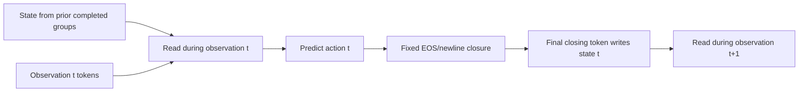

# Parallel step lane implementation report — 2026-10-04

The implementation at source commit `3c8f580` passes the pinned GPU/tokenizer suite, real-model FullContext and Window8 numerical gates, sequential-session isolation, distributed smoke, trained-model reload, matched latency, and the tested FullContext/Window8 longest profiles and mixed-tail staging. The requested production experiment is **one additional joint R2R+RxR pass from the trained no-history FullContext parent: 30,815 episodes, 3,852 updates, and 116 warmup updates**.

**Exact checkpoint restoration is verified; continuation is not bitwise reproducible.** The final FullContext/no-history joint run is running in allocation 4652, step 4652.29, from a read-only source snapshot. At 2026-10-04 15:05:51 UTC, all four ranks had completed 13 of 3,852 updates; this report does not claim the training pass is finished. Numerical correctness, measured resource fit, and eventual navigation benefit are separate claims.

This report distinguishes committed behavior, measured execution, numerical qualifications, and future research. Evidence files are stored under `.superpowers/sdd/implementation_plan_dual_lane/remote-evidence/` locally and `/mnt/data/vmo-ai-task/anhdh35/SimpleMemVLN-streaming_logits_dual-evidence` on the server. That local directory is ignored by Git; the report records the relevant values so these findings do not depend on accidentally publishing transient files.

## 1. Objective and scope

The question is whether an already trained streaming navigation policy benefits from a small associative state that is read at token rate and modified once per completed observation/feedback group. The additional state complements the existing Qwen gated delta network (GDN). Token-rate native updates can be useful; the implementation does not diagnose native heads as defective, force slow state to represent landmarks, or claim novelty from two clocks alone.

The host is the pinned Qwen3.5-4B SimpleMemVLN wrapper. Supported outputs are `qwen_text` and `candidate_logits`. Classification is rejected for lane v1 because its serialization has no post-decision closing block. There are no extra tokens, summary placeholders, lane convolutions, pose inputs, auxiliary labels, teacher models, or additional losses. Vision remains frozen. The experimental objective is the existing navigation loss with complete-episode backpropagation. The user-confirmed final pilot is ONE additional joint R2R+RxR pass from the trained no-history FullContext parent; this explicitly supersedes the earlier R2R-only proposal.

The preferred bounded study requires a genuinely trained matching Window8 parent. The inspected available parent is FullContext no-history candidate policy. The code supports Window8, but that support cannot turn this parent into a trained Window8 policy. A FullContext experiment must retain its separate visibility and memory claim.

## 2. Recorded parent and isolated server baseline

`reports/STEP_LANE_PREFLIGHT_2026-10-04.json` records baseline source `f194e23` and the completed parent at:

`/mnt/data/vmo-ai-task/anhdh35/SimpleMemVLN/outputs/nohistory_joint_epoch1_20261003-6Ajh9c/train/final`.

Its contract uses `candidate_logits`, `lm_rows_trainable`, feedback `none`, no appended action content, serializer `vln_candidate_logits_no_action_history_v1`, FullContext, and FlashAttention2. The backbone revision is `851bf6e806efd8d0a36b00ddf55e13ccb7b8cd0a`. The saved recipe describes one completed joint data pass, nominal global batch eight, four-rank accumulation two, 3,852 updates, and 116 warmup updates. Final adaptation now also declares one additional joint pass, independently initialized lanes and fresh optimizer/scheduler; it does not resume the parent optimizer.

The parent navigation hash is `d2a510c50d3b148987371ba6d1f61271c5e32d3b875778363616f020fd7c7b75`; its `pytorch_model.bin` hash is `6d492d012a872193adefb002057ea4c4e42a28301ffae1d1177c200e6a8b136d`. The R2R manifest hash is `a0eba63ad454d0ec11c7dd063f024cb4b6c47ad5ec9e08ba92528e3f45b98e48`; the joint manifest hash is `5deb425d2594ce96931dd6ce12bd6084b066cd44f04808c1dd3ee2e4b3672933`.

The read-only parent inspection and baseline used a separate server allocation: job 4652 on worker-3, four H100 80GB GPUs, and 480 GiB host memory. Jobs 4643 and 4649 are explicitly listed as protected. This baseline belongs to the isolated SSH/server workflow; it is not authorization to cancel jobs or modify a running campaign. The preflight JSON records successful parent reload, CPU baseline 93 passed/12 skipped, and GPU baseline 105 passed/0 skipped. It does not establish final lane integration or resource success.

Production versions are Python 3.12.13, Torch 2.10.0+cu129, Transformers 5.11.0, FLA/FLA-core 0.5.2, FlashAttention 2.8.3 for CUDA 12.9/Torch 2.10, DeepSpeed 0.16.4, and Accelerate 1.13.0. Local tests use a separate Torch 2.14.1 CPU environment. Numerical release evidence must come from the pinned production environment.

## 3. Attachment and parameter namespace

Each selected zero-based decoder layer 16, 20, 24, and 28 receives an independent `step_lane` child on its existing `linear_attn` object. Configuration checks verify actual linear-attention layer types and hidden width 2560. Under the pinned repeating `[L,L,L,F]` layout, layer 15 is full attention; layer 16 follows it.

Let `h` be decoder input and `x=existing_input_layernorm(h)`. The retained decoder computation is:

\[
 y_N=\operatorname{native\_linear\_attn}(x),\qquad
 y_L=\operatorname{step\_lane}(x),\qquad
 z=h+y_N+y_L,
\]
\[
 h'=z+\operatorname{existing\_MLP}(\operatorname{existing\_post\_attention\_layernorm}(z)).
\]

Both mixers consume the same normalized `x`. The lane does not consume the native mixer output, duplicate the decoder residual, or replace the MLP. Later layers naturally receive the combined hidden stream after learning.

`install_step_lane.py` binds a project-owned forward to each selected native instance. It retains the original unbound function in an ordinary attribute and calls it before adding the lane result. Other native mixers strip lane-specific keyword arguments before calling their original functions. No global Transformers/FLA monkeypatch is needed, and native modules are not moved under a `wrapper.native` namespace. Existing parameter objects and state-dict names survive; new names have the form `backbone.model.language_model.layers.16.linear_attn.step_lane.*`.

Installation constructs all lanes before replacing forwards, occurs before optimizer/DeepSpeed setup, is idempotent for the same immutable spec, and rejects incompatible installation. Keeping the original callable enables direct native comparison. Different layers own different matrices; interaction occurs through hidden activations rather than a global post-forward write into all layers. At a selected layer there are two banks: the retained native bank `[B,32,128,128]` and the new lane bank `[B,4,128,128]`, not two individual matrices. Runtime banks are episode-generated state, while projection/gate/norm weights are checkpointed parameters.

The final no-history causal order is:



The arrow from prediction to closure denotes execution order. It does not insert the predicted action into the no-history token stream. The write occurs too late to affect the current decision.

## 4. Lane mathematics and tensor policy

For `x:[B,L,2560]`, with production restricted to unpadded B1 episodes, a bias-free QKV projection maps 2560 to 1024 and applies SiLU. Splits of widths 256, 256, 512 become raw Q/K `[B,L,2,128]` and V `[B,L,4,128]`. Repeating each Q/K head twice produces four heads. Z uses a separate bias-free 2560→512 projection reshaped `[B,L,4,128]`. A uses bias-free 2560→4; B uses 2560→4 with a four-element bias. `A_log` and `dt_bias` each have four parameters.

Q/K normalization follows the additive-epsilon convention

\[
 \operatorname{l2}(q)=q\,\operatorname{rsqrt}\!\left(\sum_j q_j^2+10^{-6}\right).
\]

Production delegates this to FLA with `use_qk_l2norm_in_kernel=True`; it does not normalize twice. Query scale is `128**-0.5`, supplied exactly once. There is no lane RoPE.

Raw gates are

\[
 g_{raw}=-\exp(A_{log}^{FP32})\operatorname{softplus}(a^{FP32}+dt_{bias}^{FP32}),
 \qquad \beta_{raw}=\sigma(b).
\]

For the step-clock arm, writer/decay mask `m` is one only at STEP_END. Functional `where` expressions produce `g=where(m,g_raw,0)` and `beta=where(m,beta_raw,0)` without in-place changes to saved backward tensors. The implemented calibrated clock instead masks only prefix: every nonprefix token writes/decays, with its manifest reference required at configuration time. Only the step-clock arm is declared for the final pilot; calibration is available for its controlled followup.

Each value head has an FP32 state `R:[128,128]`, oriented key-by-value. For token `i`:

\[
 \bar R_i=e^{g_i}R_{i-1},\quad
 \hat v_i=\bar R_i^T k_i,\quad
 \delta_i=\beta_i(v_i-\hat v_i),
\]
\[
 R_i=\bar R_i+k_i\delta_i^T,\qquad
 r_i=R_i^T(q_i/\sqrt{128}).
\]

Writer reads occur after that writer's update. Elsewhere `g=beta=0`, leaving state mathematically unchanged while queries may yield different reads. Tests use unequal Dk=3/Dv=5 to expose accidental transposition.

Output uses FP32 RMS statistics and gating:

\[
 u_i=\left[r_i\operatorname{rsqrt}(\operatorname{mean}(r_i^2)+10^{-6})\odot w_{norm}\right]\odot\operatorname{SiLU}(z_i).
\]

The shared norm weight is a single 128-vector. Normalization precedes multiplication by Z's SiLU gate. Four heads concatenate to 512; a bias-free 512→2560 projection returns the lane contribution. The intermediate is cast to the actual projection dtype, including under BF16 autocast. Residual/MLP operations stay outside the lane.

Inputs, initial states, projected gates, raw gates, kernel outputs, final state, normalized-gated values, and final output are checked for finiteness. Failure raises; there is no NaN replacement, tiny write at a nonwriter, or zero-output shortcut that hides invalid math.

## 5. Initialization and exact costs

QKV and Z matrices use independent Normal(0,0.02) initialization. A weights and `A_log` start at zero. Half-lives `[8, 24, 64, 192]` write events determine `dt_bias=log(expm1(log(2)/HL))`, formed in FP32 then cast. B weights start at zero and bias at `log(0.1/0.9)`. Norm weights start at one; output projection starts exactly zero. Episode state starts at zero and is never a learned parameter.

The sole zero bottleneck is output projection. This preserves initial branch output while still computing a differentiable graph. On a multi-step episode its initial gradient can open the projection; earlier lane projections can have finite zero gradients on the first backward. Subsequent losses can train preceding writers. One-step STOP-only episodes legitimately have zero lane gradients, with every parameter still participating for `ddp_find_unused_parameters=False`.

RNG construction is isolated. The installer forks CPU and selected-device RNGs; each lane uses seed `init_seed+layer_index` inside its own target-device fork. CPU construction does not enumerate or seed CUDA devices. Direct generator seeding avoids creating all GPU contexts on every rank. RNG state is restored after construction.

| Component | Parameters per lane |
|---|---:|
| QKV 2560×1024 | 2,621,440 |
| Z 2560×512 | 1,310,720 |
| A 2560×4 | 10,240 |
| B 2560×4 plus bias 4 | 10,244 |
| A_log 4 plus dt_bias 4 | 8 |
| Shared norm 128 | 128 |
| Output 512×2560 | 1,310,720 |
| Total | 5,263,500 |

Four lanes total 21,054,000 parameters. Each layer stores `[1,4,128,128]` FP32: 262,144 bytes. Four layers add 1,048,576 bytes, exactly 1 MiB per episode. This excludes native GDN/conv state, KV, activations, optimizer slots, and protection clones. Projecting QKV/Z/read values over the entire sequence can add material activation/time cost despite small serving state.

BF16 casting changes realized initial decay values. Tests allow an explicit 3.5% relative rounding tolerance; a calibrated tiny fixture showed 2.628% maximum error. Parameter diagnostics record actual zero-input values. These are decay-only half-lives; beta/key-dependent correction can erase information sooner, and learned semantic recall is not inferred from them.

## 6. Serialization, no-history, and causal ordering

`StepLaneSpec` is immutable and parsed under `model.step_lane`. Missing/false enabled returns no spec and introduces no new metadata. Parsing validates version, dimensions, layers, finite positive constants, clock mode, prefix mode, and calibrated reference. `init_seed` is validated separately from mathematical spec.

Roles are uint8 `[1,L]`: PREFIX 0, OBSERVATION 1, FEEDBACK 2, STEP_END 3. `build_lane_roles` uses spans, never token IDs. Prefix is read-only. Observations cover image/framing/decision cue. Feedback covers existing action/closing tokens, with only the group's final token promoted to STEP_END. Repeated newline IDs elsewhere are not writers. Gaps, overlaps, truncation, unmatched spans, and missing post-decision closure raise.

The inherited image contract remains RGB 640×480 with 300 actual expanded visual tokens and native image grid `[1,30,40]`; the lane introduces no new image or text tokens. Native multimodal positions and FP32 rotary-frequency preservation remain in the existing path. The serializer saves observation end before adding the unchanged feedback. Enabled serialization adds only `step_lane_roles`; original token/image/type tensors, targets, reads, and complete step spans remain identical. Candidate decision positions are existing `read_positions`. Text decisions are independently derived from first response target minus one. In each group `[s,e)`, writer `e-1` must exceed decision index. Final STOP still has a writer.

Candidate `none` remains EOS plus fixed separator, independent of action label. Its lane stores observation/closing context, not chosen-action content. Metamorphic tests alter action targets and verify identical no-history inputs and roles. History-enabled modes retain candidate token or canonical action text exactly.

Streaming prefix reads zero state and cannot populate it. Current observations read state from previous completed groups. Ordinary generated text tokens remain FEEDBACK without writes. EOS plus separator is appended together, with its last token the sole writer. Thus the current decision cannot use its own later write. A learned lane still contributes zero before the first decision from an empty prefix state, holding native weights fixed for that comparison.

## 7. State lifecycle, kernels, and visibility

`StepLaneCache` belongs to a StreamSession, independently from native DynamicCache. The native cache retains its original FP32LinearAttentionLayer entries, recurrent/conv structure and has-previous-state behavior; the sidecar adds no fake native layer entries. It stores one FP32 matrix bank and processed-token cursor per selected layer. Initial access checks exact logical start and returns a clone. Commit validates layer, shape/device/dtype, finiteness, positive token count, cursor, and absence of a gradient graph before replacing state and accounting. Stored values are detached clones. Repeated or skipped commits fail; every selected layer must reach the same append end.

Model adapters require eval mode, disabled gradients, native cache, sidecar, and logical start together for cached execution. Uncached execution cannot borrow serving state. Model/lane modules contain no runtime episode matrices. Reset creates fresh native cache, position ledger, and lane sidecar. Same-step retry returns its saved result without another append/write; a later step with the same image remains a new step. Invalid generation/append errors invalidate the session.

Production uses the native instance's approved FLA chunk and fused recurrent functions. Torch fallbacks are rejected. Offline execution starts at `initial_state=None` and requests no final state. Single-token inference appends requesting final state use recurrent; longer appends use chunk continuation and request FP32 final state. Functional or gradient-enabled calls use the differentiable chunk path even at length one. This reviewed correction avoids relying on inference-oriented fused recurrent backward support. Functional initial-state cloning protects callers from aliasing while preserving gradients. A CPU sequential kernel exists only in tests, requiring explicit CPU-only test mode.

Window8 evicts native full-attention KV before the new observation. It retains lane matrices, native GDN/conv state, and logical counters. Writers are not deferred across an eviction boundary. FullContext supports the same lane but native KV grows with history; 1 MiB lane state does not make total serving memory bounded.

Feedback is committed before simulator execution, matching the parent contract. History-enabled modes expose the chosen-command context; the actual no-history parent exposes only observation and fixed closure. Neither mode observes measured execution success through this append. Execution failure or nonterminal action mismatch requires abort/reset; terminal forced STOP must not be carried into another episode. Concurrent sessions sharing model-global native positional machinery are unsupported. The numerical gate now explicitly compares two sequentially interleaved sessions against isolated replay for ten steps, including Window8 steps eight/nine, and snapshots the inactive sidecar. That test targets sequential isolation; it does not establish simultaneous multithreaded serving. Both final JSON gates report exact agreement for this ten-step sequential-interleaving test and unchanged inactive-session sidecars. This validates the tested sequential usage, not simultaneous multithreaded requests.

## 8. Training graph, checkpoints, and optimizer

Training remains B1 unpadded complete episodes with `use_cache=False`, no serving sidecar, and no detach between navigation groups. FLA chunk execution implements the entire causal scan rather than truncated BPTT. Immutable role tensors travel as explicit kwargs through native decoder checkpointing. Nonreentrant recomputation consumes captured roles rather than a global mutable clock. Tests exercise both adapters and an actual pinned decoder layer with CPU reference lane to compare direct and recomputed outputs/gradients.

A loss at step t can train writers at earlier steps, never its later post-decision writer. The last STOP writer need not receive episode loss. Frozen vision stays outside the gradient graph. Existing per-action text-token averaging, candidate cross-entropy, global action count across accumulation/ranks, and loss scaling are retained.

Weights-only adaptation and exact resume are separate APIs. `--init-policy-checkpoint` is mutually exclusive with `--resume_from_checkpoint`. Adaptation strictly loads the trained wrapper, validates every protected nontraining field, retains inherited parameter objects, installs fresh lanes, and rebuilds serializer metadata from the unchanged processor. Head type/output/feedback/visibility/vision/revision conversions are rejected. A trained copied-linear head is restored before adaptation rather than recreated from LM rows. Parent weight/navigation hashes and fresh optimizer/scheduler declarations are written to `lane_initialization.json`. The CLI now rejects an existing checkpoint/final output without explicit resume before loading the adaptation model or writing initialization provenance, preventing refusal from overwriting the previous run identity.

Resume reconstructs the same lane architecture before loading weights and compares full navigation/data contracts, including lane spec, manifest hash, selected episode order, seed, tail policy, world size, and accumulation. Existing Trainer/recovery paths restore optimizer, scheduler, RNG, and data progress at optimizer boundaries. Serving caches are not checkpointed. Model exports retain learned lane parameters under native-compatible names.

Optimizer grouping assigns every trainable parameter exactly once, checks ID uniqueness/coverage, and excludes frozen vision. Lane matrices receive LR 1e-4 and decay 0.01; bias, normalization, A_log, and dt_bias receive no decay. Native parameters use 5e-6; classifier/merger grouping retains its configured rate. AdamW betas are 0.9/0.95, clip 1.0, and cosine-with-min-LR ratio 0.1.

## 9. Final training recipe and runnable entrypoint

The final recipe is `configs/vln_dual_full_no_history_joint.yaml`. It preserves the trained parent's FullContext visibility, `candidate_logits`, trainable LM-row head, feedback `none`, frozen vision, revision, and tokenizer/serializer format. `configs/vln_dual_window8_no_history_joint.yaml` declares the bounded implementation for a separate matching-parent study; it does not authorize relabeling this FullContext parent as Window8. The Window8 numerical gate uses the pinned base model, explicitly recorded with `parent:null`, rather than a trained-parent visibility conversion.

The additional joint manifest has 30,815 episodes. Four ranks × one episode/rank × accumulation two gives global eight episodes/update; `ceil(30,815/8)=3,852`. Nominal capacity is 30,816, so the declared Accelerate tail policy repeats one episode. Actual repeated IDs/exposures must be verified from sampler/exposure records. Final warmup is 116 updates, roughly 3%, followed by cosine-with-min-LR ratio 0.1. The original R2R-only proposal of 10,819 episodes/1,353 updates/41 warmup was explicitly superseded by the user's joint choice. The retained `_r2r.yaml` files are earlier configurations, not the requested final run.

The **public executable entrypoint is `qwen_vl.train.train_qwen`**. Its `train()` dispatches to the episode trainer when `--vln_config` is present. `qwen_vl.train.train_episode` is a helper module and has no `__main__` invocation; running it with `python -m` or `torchrun -m` can exit 0 without training. A failed recovery-check attempt used that helper, did no training and emitted no artifacts; it is excluded from recovery evidence. Successful command exit alone is insufficient: Trainer steps, loss/exposure records, checkpoint state, and expected artifacts must exist.

The intended adaptation command has this form, run from the immutable source checkout with the production environment and `PYTHONPATH=src`:

```bash
torchrun --standalone --nproc_per_node=4 -m qwen_vl.train.train_qwen \
  --vln_config configs/vln_dual_full_no_history_joint.yaml \
  --output_config /path/to/empty_output.yaml \
  --manifest /mnt/data/vmo-ai-task/anhdh35/SimpleMemVLN/artifacts/r2r_rxr15_train_20260929.jsonl \
  --model_name_or_path /path/to/pinned/Qwen3.5-4B/snapshot \
  --init-policy-checkpoint /mnt/data/vmo-ai-task/anhdh35/SimpleMemVLN/outputs/nohistory_joint_epoch1_20261003-6Ajh9c/train/final \
  --output_dir /path/to/fresh/campaign/train \
  --run-name dual_full_joint
```

`empty_output.yaml` contains `{}`; it must not replace parent-protected policy fields with unrelated defaults. Another safe resolution starts from saved parent config plus explicit training/lane overlays. Full production must not use the resource-profile overlay or shorten the update budget. The listed command is a usage example, **not a claim it has run**.

For exact resume, use the same public entrypoint, resolved configuration, manifest, world size, accumulation, and output directory, replacing `--init-policy-checkpoint` with `--resume_from_checkpoint <complete-checkpoint>` or `auto`. Initialization and resume are mutually exclusive. `--recovery-save-steps` adds periodic recovery checkpoints; epoch/final model exports remain a different artifact class. Recovery validates completeness, restores state through Trainer/DeepSpeed, sets the canonical sampler epoch, and rewinds reports at a qualified checkpoint when configured. A served model reload tests weights/serializer behavior; it does not validate optimizer-slot, scheduler, RNG, or dataset-order restoration.

`ScheduleGuard` checks actual Trainer max steps and warmup against 3,852/116. `--profile-only` suppresses weight checkpoint publication, while `scripts.vln.profile_episode` uses selected real representatives and an explicit two-update repeated-fixture profile. `vln_dual_profile.yaml` sets warmup zero for those resource tests. Profile runs are not complete joint exposure or matched-schedule research continuations.

Recipes are now valid native YAML with numeric scientific notation such as `5.0e-06`. An earlier JSON-style `5e-06` was read as a string by YAML1.1, causing a pre-production parsing failure. Regression tests cover all recipe learning rates; failed and corrected smoke outputs are retained separately. That parsing failure was not a kernel failure or GPU OOM.

## 10. Diagnostics actually implemented and observed

`LaneParameterCallback` writes detached zero-input beta/decay reference values and output-projection norms at startup, update 1, and every 50 updates. These values are labeled parameter references, not observed writer statistics or semantic recall. `ObservedLaneDiagnostics` uses scoped inference hooks, 128 rows by default and 256 in replay. It records writer count, actual projection-dtype sigmoid beta, FP32 decay alpha, state norms per head, and single-writer correction magnitude from `R_final-alpha*R_initial`.

Observed hooks reject multiwriter appends rather than calling a whole offline scan one write. Their reductions do not retain episode autograd graphs. Output RMS and a lane/native RMS ratio are included. Native RMS is explicitly an estimate from combined-minus-lane in FP32, including BF16 addition rounding. Hooks and pending tensors are removed at context exit; normal training/serving has no diagnostic hooks. CPU regression verifies exact output/state agreement when diagnostics are enabled on its fixture, record bounds, and cleanup.

`diagnose_step_lane.py` replays fixed expert observations under four interventions: normal, lane output suppressed, lane state zeroed after each completed group, and writing frozen after the declared boundary. Feedback history is fixed across arms. It records logits, per-layer state norms, logical positions, and lane bytes. It does not execute simulator trajectories or calculate SR/SPL. Native GDN/KV may already contain earlier lane influence, so resetting a sidecar or suppressing current lane output does not erase every lane-mediated pathway.

Both R2R and RxR 17-step/four-intervention diagnostics completed successfully. The locally reviewed artifacts are `diagnostics-r2rce.json` and `diagnostics-rxrce.json`. Each has 17 steps and 140 bounded diagnostic rows per intervention, consistent with four layers across prefix and observation/closure appends. State storage remains exactly 1,048,576 bytes at every recorded step.

| Intervention versus normal | R2R max absolute four-score difference | RxR max absolute four-score difference |
|---|---:|---:|
| Output suppressed | 5.84375 | 0.75 |
| State reset after each group | 5.78125 | 0.6875 |
| Writes frozen after boundary | 0.140625 | 0.0625 |

These values show that the briefly trained smoke model is sensitive to the tested interventions. They do not show improved decisions, useful landmark retention, or navigation success. The arms share fixed observations rather than their own action-conditioned trajectories. Effects already carried by the native hidden/cache pathways remain a limitation.

## 11. Committed source, review, and test coverage

| Commit | Implementation milestone |
|---|---|
| `951cb04` | Pure spec/roles, unchanged-token serialization, lane mathematics and sidecar |
| `cca4808` | Model/session integration, strict adaptation, optimizer and validation scripts |
| `373d289` | Differentiable one-token calls, reviewed fixes and conservative host accounting |
| `3c8f580` | Matched native/lane streaming latency benchmark; current production source snapshot |

The final local CPU suite is **187 passed, 23 skipped**. The final pinned GPU/tokenizer suite is **210 passed, 0 skipped, 89 warnings in 32.91 seconds**. Local skips require production CUDA/kernel/tokenizer dependencies and are not treated as passes. The 89 production warnings remain disclosed; they are not failures, but this report does not invent an uninspected warning breakdown. Historical foundation 70/10 and intermediate 198/0 results refer to earlier snapshots and are superseded for consolidated coverage.

Independent scoped review approved the provenance guard, observed diagnostics, replay integration, sequential-session test, gradient-report wording, and differentiable one-token dispatch. Its focused 31-test run passed in 2.98 seconds with clean diff checking; a separate two-test guard review also passed. The review is code assurance for its scope, not an independently rerun navigation campaign.

Tests exercise configuration rejection and legacy behavior; span-derived integer roles; exact enabled/disabled tokens, targets and images; no-history label independence; unequal key/value orientation; exact reference state identity at nonwriters; normalize-before-gate behavior; parameter count and initialization; RNG restoration without cross-GPU context creation; first-decision zero contribution; finite zero gradients for STOP-only episodes; opening the output projection and learning prior writes; functional sequence/block outputs and gradients; sidecar alias/cursor checks; preserved namespaces and parameter identity; captured checkpoint roles; strict parent compatibility/copied-head preservation; optimizer coverage and decay groups; diagnostics bounds/cleanup; CLI refusal without provenance overwrite; and resource-accounting semantics.

Production FLA gates compare chunk 137 and recurrent 1 against test-only FP32 reference with a 70-token read-only prefix spanning a 64-token boundary and exact beta=0/g=0. They check state immutability, gradients, BF16 outputs/state, one-token differentiable chunk execution, irregular streamed continuation, and exact zero native-input/upstream gradients behind zero output projection. The CPU reference remains test-only and is never a production fallback.

## 12. Real-model numerical and session results

The locally copied final artifacts are `integration-full-final.json` and `integration-window-final.json`. Both report PASS, 21,054,000 lane parameters, exact initial logits/loss at zero output projection, finite participating lane gradients, nonzero first output-projection gradients, opened temporal writer paths, frozen vision, no-history label independence, reset/retry behavior, and exact ten-step sequential interleaving. FullContext uses the actual trained parent; Window8 explicitly uses pinned base weights with no trained parent specified.

| Visibility and dataset | Max absolute score error | RMS score error | Top-1 agreement |
|---|---:|---:|---:|
| FullContext R2R | 0.125 | 0.04698975 | 17/17 |
| FullContext RxR | 0.125 | 0.04756539 | 17/17 |
| Window8 R2R | 0.4375 | 0.14240097 | 16/17 |
| Window8 RxR | 0.25 | 0.09794534 | 17/17 |

These compare whole-sequence and streaming executions on the same first 17 real expert observations, with a forced terminal label used only to satisfy serialization. The lane output projection is deliberately opened for the temporal test. No-history closure lets replay compare identical token history despite different action labels. The gate's declared score tolerance is `atol=0.75, rtol=0.03`, with RMS at most 0.15.

**Window8 R2R is not exact action equivalence:** one of 17 top-1 scores changes argmax despite passing the score tolerance. Near a tie, a tolerated numerical difference can change the selected action. Reporting PASS means the implemented numerical gate passed; it does not imply identical simulator trajectories. FullContext/RxR top-1 agreement on these fixtures is likewise not a closed-loop SR/SPL result.

Sequential interleaving alternates two sessions through one shared model for ten steps, including Window8 eviction at steps 8/9, compares each against isolated-session scores exactly, and verifies the inactive sidecar is unchanged. Both final artifacts record `interleaved_sessions_exact:true`. This validates the tested sequential use while simultaneous requests remain unsupported. In each cached append, every selected layer advances to the same logical end; eviction changes resident KV but preserves lane/native recurrence and positions.

### Native-gradient qualification at zero output projection

Initial logits/loss match exactly, but repeated unmodified native BF16 backward is not bitwise reproducible. The gate compares four named tensors: layer 0 native QKV, layer 16 native QKV, layer 20 MLP down projection, and layer 28 native output projection. It applies `relative_error <= max(0.002,2*native_repeat_relative_error)` plus an independent 3% cap, and `max_abs <= max(1e-6,2*native_repeat_max_abs)`. The 0.002 and 1e-6 floors remain explicit.

| Sampled native tensor | Full native repeat / lane comparison relative norm | Window8 native repeat / lane comparison relative norm |
|---|---:|---:|
| Layer0 QKV | 1.5581% / 1.4904% | 1.8646% / 1.7505% |
| Layer16 QKV | 0.5945% / 0.5968% | 0.8459% / 0.8531% |
| Layer20 MLP down | 1.1175% / 1.1444% | 0.6157% / 0.6656% |
| Layer28 native output | 0.3313% / 0.3339% | 0.1529% / 0.1981% |

All four pass their measured-relative and absolute limits. This is bounded sampled-tensor evidence, not exact or all-parameter gradient equality; backend variation can conceal smaller defects. An independent production lane test requires exactly zero gradients to its native input and upstream lane parameters behind zero W_out. Once W_out is opened, each selected lane's QKV and beta weights receives a finite nonzero gradient from later losses.

## 13. Measured native versus lane latency

`latency.json` records one process on the same hardware, the same trained native parent, and the same 17 RGB observations. Native measurement runs first; then fresh zero-output lanes are installed in the same model. Each arm has one warmup episode and two measured episodes, 34 timed steps. Chosen actions match exactly across arms. No diagnostics hooks are installed.

| Arm | Median model step | Mean model step |
|---|---:|---:|
| Native | 84.225 ms | 84.712 ms |
| Fresh lane | 98.125 ms | 98.267 ms |

The median ratio is **1.1650285**, an observed 16.5% increase, about 13.90 ms/step on this fixture. Timing includes image preprocessing, model observation append, four-score readout, and existing closure append. It excludes simulator time, transport, image-file I/O, model loading, and prefix reset. This is one 17-observation fixture with sequential arm ordering, not a universal serving percentile or trained-lane speed guarantee. The branch still executes behind zero W_out, so the result measures its actual compute/check/cache overhead rather than a skipped branch. No speedup or negligible-overhead claim is supported.

## 14. Distributed smoke, reload, and memory qualification

Smoke uses four ranks, complete unpadded episodes, real optimizer updates and the inherited frozen-vision/checkpointing recipe. It is separate from final joint training. The mixed run completes two updates and writes checkpoint 1/checkpoint 2/final. The STOP-only four-rank run also completes two updates, exercising the graph with no later action loss to train its writer.

The copied all-rank profile rows show smoke maxima of 35.71875 GiB reserved for mixed episodes and 34.587890625 GiB for STOP-only; allocated maxima are about 30.2309 GiB. The table uses explicit maxima across every copied rank/update record, superseding preliminary status-summary peaks.

A strict served-model reload of the trained smoke export passed with `loss_sum=0.0014061101246625185`. It exercises saved nonzero lane weights, the original head, tokenizer/navigation compatibility, and matching model reconstruction. That result is distinct from optimizer/scheduler/RNG/sampler resume, qualified separately in section 15. The ineffective helper-module command described above contributes no recovery evidence.

| Resource fixture | Completed updates/ranks | GPU peak reserved | Guarded host working set | Status |
|---|---:|---:|---:|---|
| Mixed short smoke | 2 / 4 | 35.71875 GiB | Not a tail gate | PASS |
| One-step STOP smoke | 2 / 4 | 34.58789 GiB | Not a tail gate | PASS |
| FullContext RxR longest: 627 observations, 200,387 tokens | 2 / 4 | 76.9453125 GiB | 318.9133 GiB | PASS |
| FullContext R2R longest: 183 observations, 58,498 tokens | 2 / 4 | 50.5234375 GiB | 81.1474 GiB | PASS |
| Below offload threshold: 205 observations, 65,533 tokens | 2 / 4 | 53.669921875 GiB | 79.2641 GiB | PASS |
| Window8 RxR longest | 2 / 4 | 76.943359375 GiB | 323.6910 GiB | PASS |
| Mixed-tail staging/profile | 3 / 4 | 76.923828125 GiB | 194.0485 GiB | PASS; all-rank exposures verified |

The FullContext RxR longest fixture is a real joint-manifest episode repeated explicitly for qualification. `full-rxr-longest-v2/profile/representatives.json` identifies `rxrce:train:mp3d/82sE5b5pLXE/82sE5b5pLXE.glb:31149:22206`. Every rank completes both updates. The second update measures the footprint after optimizer slots exist. Maximum allocated GPU memory is 76.386284351 GiB and reserved is 76.9453125 GiB. Host total peaks at 479.999633789 GiB while the guarded working set peaks at 318.913318634 GiB, without guard termination. Recorded cgroup OOM/OOM-kill counters remain zero.

`full-rxr-longest-v2/resources.json` records PASS, exit 0, no host-guard trigger, and 404.3583 seconds including startup/teardown. Per-rank update callbacks measure roughly 145.4–145.7 seconds/update. These timing boundaries differ from full wall time and from streaming latency. The reserved GPU peak is below the existing 78 GiB qualification policy by about 1.055 GiB; the margin is finite and does not guarantee every future allocation/environment will fit. High total host memory required filesystem-cache reclaim, so the measured working set and OS behavior must remain disclosed.

The FullContext R2R fixture is identified as `r2rce:train:mp3d/PuKPg4mmafe/PuKPg4mmafe.glb:6967:6967`. It stays below the inherited 65,536-token activation-offload threshold and reaches 48.604817390 GiB allocated/50.5234375 GiB reserved. `full-r2r-longest/resources.json` reports PASS, 104.1137 seconds wall time, 230.5846 GiB total host peak and 81.1474 GiB guarded peak; all four rank logs contain both updates.

The 205-observation RxR fixture has 65,533 tokens, three below the offload threshold, checking the large sequence immediately before offload becomes eligible. Its UID is `rxrce:train:mp3d/D7N2EKCX4Sj/D7N2EKCX4Sj.glb:11913:84497`. `full-below-offload/` records PASS and both updates on all ranks, 51.353675365 GiB allocated/53.669921875 GiB reserved, 228.7088 GiB total host peak, 79.2641 GiB guarded peak, and 112.1107 seconds wall time. The threshold workload and actual 627-observation tail are different memory regimes; neither replaces mixed-tail staging.

The latest Window8 longest summary reports two-update PASS with 76.38628435 GiB allocated/76.943359375 GiB reserved, 323.690956 GiB guarded host peak, 473.143185 GiB total host peak, and 230.2576 seconds including startup/teardown. This validates the tested architecture/resource path, not adaptation of the FullContext parent to Window8. Its newly copied resource records are available with the other profiles; per-rank peaks and completion must remain the basis for any later resource comparison.

The mixed-tail staging run completes three optimizer updates on all ranks and passes the existing exposure/report validator. Its maximum reserved GPU peak is 76.923828125 GiB, guarded host peak 194.0484924 GiB, total host peak 343.5594368 GiB, and total supervised-command wall time 366.32746 seconds. This closes the remaining representative-loading/staging resource check. It is a short resource qualification with real fixtures, not the authorized full 3,852-update joint campaign.

### First host-guard stop and corrected accounting

The first longest attempt at `full-rxr-longest/` was stopped by the total-memory guard at 445.84 GiB before a completed update. It did not OOM and was not counted as PASS. After exit, raw counters gave 193.966 GiB total, 188.671 GiB file cache, 178.639 GiB inactive file cache, and roughly 4.56 MiB anonymous memory, with zero OOM events. Those values correct the earlier compressed status wording that mixed total and file-cache quantities. Post-exit cache composition does not reconstruct live activation memory at the earlier peak.

The guard now samples:

\[
 C_{clean}=\max(0,inactive\_file-file\_dirty-file\_writeback),\qquad
 M_{guard}=\max(0,memory.current-C_{clean}).
\]

It excludes estimated reclaimable clean inactive cache, conservatively retains dirty/writeback cache, and logs both working-set and total peaks. It does not raise cgroup limits or drop shared caches. Samples are two seconds apart and counters are not atomic, so this is a protective diagnostic rather than proof against OOM. The supervisor signals only its newly owned command process group; protected jobs/allocation are unaffected. The successful second attempt is a separate run with this declared accounting change.

SSH became temporarily unreachable while that repeated profile was running. The user restored connectivity after “Try again”; the existing test survived and completed. The interruption was not a failed memory result or a reason to relaunch a duplicate test. Final peaks and completed Trainer artifacts, rather than an intermediate disconnected sample, determine its PASS status.

## 15. Recovery, final production snapshot, and remaining work

All stated resource profiles, the 210-test production suite, real-model gates, and strict trained-export reloads pass. Recovery required a separate investigation, retained here rather than hidden behind the final qualification.

The first real resume restored checkpoint 1 and completed update 2. Every rank consumed the identical next two episodes, with identical tokens/actions/global denominators and **exactly identical pre-update per-episode loss sums**. Scheduler dictionaries also matched exactly. However, comparison of final validation logits against uninterrupted training had maximum difference **0.28125**, failing the provisional **0.125** bound. That initial comparison remains **FAIL**; it was not rerun under a silently relaxed threshold.

A validation-only driver, `resume-probe.py` under the remote evidence root, repeated the same checkpoint-1 update and inspected restoration before the update. It wrapped DeepSpeed's existing load operation, then compared the complete loaded base optimizer state, FP32 master flat groups, padding/partition metadata, and parameter slice mappings to the saved rank shard. This included Adam moments, step counters, parameter-group ordering and settings. **All four ranks matched exactly: 16 tensors and 3,170,103,976 tensor elements per rank.** A separate hook immediately after Trainer RNG restoration confirmed exact Python, NumPy, Torch CPU and all saved CUDA RNG states on each rank. These probes read state and do not modify production code. The repeated run matched `save_steps=1` to remove a harmless save-cadence warning from the first resume; both used recovery interval one.

Let A be uninterrupted training, B the first real resume, and C the independently repeated, instrumented resume. All comparisons use the same saved 21-step validation episode and the same trained model architecture:

| Comparison | Max raw logit difference | Raw RMS | Max centered-logit difference | Centered RMS | Max probability difference | Loss-sum difference |
|---|---:|---:|---:|---:|---:|---:|
| A vs B | 0.28125 | 0.07647533 | 0.234375 | 0.06745791 | 0.000065744 | 0.0000534883 |
| A vs C | 0.1875 | 0.07622313 | 0.2421875 | 0.06387417 | 0.000065744 | 0.0000646939 |
| B vs C | 0.15625 | 0.05884124 | 0.16796875 | 0.05512257 | 0.0000110865 | 0.0000112056 |

All three produced identical validation argmax actions. Centering subtracts each decision's mean across its four scores. The uninterrupted/resumed raw and centered logit errors fall below twice the measured repeated-resume differences, and raw RMS is below the existing replay limit 0.15. This **follow-up criterion is based on limited repeats**; it is not an original bitwise criterion or a general error guarantee. Exact state restoration plus independently observed repeated-update drift supports numerical nondeterminism in the native fused BF16 backward as the explanation. Matching forward loss alone would not have established correct Adam restoration.

The two resumed exports separately pass the strict saved-reference reload check, with loss sums `0.0013526218244805932` and `0.0013414162676781416`. Their own reload references reproduce correctly; the differences above arise across separately executed optimizer updates. The release qualification is therefore **exact state restoration PASS; numerically bounded continuation**, with the failed initial strict logit bound explicitly retained. An independent reviewer found no remaining load-bearing restoration concern after the state probes and both reloads passed.

The production source is detached commit `3c8f580063d4fedb9ba3fdce98431f1e9a25e137`, at:

`/mnt/data/vmo-ai-task/anhdh35/SimpleMemVLN-streaming_logits_dual-runs/full_joint_20261004-FmTR5M/source`.

`rsync -rcn` compared it byte-for-byte against the tested implementation, excluding Git metadata, caches, reports and plans, with no differences. Its source tree was made read-only. The final run uses the trained parent afresh, **not** any repeatedly overfit smoke/profile checkpoint. It has fresh lanes and optimizer/scheduler, one joint pass, 3,852 updates and 116 warmup. A detached `nohup srun` launcher started at **2026-10-04 15:01:03 UTC**, in allocation **4652**, step **4652.29**, on **worker-3**. The login-node launcher PID is **4130260**. At **15:05:51 UTC**, all four ranks had completed **13/3852** updates with finite logged losses. The latest observed global loss was **0.33320236899** at update 13; this is a training metric, not navigation evaluation. Peak reserved GPU memory observed in the first 13 updates was **65.796875 GiB**, and sampled guarded host working set peaked at **263.721966 GiB**. The prior worst-case qualification peaks remain the relevant resource bounds, not these early-run values. All four ranks printed `SCHEDULE_GATE_PASS (3852, 116)`. Protected jobs 4643 and 4649 were still RUNNING on worker-2 and worker-1 respectively at that check.

The campaign preflight checks the recorded qualified validation summary, exact clean source revision, imported lane module path inside that snapshot, parent weights/navigation hashes, full manifest hash, no-history/FullContext/schedule settings, fresh output directory, and at least 350 GiB checkpoint headroom. It then invokes the same resource supervisor and production `train_qwen` entrypoint. Recovery saves occur every 100 updates, with two rolling recovery checkpoints retained under the existing completeness policy; epoch-boundary saves remain separate. The source snapshot and output directory are separate from the editable branch checkout.

Parent/checkpoint files and protected campaigns remain separate from the new source/output roots. The old dirty server checkout is not used as an implementation staging area. The clean local parent was fast-forwarded from `5d8edfd` to documentation baseline `f194e23`; implementation itself is confined to the sibling `streaming_logits_dual` worktree. No report claim depends on changing a running campaign's source.

### Operational files and commands

Campaign root:

`/mnt/data/vmo-ai-task/anhdh35/SimpleMemVLN-streaming_logits_dual-runs/full_joint_20261004-FmTR5M`

| Path under campaign root | Purpose |
|---|---|
| `source/` | Read-only detached source revision used by all four ranks |
| `launch.sh`, `preflight.py` | Exact environment/command and preflight checks |
| `validation_summary.json` | Release evidence summary, including the failed initial recovery-logit bound and qualified follow-up |
| `launch_manifest.json` | Source/import path, parent/data hashes, resolved recipe, command and launch disk headroom |
| `launched_at_utc.txt`, `launcher.pid` | Launcher timestamp and login-node PID |
| `console.log` | Slurm/preflight/supervisor output |
| `supervisor/command.log` | Live training log |
| `supervisor/host_memory.jsonl` | Two-second total/working-set memory observations |
| `supervisor/resources.json` | Written when the supervised command eventually exits; absence during training is expected |
| `train/profile_rank*.jsonl` | Per-rank update time and allocated/reserved GPU peaks |
| `train/exposures_rank*.jsonl`, `train/action_metrics.jsonl` | Actual data exposure and training metrics |
| `train/lane_parameters.jsonl` | Bounded lane parameter reference summaries |
| `train/checkpoint-*/RECOVERY_COMPLETE.json` | Completeness markers for resumable checkpoints |
| `train/final/` | Final export, created only after the full training pass completes |
| `startup_verified.json` | The timestamped live check summarized above |

The worker-side training command, after the environment in `launch.sh` is set, is:

```bash
torchrun --standalone --nproc_per_node=4 -m qwen_vl.train.train_qwen \
  --vln_config configs/vln_dual_full_no_history_joint.yaml \
  --output_config configs/vln_empty.yaml \
  --manifest /mnt/data/vmo-ai-task/anhdh35/SimpleMemVLN/artifacts/r2r_rxr15_train_20260929.jsonl \
  --model_name_or_path /mnt/data/vmo-ai-task/anhdh35/cache/huggingface/hub/models--Qwen--Qwen3.5-4B/snapshots/851bf6e806efd8d0a36b00ddf55e13ccb7b8cd0a \
  --init-policy-checkpoint /mnt/data/vmo-ai-task/anhdh35/SimpleMemVLN/outputs/nohistory_joint_epoch1_20261003-6Ajh9c/train/final \
  --output_dir /mnt/data/vmo-ai-task/anhdh35/SimpleMemVLN-streaming_logits_dual-runs/full_joint_20261004-FmTR5M/train \
  --run-name dual-full-nohistory-joint-1pass \
  --recovery-save-steps 100 --deepspeed deepspeed.json
```

The actual launcher wraps this command with `scripts.vln.run_step_lane_gate` and runs it through `srun --jobid=4652 --overlap --nodes=1 --ntasks=1 --cpus-per-task=40 --gres=gpu:4`. It uses the existing virtual environment and CUDA toolkit, BF16, expandable CUDA segments, two CPU threads per process for OpenMP/MKL/OpenBLAS, and offline Hugging Face loading. The preflight measured **991.77246 GiB free** before launch. It does not install or upgrade dependencies.

To inspect the active run from the server:

```bash
RUN=/mnt/data/vmo-ai-task/anhdh35/SimpleMemVLN-streaming_logits_dual-runs/full_joint_20261004-FmTR5M
squeue --steps -j 4652
tail -f "$RUN/supervisor/command.log"
```

The detached launcher survives disconnection of this SSH client, but the underlying interactive allocation must remain alive. If interrupted, do not treat the initial warm-start script as resume: its fresh-output guard deliberately refuses existing outputs. Retain the same source/environment/config/manifest/output directory, validate a completed `checkpoint-N`, replace `--init-policy-checkpoint` with `--resume_from_checkpoint /absolute/path/to/checkpoint-N`, and use a new supervisor-log directory. Never combine those mutually exclusive flags or initialize from a smoke checkpoint. Strict metadata validation protects the data order, visibility, feedback and lane architecture. This run is ongoing; neither a final export nor completed-epoch evaluation is claimed here.

The publication branch is `streaming_logits_dual` in `https://github.com/anhdao69/SimpleMemVLN`. Documentation commits after source `3c8f580` update this report and plans; the running source snapshot remains fixed at the tested revision.

## 16. Implementation inventory

| Area | Files relative to `src/qwen_vl`, unless `scripts/` | Responsibility |
|---|---|---|
| Contract | `research/lane_contract.py`, `contracts.py` | Immutable spec, validation and legacy-disabled behavior |
| Serialization | `data/lane_metadata.py`, `data/episode_serializer.py` | Span-derived byte roles; identical tokens/images/targets |
| Computation | `models/parallel_step_lane.py`, `models/install_step_lane.py`, `models/nav_model.py` | Pure FLA scan; original-native composition; explicit role/state inputs |
| Serving | `stream/lane_cache.py`, `stream/session.py` | Detached FP32 sidecar; offsets; writer/reset/retry/session lifecycle |
| Training | `train/lane_initialization.py`, `train/train_episode.py`, `train/trainer.py`, retained `train/vln_runtime.py` | Trained-wrapper adaptation, parameter identity, optimizer groups, strict saved contracts |
| Diagnostics | `train/lane_reporting.py`, `scripts/vln/diagnose_step_lane.py` | Parameter references and bounded observed inference interventions |
| Numerical gate | `scripts/vln/check_step_lane.py` | Real-model outputs/gradients, replay, reset/eviction and interleaving |
| Resource and latency | `scripts/vln/run_step_lane_gate.py`, `scripts/vln/benchmark_step_lane.py` | Owned-process guard and same-process matched timings |
| Regressions | `tests/vln/test_step_lane_*.py`, test-only reference utilities | Algebra, graphs, strict lifecycle and production FLA checks |

The design and implementation plan remain at `plans/dual_lane.md` and `plans/implementation_plan_dual_lane.md`, with resolved scope distinguished from the original proposal. Code contracts support `qwen_text` and all candidate feedback forms; the final scientific run specifically uses the trained candidate no-history parent. The executed real-model no-history gates do not substitute for eventual text-policy closed-loop evaluation.

## 17. Limitations and controlled research followup

No result in this report measures an SR/SPL improvement. Fixed expert replays, sensitivity to sidecar interventions, open output projections, longer decay constants, and a successful optimizer update cannot establish useful episodic memory. FullContext native KV remains unbounded; 1 MiB sidecar state does not change that. GPU/BF16 kernel tolerances permit some differences in scores and sampled gradients, with one observed Window8 R2R action discrepancy. Only tested sequential session isolation is supported, not simultaneous model access.

Resource qualification is specific to the pinned versions, hardware, checkpoint/offload recipe, and tested representatives. The longest profile has a high 76.945 GiB reserved peak and substantial host-cache reclaim. Exact state restoration is verified; post-update continuation has the explicit BF16 numerical qualification above. The resource fixtures listed here passed, but future allocation patterns and changed environments are not an absolute no-OOM guarantee. The matched latency fixture shows measured overhead, not speedup, and lacks a broad workload distribution or randomized arm ordering. Observed native RMS is approximate. Raw evidence remains on the server, while this report records the measured values and limitations.

A subsequent controlled study should compare native matched continuation N, L-step, and equal-capacity L-token-calibrated from the same parent and episode schedule. Calibrated mode freezes one joint-training-manifest reference `n_ref`, initializes `HL_token=HL_step*n_ref` and `beta_token=1-(1-beta_step)^(1/n_ref)`, and writes every nonprefix token without looking ahead to online group length. Approximate initial-rate alignment does not make the two recurrences equivalent. These arms are a research plan, not additional launches performed here.

Evaluation should use paired episode keys, scene-balanced screening, all 1,839 R2R validation episodes for selected candidates, matched repeated seeds, SR/SPL and STOP/timeout/path-length strata, old-evidence sensitivity, and frozen lagged probes. Report extra exposure, parameter/state/activation cost, selection protocol, timing boundaries, negative results and parent provenance. DSR requires its own later 2×2 native/lane control; pose, summaries, RL or new data are outside v1. The additional one-joint-pass implementation request and scientific benefit remain separate outcomes.
