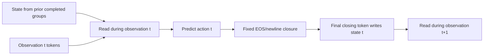

# R2R `val_unseen`: all evaluated StageVLN and SimpleMemVLN versions

Updated 2026-10-06 from the local StageVLN-v2 and SimpleMemVLN evaluation journals, checkpoint metadata, training reports, and per-action timing files. The completed-results table contains **24 full-split R2R evaluations**. It does not use training loss, smoke runs, or partial RxR runs as navigation scores. Raw artifacts remain local; this report is the consolidated interpretation.

## What is comparable

All completed R2R quality rows below were checked against the same set of **1,839 R2R-VLNCE `val_unseen` episode IDs**. The evaluation dataset gzip has SHA256 `1767a407e2c8a011fbb7abece76cd64c5b39ff9fa0e9e340ebdce5a490d167c3`; the Habitat config has SHA256 `dd20dd0e43e6dff3e552b63e9bc70c74062170c39352564758835c313bcf468f`. The Stage path and Janus path hold byte-identical dataset files; the scene directory used by Stage resolves to the Janus scene directory. Both evaluators use Habitat 0.2.4, 640×480 RGB at 79° HFOV, a 0.25 m forward action, 15° turns, a 3 m success radius, seed 42, and a 500-action cap with a forced final STOP when needed. SR and SPL are final Habitat episode metrics. Oracle success is proximity at **any** visited point; navigation error is final distance to goal.

This is a **checkpoint comparison**, not a controlled architectural ablation. Training data, schedules, history representation, prompts, output policy, and model runtimes differ. Stage executes an invalid generated action as STOP; SimpleMem records a failed episode as zero SR/SPL. Stage recorded zero invalid outputs in these full runs. Joint SimpleMem FullContext text epoch 1 and Window8 text epoch 2 each had one failed episode, retained in the denominator. No official R2R test-set result is claimed.

## Version and training dataset

| Family / version | Decision-time history and output | Training data and checkpoint status |
|---|---|---|
| Stage v0 Uniform4 | Four uniformly selected past RGB frames plus current; fresh Qwen text generation each action; no recurrent memory | R2R only, 10,819 episodes / 631,244 labeled states; one-epoch export |
| Stage v0 Uniform8 | Eight uniformly selected past frames plus current; fresh text generation; no recurrent memory | Same R2R corpus; independently trained one-epoch export |
| Stage v1 Sliding4 | Four immediately preceding frames plus current; fresh text generation; no recurrent memory | Same R2R corpus; independently trained one-epoch export |
| Stage v2 Memory64/R0, epochs 1–2 | Learned 64-slot recurrent memory; current frame only in reader; fresh text generation | Same R2R corpus; two successive exports from a five-epoch training schedule |
| Stage v3 Memory64/R4 | Learned 64-slot memory plus four recent frames and current; fresh text generation | Same R2R corpus; one-epoch export |
| Stage v3 memory disabled | Same v3 weights and Recent4 reader, with recurrent memory disabled **only at inference** | Same v3 checkpoint; inference ablation, not separately trained |
| SimpleMem `streaming` FullContext-B, epochs 1–3 | Persistent append-only full-context KV/GDN state; greedy canonical text action and generated action feedback | R2R only, 10,819 episodes / 631,244 actions; successive snapshots at steps 1,353 / 2,706 / 4,059 of one three-epoch schedule |
| SimpleMem `streaming` Window8-B, epoch 1 | Instruction prefix plus latest eight complete observation/feedback groups in full-attention KV; persistent GDN state; text actions | Same R2R-only corpus, independently initialized; completed epoch 1 at step 1,353 of a three-epoch schedule; later checkpoints were unavailable for this evaluation |
| SimpleMem `streaming` joint FullContext-B, epochs 1–2 | FullContext streaming with text actions | Joint R2R (10,819) + English RxR_15deg (19,996) = 30,815 training episodes / 3,128,624 actions; successive snapshots at steps 3,852 / 7,704 of one two-epoch schedule |
| SimpleMem `streaming_logits` joint candidate, epochs 1–2 | FullContext streaming; score only pretrained LM rows A/B/C/D, choose argmax, append fixed candidate-token feedback; no generated action text | Same joint R2R + English RxR_15deg corpus; successive snapshots at steps 3,852 / 7,704 of one two-epoch schedule |
| SimpleMem joint Window8-B text, epochs 1–2 | Eight complete observation/action groups retained in full-attention KV; persistent GDN; generated text actions | Same joint corpus; successive snapshots at steps 3,852/7,704 of a two-epoch schedule |
| SimpleMem `streaming_logits` joint Window8 candidate, epochs 1–2 | Four-way candidate logits; prefix plus eight observation/feedback groups in full-attention KV; persistent GDN; selected candidate token fed back | Same joint corpus; successive snapshots at updates 3,852 and 7,704 of a two-epoch schedule |
| SimpleMem `streaming_logits` joint FullContext candidate NoHistory, epoch 1 | Full visual context and persistent GDN; four-way candidate logits; no action-content feedback, only fixed assistant closure | Same joint corpus; completed **one-epoch** cosine schedule, update 3,852/3,852; 116 warmup updates, versus 232 for the two-epoch candidate models |
| SimpleMem `streaming_logits_dual` joint FullContext DualLane NoHistory FromBase, epochs 1–2 | NoHistory candidate policy plus trained parallel step lanes at layers 16/20/24/28; full visual KV and native GDN persist | Same joint corpus; initialized from Qwen3.5-4B base with fresh lanes; successive snapshots at updates 3,852/7,704; 232 warmup updates |
| SimpleMem `streaming_logits_dual` joint FullContext DualLane NoHistory Adapted, epochs 1–2 | Same inference contract and lane placement as FromBase | Same joint corpus; initialized from the completed FullContext candidate NoHistory parent with fresh lanes, then trained for two **additional** epochs; snapshots at adaptation updates 3,852/7,704; 116 warmup updates. The adaptation schedule was extended at update 100 with optimizer/scheduler/RNG state preserved |

The candidate labels map A/B/C/D to forward/left/right/STOP. Stage's explicit frame histories re-encode selected frames for each decision; SimpleMem streams each new observation into persistent state. The SimpleMem Window8 policy evicts old **full-attention KV groups**, while GDN state and logical positions continue across the episode. These implementations are therefore different even when two rows mention “8” or “4.”

The older Window8 narrative called step 1,353 “intermediate.” Its saved `trainer_state.json` records `epoch: 1.0, global_step: 1353`: it is the **completed first epoch**, while still being an intermediate checkpoint in the planned three-epoch schedule. No Window8 epoch-2/3 result is inferred from that file.

### Exact inference contracts for the new setups

The joint candidate and DualLane checkpoints use the pinned Qwen3.5-4B base revision `851bf6e806efd8d0a36b00ddf55e13ccb7b8cd0a`, frozen vision encoder during training, trainable language backbone/tied LM rows, four-way cross entropy without class weighting, backbone LR 5e-6, weight decay 0.01, and training seed 429. Global episode batch is eight. DualLane projections use LR 1e-4. Evaluation uses the checkpoint metadata without overriding its memory or feedback policy.

- **Window8 text:** autoregressively generates canonical action text; feeds the generated response back. Window8 counts the current observation among the eight retained groups.
- **Window8 candidate, epochs 1 and 2:** chooses argmax over A/B/C/D (`32/33/34/35`) and appends `[selected_id, 248046, 198]`. No action text is generated. Old observation/feedback groups are evicted together from full-attention KV; the instruction prefix stays.
- **FullContext candidate with action history:** same candidate decision/feedback contract, but all observation/feedback groups remain in full-attention KV.
- **FullContext candidate NoHistory:** chooses the same four-way action, then appends only `[248046, 198]` for every class. Neither canonical action text nor the selected candidate token is appended. **Visual history is retained.** This is not a stateless or current-frame-only policy.

All evaluated SimpleMem variants preserve advancing logical/MRoPE positions and FP32 native GDN recurrent state across observations, resetting at episode boundaries. DualLane adds four trained parallel lane states, also FP32, totaling 1 MiB per session. The lane reads during observation and writes once per layer after each decision, using the fixed no-history closure rather than an action token. Model weights and primary computation use BF16, while recurrent state and rotary calculations preserve FP32. STOP is a model decision; the evaluator forces STOP only at the 500-action cap and records that separately.

## Completed R2R quality

All rows are full-split results over 1,839 episodes. Success counts were recomputed from the journals; every journal has 1,839 distinct IDs matching the shared set.

| Policy | Successes | SR ↑ | SPL ↑ | NE ↓ | Oracle success ↑ | Invalid / failed |
|---|---:|---:|---:|---:|---:|---:|
| Stage v0 Uniform4 | 717 | 38.99% | 35.43% | 7.12 m | 51.28% | 0 invalid |
| Stage v0 Uniform8 | 807 | 43.88% | 39.12% | 6.44 m | 53.40% | 0 invalid |
| Stage v1 Sliding4 | 655 | 35.62% | 30.18% | 7.40 m | 49.86% | 0 invalid |
| Stage v2 Memory64/R0 epoch 1 | 280 | 15.23% | 13.95% | 8.63 m | 22.51% | 0 invalid |
| Stage v2 Memory64/R0 epoch 2 | 271 | 14.74% | 12.96% | 9.50 m | 26.43% | 0 invalid |
| Stage v3 Memory64/R4 | 595 | 32.35% | 27.83% | 7.63 m | 47.15% | 0 invalid |
| Stage v3, memory disabled | 594 | 32.30% | 28.06% | 7.52 m | 47.47% | 0 invalid |
| SimpleMem R2R-only FullContext-B epoch 1 | 789 | 42.90% | 39.30% | 6.60 m | 52.53% | 0 failed |
| SimpleMem R2R-only FullContext-B epoch 2 | 750 | 40.78% | 36.38% | 6.81 m | 53.67% | 0 failed |
| SimpleMem R2R-only FullContext-B epoch 3 | 761 | 41.38% | 37.50% | 6.75 m | 54.92% | 0 failed |
| SimpleMem R2R-only Window8-B epoch 1 | 756 | 41.11% | 36.86% | 6.71 m | 54.21% | 0 failed |
| SimpleMem joint FullContext-B text epoch 1 | 891 | 48.45% | 44.81% | 6.09 m | 56.12% | 1 failed |
| SimpleMem joint FullContext-B text epoch 2 | 916 | 49.81% | 45.40% | 5.99 m | 60.58% | 0 failed |
| SimpleMem joint FullContext candidate epoch 1 | 874 | 47.53% | 43.45% | 6.25 m | 56.17% | 0 failed |
| SimpleMem joint FullContext candidate epoch 2 | 882 | 47.96% | 44.01% | 6.26 m | 58.56% | 0 failed |
| SimpleMem joint Window8-B text epoch 1 | 907 | 49.32% | 45.56% | 6.04 m | 59.87% | 0 failed |
| SimpleMem joint Window8-B text epoch 2 | **960** | **52.20%** | **48.19%** | **5.68 m** | 59.98% | 1 failed |
| SimpleMem joint Window8 candidate epoch 1 | 862 | 46.87% | 42.96% | 6.48 m | 54.59% | 0 failed |
| SimpleMem joint Window8 candidate epoch 2 | 886 | 48.18% | 42.85% | 6.21 m | 57.53% | 0 failed |
| SimpleMem joint FullContext candidate NoHistory epoch 1 | 899 | 48.89% | 45.30% | 6.00 m | 57.53% | 0 failed |
| SimpleMem joint DualLane FromBase epoch 1 | 924 | 50.24% | 46.60% | 5.83 m | 57.21% | 0 failed |
| SimpleMem joint DualLane FromBase epoch 2 | 902 | 49.05% | 44.75% | 6.32 m | 59.76% | 0 failed |
| SimpleMem joint DualLane Adapted epoch 1 | 802 | 43.61% | 38.97% | 6.75 m | 57.69% | 0 failed |
| SimpleMem joint DualLane Adapted epoch 2 | 806 | 43.83% | 39.23% | 6.58 m | 57.15% | 0 failed |

The highest observed SR is **joint Window8 text epoch 2: 960/1,839 = 52.20%**, with 48.19% SPL. DualLane FromBase epoch 1 is next by SR at 50.24%. Stage v3 with memory disabled differs from enabled v3 by only one success; that single inference toggle does not support a claim that memory improved this trained policy. The R2R-only FullContext epoch-1 snapshot is the best of its three R2R-only epochs; training longer did not improve this validation SR. One failed episode in each of joint FullContext text epoch 1 and Window8 text epoch 2 remains in the 1,839-episode denominator with zero SR/SPL.

### What the completed comparisons support

- **NoHistory versus FullContext candidate with action history:** 899 versus 874 successes at epoch 1 (**+1.36 percentage points SR**, +1.85 points SPL), and 899 versus 882 at epoch 2 (**+0.92 points SR**, +1.29 points SPL). Deltas are computed from unrounded metrics; subtracting displayed rounded SR values can give 0.93 instead of 0.92. NoHistory has the higher measured full-split SR, but this does not isolate a causal benefit of removing action tokens: its one-epoch schedule ends at update 3,852, while the with-history epoch-1 checkpoint is halfway through a two-epoch schedule. There are no repeated training seeds or significance claims here.
- **Joint Window8 text:** epoch 2 improves on epoch 1 from 907 to 960 successes (**+2.88 points SR**) and is 44 successes above joint FullContext text epoch 2 (**+2.39 points SR**). This is a comparison of trained checkpoints, not an isolated effect of limiting KV history.
- **Joint Window8 candidate versus FullContext candidate, epoch 1:** 862 versus 874 successes, **−0.65 points SR**. Window8 candidate versus Window8 text is **−2.45 points SR** (862 versus 907), across independently trained output policies.
- **Joint Window8 candidate epoch 2:** 886 versus 862 successes at epoch 1 (**+1.31 points SR**); SPL falls slightly from 42.96% to 42.85%. Window8 text epoch 2 exceeds candidate epoch 2 by 74 successes (**+4.02 points SR**), across separately trained output policies.
- **DualLane FromBase:** epoch 1 has 924 successes, versus 902 at epoch 2 (**−1.20 points SR** after the second epoch). Its epoch-1 SR is 25 successes above the separate NoHistory parent (**+1.36 points**), but the weights were initialized from Qwen base and trained on a different schedule; this is not the causal effect of adding lanes.
- **DualLane Adapted:** epoch 2 has 806 successes, four more than epoch 1 (**+0.22 points SR**). Both are below the NoHistory parent (899 successes). Adapted includes two additional training epochs from that parent, so the comparison does not isolate lane utility. The adapted and FromBase runs also differ in initialization and warmup schedule.

| Completed joint policy | Model-predicted STOP episodes | Forced STOP at cap | Mean actions/episode |
|---|---:|---:|---:|
| FullContext candidate epoch 1 | 1676 | 163 | 102.51 |
| FullContext candidate epoch 2 | 1687 | 152 | 99.18 |
| SimpleMem joint Window8-B text epoch 1 | 1627 | 212 | 115.39 |
| SimpleMem joint Window8 candidate epoch 1 | 1654 | 185 | 107.21 |
| SimpleMem joint FullContext candidate NoHistory epoch 1 | 1708 | 131 | 92.09 |
| SimpleMem joint Window8-B text epoch 2 | 1734 | 104 | 89.44 |
| SimpleMem joint Window8 candidate epoch 2 | 1671 | 168 | 105.40 |
| SimpleMem joint DualLane FromBase epoch 1 | 1709 | 130 | 90.32 |
| SimpleMem joint DualLane FromBase epoch 2 | 1714 | 125 | 93.64 |
| SimpleMem joint DualLane Adapted epoch 1 | 1678 | 161 | 107.55 |
| SimpleMem joint DualLane Adapted epoch 2 | 1675 | 164 | 103.84 |

The Window8 text epoch-2 row has one invalid response/failure, so its predicted and forced STOP counts sum to 1,838. All other rows in this STOP table have zero evaluation failures. Forced STOP is part of the shared protocol, not a model-predicted STOP or an evaluation failure.

## Controlled inference speed

Each row below uses one model process at a time on the same 96 GiB NVIDIA Blackwell GPU (compute capability 12.0), BF16, Torch 2.10.0+cu129 for SimpleMem, four CPU threads and the expandable CUDA allocator. The input is the **same real 640×480 Habitat RGB frame**, SHA256 `e69cf147c19881da0e08cc69fe0204dc5de0f13fce8579eae5ecd78850558e27`, and the same instruction: “Walk into the living room and keep walking straight past the living room. Then walk into the entrance under the balcony. Wait in the entrance to the other room.” Each short probe resets once, receives 16 untimed warmup observations, then receives **64 timed repeated-frame observations** while accumulating its **own** history. CUDA is synchronized around each full decision. The measured boundary includes preprocessing, vision, memory/history work, language computation and action decoding or selection. It excludes loading, reset, Habitat simulation and cross-process IPC. No gold action history is supplied. All measured decisions were valid.

The October 5 refresh paused the only active R2R rollout at a committed episode boundary and verified that no model compute processes remained before benchmarking. Each probe ran in its own process, one model at a time; the rollout was then resumed from its journal. Its three new candidate rows pool **three independent 16-warmup + 64-measured-action runs** (192 timed actions per row). Other older rows retain their saved isolated measurements. On October 6, after all R2R evaluations finished, a new sequential session measured the NoHistory parent, all four trained DualLane exports, and Window8 text epochs 1/2 twice each (128 timed actions per row, pooled without selecting the faster repetition). Three unrelated service processes retained about 33 GiB of GPU memory at the initial check; GPU utilization was 0% then, but continuous absence of interference was not established. The repeated parent control was stable at 63.88/63.99 ms. October 5 and October 6 figures share the workload and GPU but are separate sessions; small cross-session differences are not meaningful.

| Policy | Median ms/action ↓ | Mean | p95 | Generated tokens/action |
|---|---:|---:|---:|---:|
| Stage v0 Uniform4 | 236.81 | 238.22 | 247.99 | 3 |
| Stage v0 Uniform8 | 351.79 | 352.95 | 366.41 | 3 |
| Stage v1 Sliding4 | 237.98 | 238.04 | 238.50 | 3 |
| Stage v2 Memory64/R0 epoch 1 | 145.18 | 145.17 | 145.55 | 3 |
| Stage v2 Memory64/R0 epoch 2 | 145.24 | 145.27 | 145.69 | 3 |
| Stage v3 Memory64/R4 | 242.05 | 242.06 | 242.58 | 3 |
| Stage v3, memory disabled | 236.75 | 236.80 | 237.27 | 3 |
| SimpleMem R2R-only FullContext-B epoch 1 | 91.88 | 92.11 | 95.25 | 3 |
| SimpleMem R2R-only FullContext-B epoch 2 | 94.39 | 94.12 | 97.29 | 3 |
| SimpleMem R2R-only FullContext-B epoch 3 | 96.50 | 95.38 | 101.44 | 3 |
| SimpleMem R2R-only Window8-B epoch 1 | 84.57 | 84.67 | 85.28 | 3 |
| SimpleMem joint FullContext-B text epoch 1 | 95.55 | 95.44 | 98.38 | 3 |
| SimpleMem joint FullContext-B text epoch 2 | 94.69 | 94.58 | 97.18 | 3 |
| SimpleMem joint FullContext candidate epoch 1 | 63.57 | 63.45 | 65.20 | 0 |
| SimpleMem joint FullContext candidate epoch 2 | 63.14 | 63.02 | 64.90 | 0 |
| SimpleMem joint Window8-B text epoch 1 | 84.31 | 85.72 | 91.21 | 3 |
| SimpleMem joint Window8-B text epoch 2 (Oct 6 pooled) | 84.34 | 85.28 | 91.88 | 3 |
| SimpleMem joint Window8 candidate epoch 1 | 57.09 | 57.15 | 57.52 | 0 |
| SimpleMem joint Window8 candidate epoch 2 | 57.63 | 58.99 | 61.18 | 0 |
| SimpleMem joint FullContext candidate NoHistory epoch 1 | 62.75 | 62.79 | 67.36 | 0 |
| SimpleMem joint DualLane FromBase epoch 1 (Oct 6 pooled) | 72.67 | 72.17 | 75.94 | 0 |
| SimpleMem joint DualLane FromBase epoch 2 (Oct 6 pooled) | 71.90 | 71.66 | 73.73 | 0 |
| SimpleMem joint DualLane Adapted epoch 1 (Oct 6 pooled) | 72.22 | 71.77 | 74.07 | 0 |
| SimpleMem joint DualLane Adapted epoch 2 (Oct 6 pooled) | 72.15 | 72.10 | 74.44 | 0 |

The matched **joint** epoch-1 candidate is 1.50× faster at the median than joint epoch-1 FullContext text (63.57 versus 95.55 ms/action). Its four-row logit projection alone averages about 0.046 ms, but the image encoder, language append and deterministic feedback append still run. On October 6, the NoHistory parent control pooled median was **63.99 ms/action**; the four trained DualLane exports were **71.90–72.67 ms/action**, about **7.91–8.68 ms/action** slower on the matched short workload. This is whole-policy serving latency, not an isolated causal measurement of the output head or lanes. Stage uses Transformers 5.3.0 and fresh reader generation; SimpleMem uses Transformers 5.11.0 and persistent streaming. Their per-action figures describe these implementations on this machine and should not be labeled architecture-only speedups.

FullContext latency rises with history length. In a separate 500-measured-action repeated-frame replay after the same 16 warmups:

| Policy | Median ms/action | p95 | Last 100-action bucket median |
|---|---:|---:|---:|
| SimpleMem R2R-only FullContext-B epoch 1 | 120.44 | 157.04 | 152.81 |
| SimpleMem R2R-only Window8-B epoch 1 | 84.36 | 90.25 | 84.62 |
| SimpleMem joint FullContext-B text epoch 1 | 120.47 | 156.07 | 152.53 |
| SimpleMem joint FullContext candidate epoch 1 | 83.53 | 108.98 | 105.74 |
| SimpleMem joint FullContext candidate epoch 2 | 86.08 | 108.71 | 107.23 |
| SimpleMem joint Window8-B text epoch 1 | 85.00 | 91.65 | 85.09 |
| SimpleMem joint Window8 candidate epoch 1 | 57.44 | 60.52 | 57.27 |
| SimpleMem joint Window8 candidate epoch 2 | 57.54 | 60.73 | 57.68 |
| SimpleMem joint FullContext candidate NoHistory epoch 1 | 84.63 | 111.20 | 108.18 |
| SimpleMem joint FullContext NoHistory epoch 1 (Oct 6 control) | 84.42 | 110.31 | 107.16 |
| SimpleMem joint DualLane FromBase epoch 1 (Oct 6) | 93.17 | 118.60 | 115.92 |
| SimpleMem joint DualLane FromBase epoch 2 (Oct 6) | 93.22 | 120.22 | 117.15 |
| SimpleMem joint DualLane Adapted epoch 1 (Oct 6) | 93.42 | 119.21 | 115.99 |
| SimpleMem joint DualLane Adapted epoch 2 (Oct 6) | 93.81 | 119.59 | 116.62 |
| SimpleMem joint Window8-B text epoch 1 (Oct 6 control) | 84.83 | 92.03 | 84.73 |
| SimpleMem joint Window8-B text epoch 2 (Oct 6) | 84.60 | 91.48 | 84.62 |

The historical Window8 and FullContext candidate rows are different checkpoints and training policies. FullContext KV grows; Window8 bounds full-attention KV, explaining its flatter long-horizon timing. October 6 Window8 text epochs 1/2 retained 2,618 KV tokens; all four DualLane exports and the NoHistory parent retained 164,702 at 516 total steps. Three older clean 64-action repetitions for joint Window8 text had medians **90.79, 88.29, and 84.22 ms**. The October 6 matched repetitions were **84.35/84.50 ms** for epoch 1 and **84.43/84.30 ms** for epoch 2. This historical spread matters when comparing small speed differences. These repeated-frame runs are latency probes, **not navigation rollouts or SR measurements**. Stage variants do not have a matched 500-action probe here.

### Repeat spread and recorded rollout latency

Independent short-run medians, in ms/action:

| Newly measured policy | Repetition 1 / 2 / 3 |
|---|---:|
| SimpleMem joint Window8 candidate epoch 1 | 56.95 / 57.09 / 57.31 |
| SimpleMem joint Window8 candidate epoch 2 | 60.80 / 57.27 / 60.25 |
| SimpleMem joint FullContext candidate NoHistory epoch 1 | 62.16 / 62.15 / 63.40 |

October 6 independent short-run medians, in ms/action. The short results above pool all 128 actions for each DualLane row; pooling is not the average of the two displayed medians.

| Policy | Repetition 1 / 2 | Pooled median / mean / p95 |
|---|---:|---:|
| FullContext NoHistory parent epoch 1 | 63.88 / 63.99 | 63.99 / 64.15 / 68.00 |
| DualLane FromBase epoch 1 | 74.03 / 70.23 | 72.67 / 72.17 / 75.94 |
| DualLane FromBase epoch 2 | 72.44 / 70.94 | 71.90 / 71.66 / 73.73 |
| DualLane Adapted epoch 1 | 70.55 / 72.96 | 72.22 / 71.77 / 74.07 |
| DualLane Adapted epoch 2 | 72.88 / 71.68 | 72.15 / 72.10 / 74.44 |
| Window8 text epoch 1 control | 84.35 / 84.50 | 84.42 / 84.79 / 86.49 |
| Window8 text epoch 2 | 84.43 / 84.30 | 84.34 / 85.28 / 91.88 |

With the refreshed controls, Window8 candidate epoch 1 is **1.48×** faster than Window8 text on this short probe. NoHistory's short-run median is close to the FullContext candidate controls; these few repeats do not establish a general speed advantage. On the 500-action probe, FullContext NoHistory latency grows with KV history, while Window8 remains approximately flat. Checkpoint quality and inference speed remain separate measurements.

Completed-rollout model latencies were recorded under changing GPU contention and actual, variable-length trajectories. They are provided for operational context only and **must not be used as controlled speed comparisons**:

| Completed policy | Model p50 / mean / p95 ms/action | Model + IPC p50 ms/action | Peak retained KV tokens |
|---|---:|---:|---:|
| Joint Window8 text epoch 1 | 203.58 / 184.79 / 291.41 | 209.72 | 2,718 |
| Joint Window8 candidate epoch 1 | 178.93 / 179.44 / 234.93 | 184.98 | 2,758 |
| Joint FullContext NoHistory epoch 1 | 200.00 / 205.01 / 297.62 | 206.17 | 159,648 |
| Joint Window8 text epoch 2 | 162.37 / 173.93 / 234.38 | 168.47 | 2,718 |
| Joint Window8 candidate epoch 2 | 167.48 / 158.15 / 234.68 | 173.69 | 2,758 |
| Joint DualLane FromBase epoch 1 | 221.66 / 249.55 / 448.33 | 227.65 | 159,648 |
| Joint DualLane FromBase epoch 2 | 144.09 / 151.46 / 203.31 | 150.14 | 159,648 |
| Joint DualLane Adapted epoch 1 | 182.27 / 234.63 / 443.58 | 188.33 | 159,647 |
| Joint DualLane Adapted epoch 2 | 135.21 / 128.83 / 186.80 | 141.29 | 159,636 |

October 5 raw measurements and exact commands are in `artifacts/inference_speed/refresh-20261005/` (`manifest.json`, 15 measurement JSONs and their logs). Each new candidate has `*-64-r{1,2,3}.json` and `*-500-r1.json`; the controls have `*-64-r1.json`. All 15 probes completed with valid decisions. The 500-action measurements each use a separate reset and 16 warmup observations; they are not pooled with the short runs.

October 6 measurements and exact commands are in `artifacts/inference_speed/dual-20261006/`: `manifest.json`, **21 measurement JSONs**, and their logs. They cover ten short parent/DualLane probes, five separate 500-action parent/DualLane probes, four short Window8-text probes, and two separate 500-action Window8-text probes. The first five short probes run parent, FromBase 1/2, Adapted 1/2; repetition 2 reverses that order, ending with the parent control. All 21 exited successfully and every recorded decision was valid. Long probes have one repetition each; no broad serving percentile or statistical significance is claimed.

## Unfinished or unmeasured variants

- Joint text-policy RxR_15deg evaluations are **partial**: epoch 1 stopped at 803/3,669 (43.21% partial SR), and epoch 2 stopped at 278/3,669 (40.29% partial SR, one failure). These are excluded from the R2R quality table and are not final RxR scores.
- Window8 text epochs 1/2, Window8 candidate epochs 1/2, FullContext NoHistory epoch 1, and DualLane FromBase/Adapted epochs 1/2 are **complete** and included above. The server's fresh zero-output-lane timing in `DUAL_LANE_IMPLEMENTATION_2026-10-04.md` uses a different 17-observation fixture and hardware context; its 84.225/98.125 ms medians are not pooled with the trained-checkpoint Blackwell probes here.
- Candidate controls (`canonical_action_text` feedback, frozen LM rows, copied linear head, square-root/effective-number class weights) are implemented configurations, not completed full-training and Habitat-evaluation rows. No SR or speed is imputed to them.

## Evaluation status

At **2026-10-06 19:19 Asia/Ho_Chi_Minh**, all 24 R2R rows in this report were complete. Each has 1,839 distinct official episode IDs. Success counts, SR/SPL, failures and the new speed probes were checked from local artifacts; no partial R2R score is used in the ranking. The two stopped RxR runs remain partial and are listed separately above.

## Evidence and limits

Candidate FullContext epoch 2 came from immutable Hub revision `a283921eb72713cee1a591febe8e1db4f5c0337b`; all eight epoch-2 SHA256 manifest entries passed. Its completed journal has 1,839 unique episode IDs, the same order, source hashes, dataset and Habitat configuration as candidate epoch 1; only checkpoint path and weight hash differ. The full Stage summaries and journals are under `StageVLN-v2/evaluation/r2r_v*/`; SimpleMem summaries, journals, contracts and runtime metadata are under `SimpleMemVLN/artifacts/evaluation/`. The controlled per-action JSON files are under `SimpleMemVLN/artifacts/inference_speed/`. The earlier Stage v0 Uniform4/v2/v3 timings were measured with their exported policy sessions and the same 16+64 timing boundary; clean repeat files for Uniform8 and Sliding4 were used after an overlapping-GPU run was discarded. SimpleMem timings use `scripts/vln/benchmark_inference.py`. The raw evaluation and timing artifacts are local and are **not** included in this Git repository.

Earlier SimpleMem evaluation, speed, and training reports are preserved under `reports/archive/` on the `streaming` and `streaming_logits` branches. The StageVLN-v2 `v2_r2r_evaluation.md` and checkpoint training metadata provide the Stage provenance. Those older reports describe their own observation dates; the completed rows above were checked from the current local artifacts.

### New checkpoint and execution provenance

| Setup | Hugging Face repository under `anhdao69/` | Immutable download revision | Evaluated checkpoint / local journal |
|---|---|---|---|
| Joint Window8 text | `SimpleMemVLN-R2R-RxR15deg-Window8-B` | `3c17fdd7519742d4510fb1e2f6c3151a2bb9ae67` | `epoch-1`; `window8-rxr15-text-r2r/epoch-1` |
| Joint Window8 text | `SimpleMemVLN-R2R-RxR15deg-Window8-B` | `0a111c781477440d45afef600f3b79c340416d9f` | `epoch-2`; `window8-rxr15-text-r2r/epoch-2` |
| Joint Window8 candidate | `SimpleMemVLN-R2R-RxR15deg-Window8-CandidateLogits` | `04d3b2264a532a8ad7f778a3e23391fa12f6c98f` | `epoch-1`; `window8-candidate-r2r/epoch-1` |
| Joint Window8 candidate | `SimpleMemVLN-R2R-RxR15deg-Window8-CandidateLogits` | `4e1b922fb7d243a01170d963d4b675a0483bab72` | `epoch-2`; `window8-candidate-r2r/epoch-2` |
| Joint FullContext candidate NoHistory | `SimpleMemVLN-R2R-RxR15deg-FullContext-CandidateLogits-NoHistory` | `40de30d7febd215849f6bf56679eb1a11a47a073` | `epoch-1`; `fullcontext-candidate-nohistory-r2r/epoch-1` |
| Joint DualLane FromBase | `SimpleMemVLN-R2R-RxR15deg-FullContext-DualLane-NoHistory-FromBase` | `394847e9072106ee08abc052812c98b972aa6bf7` | `epoch-1`; `duallane-nohistory-frombase-r2r/epoch-1` |
| Joint DualLane FromBase | `SimpleMemVLN-R2R-RxR15deg-FullContext-DualLane-NoHistory-FromBase` | `1f36ade02b4036d33af7793599d43ea16ce45675` | `epoch-2`; `duallane-nohistory-frombase-r2r/epoch-2` |
| Joint DualLane Adapted | `SimpleMemVLN-R2R-RxR15deg-FullContext-DualLane-NoHistory-Adapted` | `6036f64ead4164731d02351ea0ccd9b5d3b67dba` | `epoch-1`; `duallane-nohistory-adapted-r2r/epoch-1` |
| Joint DualLane Adapted | `SimpleMemVLN-R2R-RxR15deg-FullContext-DualLane-NoHistory-Adapted` | `e7e4d3dc7357d34e78646827fd9556240131899c` | `epoch-2`; `duallane-nohistory-adapted-r2r/epoch-2` |

All downloaded manifest entries needed for each evaluation were verified before launch. Each completed R2R journal contains the same 1,839 distinct official episode IDs. The newer SimpleMem contracts match the dataset and Habitat config hashes above, seed 42, 500-action cap, zero-SR/SPL failure policy, and lossless transport. The earlier candidate evaluations use source commit `9786b15a9889712caee8bf9ab16a523a3b5b546d`, based on `streaming_logits` commit `f194e238aa9cab5d8271791a62630cdb9376d7cf`; its validation suite passed 115 tests with four GPU/training-specific tests skipped, followed by real-checkpoint Habitat smoke tests. Candidate epoch-1/2 Window8 evaluation contracts match except for checkpoint path and weight hash.

The four DualLane runs and October 6 timing session use evaluation source commit `c30489bf55678d425c64ea2c9739cf4f9b2e9508` in the local `eval_dual_variants_20261005` worktree based on `streaming_logits_dual`. The native strict loader, lane implementation, and no-history serializer are retained. Within each DualLane training path, epoch-1 and epoch-2 `navigation.json` are equal; trainer state records epochs 1.0/2.0 and updates 3,852/7,704 of 7,704. Each export passed `scripts/vln/check_dual_evaluation.py` and a two-episode Habitat smoke before its full run: trained lane projections and observation outputs are nonzero, FP32 sidecars total 1 MiB, one write per selected layer follows each decision, retries preserve state, episode reset clears state, and four-step offline/stream scores pass the declared numerical gate with all four argmax actions matching. These fixtures establish tested runtime behavior; the full closed-loop journals supply SR/SPL.

The older DualLane implementation report described an initially requested one-pass adaptation. The published Adapted checkpoint metadata supersedes that schedule description: training was extended to two adaptation epochs at update 100, retaining 116 warmup updates. Adapted therefore has the parent's completed joint pass plus two adaptation passes; FromBase has two passes from Qwen base. Their validation differences cannot be attributed only to initialization or lane design.

Weight SHA256 values:

- Joint Window8 text epoch 1: `e5c81d168326d59e6b48321fbd73da713b280a92dc2fcd0865e15aa8382f281e`.
- Joint Window8 text epoch 2: `4391b1f697616e2f003c0afbfed5f85327e4c2986d8922f73cd1a556bbf6dbcf`.
- Joint Window8 candidate epoch 1: `4f481c576ae0253679820bec257238cda75c72a1dfcb25c9c0bab880ed3f6605`.
- Joint Window8 candidate epoch 2: `fb5aec690ddb6419ad5656efa2c36bdefdb933c086683280dc0c91712fe894d1`.
- Joint FullContext candidate NoHistory epoch 1: `6d492d012a872193adefb002057ea4c4e42a28301ffae1d1177c200e6a8b136d`.
- Joint DualLane FromBase epoch 1: `b369b9c994a59f23ad055e60c0417febcb3b2075f59135c7b9d17c646a248cd9`.
- Joint DualLane FromBase epoch 2: `5243a1a61ac64929e78f94f79300f36a6f0a46c4de90f928aba2609d6c8afc96`.
- Joint DualLane Adapted epoch 1: `7e2e6d97678b9f93b976608756bcb31294bd8d111a43c27347ad395e97ece183`.
- Joint DualLane Adapted epoch 2: `9c857eda5cd929cfc4735026add1bdf10d1bf6d6e16b0223af3d1194d002265e`.

## Consolidated branch and run records
Consolidated 2026-10-06. The retained branches are `main`, `streaming`, `streaming_logits`, and `streaming_logits_dual`. Every auxiliary branch listed below is already an ancestor of its retained branch, so its commits and evaluation code remain reachable after the auxiliary branch name is removed. The same consolidated report is published on all four retained branches.
| Auxiliary branch | Preserved commit | Retained branch | Work recorded |
|---|---|---|---|
| `eval_candidate_variants_20261004` | [`9786b15`](https://github.com/anhdao69/SimpleMemVLN/commit/9786b15a9889712caee8bf9ab16a523a3b5b546d) | `streaming_logits` | Add resumable R2R evaluation for candidate logits and no-history checkpoints |
| `eval_dual_variants_20261005` | [`c30489b`](https://github.com/anhdao69/SimpleMemVLN/commit/c30489bf55678d425c64ea2c9739cf4f9b2e9508) | `streaming_logits_dual` | Add verified R2R evaluation and lifecycle audit for trained dual-lane policies |
| `report_all_results_logits` | [`f194e23`](https://github.com/anhdao69/SimpleMemVLN/commit/f194e238aa9cab5d8271791a62630cdb9376d7cf) | `streaming_logits` | Update R2R results and archive supporting reports |
| `report_all_results_main` | [`b78bdf5`](https://github.com/anhdao69/SimpleMemVLN/commit/b78bdf50c04069fadb15b2ec0e5d6fda04895ccc) | `main` | Update R2R results, setup contracts, and isolated inference speeds |
| `report_all_results_streaming` | [`997864c`](https://github.com/anhdao69/SimpleMemVLN/commit/997864c44845db903b4fb1093357c974ae128ea0) | `streaming` | Update R2R results and archive supporting reports |
| `report_refresh_streaming_20261005` | [`7f1cdda`](https://github.com/anhdao69/SimpleMemVLN/commit/7f1cddacc3c67297456d2037d0e251ff254051d1) | `streaming` | Update R2R results, setup contracts, and isolated inference speeds |
| `report_refresh_streaming_logits_20261005` | [`34ee70d`](https://github.com/anhdao69/SimpleMemVLN/commit/34ee70db57a43166bb48e1f990cb2cf0ebd8bcfc) | `streaming_logits` | Update R2R results, setup contracts, and isolated inference speeds |
| `report_refresh_streaming_logits_dual_20261005` | [`ac85ecf`](https://github.com/anhdao69/SimpleMemVLN/commit/ac85ecfdbdb8467fec7f5f12e85b78ff73f021a4) | `streaming_logits_dual` | Update R2R results, setup contracts, and isolated inference speeds |

### Historical run records
The following records preserve the earlier training campaigns, submissions, smoke tests, failed resource gates, checkpoint/recovery checks, evaluation launches, and latency probes in this single file. They are dated snapshots: statements such as “pending,” “not yet evaluated,” and the original one-pass dual-lane schedule describe the observation date of that record. The completed-results table, evaluation status, and checkpoint provenance above describe the latest consolidated results. Smoke losses and historical timing fixtures remain separate from full-split navigation scores.
| Historical record | Scope |
|---|---|
| [Record 1: `DUAL_LANE_IMPLEMENTATION_2026-10-04.md`](#historical-record-1) | Lane implementation, real-model/resource/recovery qualifications, timing, and original adaptation launch |
| [Record 2: `STEP_LANE_PREFLIGHT_2026-10-04.json`](#historical-record-2) | Machine-readable dual-lane preflight evidence |
| [Record 3: `CANDIDATE_JOINT_FULL_SUBMISSION_2026-10-02.md`](#historical-record-3) | Job 4623 recipe, three-update smoke, token admission, and required production gates |
| [Record 4: `CANDIDATE_LOGITS_DESIGN.md`](#historical-record-4) | Candidate-policy experimental contracts and planned controls |
| [Record 5: `CANDIDATE_LOGITS_IMPLEMENTATION_2026-10-02.md`](#historical-record-5) | Four memory/feedback integration fixtures, distributed smoke/reload, diagnostics, and matched H100 timing |
| [Record 6: `CANDIDATE_LOGITS_PROGRESS.md`](#historical-record-6) | Implementation and validation ledger, including limits and historical test counts |
| [Record 7: `CANDIDATE_R2R_EVALUATION_2026-10-03.md`](#historical-record-7) | Candidate FullContext epoch-1 smoke and completed 1,839-episode evaluation |
| [Record 8: `CANDIDATE_WINDOW8_SUBMISSION_2026-10-03.md`](#historical-record-8) | Job 4649 recipe, dependency on 4623, and required Window8 resource/recovery gates |
| [Record 9: `H100_R2R_SMOKE_2026-09-28.md`](#historical-record-9) | Native streaming implementation, A/B training smokes, resource profiles, numerical gates, and 500-step serving checks |
| [Record 10: `R2R_B_3EPOCH_CAMPAIGN.md`](#historical-record-10) | R2R-only FullContext/Window8 three-epoch recipes, submission gates, reports, and checkpoint publication |
| [Record 11: `R2R_EVALUATION_2026-09-29.md`](#historical-record-11) | FullContext-B checkpoint verification, Habitat smokes, raw RGB transport, parallel horizon checks, and full evaluation launch |
| [Record 12: `R2R_INFERENCE_SPEED_2026-09-30.md`](#historical-record-12) | Matched Stage/SimpleMem short probes and 500-action FullContext/Window8 timing |
| [Record 13: `R2R_RXR15_B_2EPOCH_CAMPAIGN.md`](#historical-record-13) | Joint text-policy memory failure, activation-offload gate, timing sample, and job 4544 submission |
| [Record 14: `R2R_VAL_UNSEEN_RESULTS_2026-10-01.md`](#historical-record-14) | Earlier completed R2R quality comparison and evaluation provenance |
| [Record 15: `WINDOW8_TEXT_2GPU_CHANGE_2026-10-02.md`](#historical-record-15) | Jobs 4595/4624/4625/4643, CUDA/host-memory failures, reporting failure, corrected callback, and resubmission |

<a id="historical-record-1"></a>

<details>
<summary>Record 1: DUAL_LANE_IMPLEMENTATION_2026-10-04.md</summary>

Source: [reports/DUAL_LANE_IMPLEMENTATION_2026-10-04.md](https://github.com/anhdao69/SimpleMemVLN/blob/2ca0410ef8b5d61472304c95cc374c45a2f9a87e/reports/DUAL_LANE_IMPLEMENTATION_2026-10-04.md), preserved from commit `2ca0410ef8b5d61472304c95cc374c45a2f9a87e`.

# Parallel step lane implementation report — 2026-10-04

The implementation at source commit `3c8f580` passes the pinned GPU/tokenizer suite, real-model FullContext and Window8 numerical gates, sequential-session isolation, distributed smoke, trained-model reload, matched latency, and the tested FullContext/Window8 longest profiles and mixed-tail staging. The requested production experiment is **one additional joint R2R+RxR pass from the trained no-history FullContext parent: 30,815 episodes, 3,852 updates, and 116 warmup updates**.

**Exact checkpoint restoration is verified; continuation is not bitwise reproducible.** The final FullContext/no-history joint run is running in allocation 4652, step 4652.29, from a read-only source snapshot. At 2026-10-04 15:05:51 UTC, all four ranks had completed 13 of 3,852 updates; this report does not claim the training pass is finished. Numerical correctness, measured resource fit, and eventual navigation benefit are separate claims.

This report distinguishes committed behavior, measured execution, numerical qualifications, and future research. Evidence files are stored under `.superpowers/sdd/implementation_plan_dual_lane/remote-evidence/` locally and `/mnt/data/vmo-ai-task/anhdh35/SimpleMemVLN-streaming_logits_dual-evidence` on the server. That local directory is ignored by Git; the report records the relevant values so these findings do not depend on accidentally publishing transient files.

## 1. Objective and scope

The question is whether an already trained streaming navigation policy benefits from a small associative state that is read at token rate and modified once per completed observation/feedback group. The additional state complements the existing Qwen gated delta network (GDN). Token-rate native updates can be useful; the implementation does not diagnose native heads as defective, force slow state to represent landmarks, or claim novelty from two clocks alone.

The host is the pinned Qwen3.5-4B SimpleMemVLN wrapper. Supported outputs are `qwen_text` and `candidate_logits`. Classification is rejected for lane v1 because its serialization has no post-decision closing block. There are no extra tokens, summary placeholders, lane convolutions, pose inputs, auxiliary labels, teacher models, or additional losses. Vision remains frozen. The experimental objective is the existing navigation loss with complete-episode backpropagation. The user-confirmed final pilot is ONE additional joint R2R+RxR pass from the trained no-history FullContext parent; this explicitly supersedes the earlier R2R-only proposal.

The preferred bounded study requires a genuinely trained matching Window8 parent. The inspected available parent is FullContext no-history candidate policy. The code supports Window8, but that support cannot turn this parent into a trained Window8 policy. A FullContext experiment must retain its separate visibility and memory claim.

## 2. Recorded parent and isolated server baseline

`reports/STEP_LANE_PREFLIGHT_2026-10-04.json` records baseline source `f194e23` and the completed parent at:

`/mnt/data/vmo-ai-task/anhdh35/SimpleMemVLN/outputs/nohistory_joint_epoch1_20261003-6Ajh9c/train/final`.

Its contract uses `candidate_logits`, `lm_rows_trainable`, feedback `none`, no appended action content, serializer `vln_candidate_logits_no_action_history_v1`, FullContext, and FlashAttention2. The backbone revision is `851bf6e806efd8d0a36b00ddf55e13ccb7b8cd0a`. The saved recipe describes one completed joint data pass, nominal global batch eight, four-rank accumulation two, 3,852 updates, and 116 warmup updates. Final adaptation now also declares one additional joint pass, independently initialized lanes and fresh optimizer/scheduler; it does not resume the parent optimizer.

The parent navigation hash is `d2a510c50d3b148987371ba6d1f61271c5e32d3b875778363616f020fd7c7b75`; its `pytorch_model.bin` hash is `6d492d012a872193adefb002057ea4c4e42a28301ffae1d1177c200e6a8b136d`. The R2R manifest hash is `a0eba63ad454d0ec11c7dd063f024cb4b6c47ad5ec9e08ba92528e3f45b98e48`; the joint manifest hash is `5deb425d2594ce96931dd6ce12bd6084b066cd44f04808c1dd3ee2e4b3672933`.

The read-only parent inspection and baseline used a separate server allocation: job 4652 on worker-3, four H100 80GB GPUs, and 480 GiB host memory. Jobs 4643 and 4649 are explicitly listed as protected. This baseline belongs to the isolated SSH/server workflow; it is not authorization to cancel jobs or modify a running campaign. The preflight JSON records successful parent reload, CPU baseline 93 passed/12 skipped, and GPU baseline 105 passed/0 skipped. It does not establish final lane integration or resource success.

Production versions are Python 3.12.13, Torch 2.10.0+cu129, Transformers 5.11.0, FLA/FLA-core 0.5.2, FlashAttention 2.8.3 for CUDA 12.9/Torch 2.10, DeepSpeed 0.16.4, and Accelerate 1.13.0. Local tests use a separate Torch 2.14.1 CPU environment. Numerical release evidence must come from the pinned production environment.

## 3. Attachment and parameter namespace

Each selected zero-based decoder layer 16, 20, 24, and 28 receives an independent `step_lane` child on its existing `linear_attn` object. Configuration checks verify actual linear-attention layer types and hidden width 2560. Under the pinned repeating `[L,L,L,F]` layout, layer 15 is full attention; layer 16 follows it.

Let `h` be decoder input and `x=existing_input_layernorm(h)`. The retained decoder computation is:

\[
 y_N=\operatorname{native\_linear\_attn}(x),\qquad
 y_L=\operatorname{step\_lane}(x),\qquad
 z=h+y_N+y_L,
\]
\[
 h'=z+\operatorname{existing\_MLP}(\operatorname{existing\_post\_attention\_layernorm}(z)).
\]

Both mixers consume the same normalized `x`. The lane does not consume the native mixer output, duplicate the decoder residual, or replace the MLP. Later layers naturally receive the combined hidden stream after learning.

`install_step_lane.py` binds a project-owned forward to each selected native instance. It retains the original unbound function in an ordinary attribute and calls it before adding the lane result. Other native mixers strip lane-specific keyword arguments before calling their original functions. No global Transformers/FLA monkeypatch is needed, and native modules are not moved under a `wrapper.native` namespace. Existing parameter objects and state-dict names survive; new names have the form `backbone.model.language_model.layers.16.linear_attn.step_lane.*`.

Installation constructs all lanes before replacing forwards, occurs before optimizer/DeepSpeed setup, is idempotent for the same immutable spec, and rejects incompatible installation. Keeping the original callable enables direct native comparison. Different layers own different matrices; interaction occurs through hidden activations rather than a global post-forward write into all layers. At a selected layer there are two banks: the retained native bank `[B,32,128,128]` and the new lane bank `[B,4,128,128]`, not two individual matrices. Runtime banks are episode-generated state, while projection/gate/norm weights are checkpointed parameters.

The final no-history causal order is:



The arrow from prediction to closure denotes execution order. It does not insert the predicted action into the no-history token stream. The write occurs too late to affect the current decision.

## 4. Lane mathematics and tensor policy

For `x:[B,L,2560]`, with production restricted to unpadded B1 episodes, a bias-free QKV projection maps 2560 to 1024 and applies SiLU. Splits of widths 256, 256, 512 become raw Q/K `[B,L,2,128]` and V `[B,L,4,128]`. Repeating each Q/K head twice produces four heads. Z uses a separate bias-free 2560→512 projection reshaped `[B,L,4,128]`. A uses bias-free 2560→4; B uses 2560→4 with a four-element bias. `A_log` and `dt_bias` each have four parameters.

Q/K normalization follows the additive-epsilon convention

\[
 \operatorname{l2}(q)=q\,\operatorname{rsqrt}\!\left(\sum_j q_j^2+10^{-6}\right).
\]

Production delegates this to FLA with `use_qk_l2norm_in_kernel=True`; it does not normalize twice. Query scale is `128**-0.5`, supplied exactly once. There is no lane RoPE.

Raw gates are

\[
 g_{raw}=-\exp(A_{log}^{FP32})\operatorname{softplus}(a^{FP32}+dt_{bias}^{FP32}),
 \qquad \beta_{raw}=\sigma(b).
\]

For the step-clock arm, writer/decay mask `m` is one only at STEP_END. Functional `where` expressions produce `g=where(m,g_raw,0)` and `beta=where(m,beta_raw,0)` without in-place changes to saved backward tensors. The implemented calibrated clock instead masks only prefix: every nonprefix token writes/decays, with its manifest reference required at configuration time. Only the step-clock arm is declared for the final pilot; calibration is available for its controlled followup.

Each value head has an FP32 state `R:[128,128]`, oriented key-by-value. For token `i`:

\[
 \bar R_i=e^{g_i}R_{i-1},\quad
 \hat v_i=\bar R_i^T k_i,\quad
 \delta_i=\beta_i(v_i-\hat v_i),
\]
\[
 R_i=\bar R_i+k_i\delta_i^T,\qquad
 r_i=R_i^T(q_i/\sqrt{128}).
\]

Writer reads occur after that writer's update. Elsewhere `g=beta=0`, leaving state mathematically unchanged while queries may yield different reads. Tests use unequal Dk=3/Dv=5 to expose accidental transposition.

Output uses FP32 RMS statistics and gating:

\[
 u_i=\left[r_i\operatorname{rsqrt}(\operatorname{mean}(r_i^2)+10^{-6})\odot w_{norm}\right]\odot\operatorname{SiLU}(z_i).
\]

The shared norm weight is a single 128-vector. Normalization precedes multiplication by Z's SiLU gate. Four heads concatenate to 512; a bias-free 512→2560 projection returns the lane contribution. The intermediate is cast to the actual projection dtype, including under BF16 autocast. Residual/MLP operations stay outside the lane.

Inputs, initial states, projected gates, raw gates, kernel outputs, final state, normalized-gated values, and final output are checked for finiteness. Failure raises; there is no NaN replacement, tiny write at a nonwriter, or zero-output shortcut that hides invalid math.

## 5. Initialization and exact costs

QKV and Z matrices use independent Normal(0,0.02) initialization. A weights and `A_log` start at zero. Half-lives `[8, 24, 64, 192]` write events determine `dt_bias=log(expm1(log(2)/HL))`, formed in FP32 then cast. B weights start at zero and bias at `log(0.1/0.9)`. Norm weights start at one; output projection starts exactly zero. Episode state starts at zero and is never a learned parameter.

The sole zero bottleneck is output projection. This preserves initial branch output while still computing a differentiable graph. On a multi-step episode its initial gradient can open the projection; earlier lane projections can have finite zero gradients on the first backward. Subsequent losses can train preceding writers. One-step STOP-only episodes legitimately have zero lane gradients, with every parameter still participating for `ddp_find_unused_parameters=False`.

RNG construction is isolated. The installer forks CPU and selected-device RNGs; each lane uses seed `init_seed+layer_index` inside its own target-device fork. CPU construction does not enumerate or seed CUDA devices. Direct generator seeding avoids creating all GPU contexts on every rank. RNG state is restored after construction.

| Component | Parameters per lane |
|---|---:|
| QKV 2560×1024 | 2,621,440 |
| Z 2560×512 | 1,310,720 |
| A 2560×4 | 10,240 |
| B 2560×4 plus bias 4 | 10,244 |
| A_log 4 plus dt_bias 4 | 8 |
| Shared norm 128 | 128 |
| Output 512×2560 | 1,310,720 |
| Total | 5,263,500 |

Four lanes total 21,054,000 parameters. Each layer stores `[1,4,128,128]` FP32: 262,144 bytes. Four layers add 1,048,576 bytes, exactly 1 MiB per episode. This excludes native GDN/conv state, KV, activations, optimizer slots, and protection clones. Projecting QKV/Z/read values over the entire sequence can add material activation/time cost despite small serving state.

BF16 casting changes realized initial decay values. Tests allow an explicit 3.5% relative rounding tolerance; a calibrated tiny fixture showed 2.628% maximum error. Parameter diagnostics record actual zero-input values. These are decay-only half-lives; beta/key-dependent correction can erase information sooner, and learned semantic recall is not inferred from them.

## 6. Serialization, no-history, and causal ordering

`StepLaneSpec` is immutable and parsed under `model.step_lane`. Missing/false enabled returns no spec and introduces no new metadata. Parsing validates version, dimensions, layers, finite positive constants, clock mode, prefix mode, and calibrated reference. `init_seed` is validated separately from mathematical spec.

Roles are uint8 `[1,L]`: PREFIX 0, OBSERVATION 1, FEEDBACK 2, STEP_END 3. `build_lane_roles` uses spans, never token IDs. Prefix is read-only. Observations cover image/framing/decision cue. Feedback covers existing action/closing tokens, with only the group's final token promoted to STEP_END. Repeated newline IDs elsewhere are not writers. Gaps, overlaps, truncation, unmatched spans, and missing post-decision closure raise.

The inherited image contract remains RGB 640×480 with 300 actual expanded visual tokens and native image grid `[1,30,40]`; the lane introduces no new image or text tokens. Native multimodal positions and FP32 rotary-frequency preservation remain in the existing path. The serializer saves observation end before adding the unchanged feedback. Enabled serialization adds only `step_lane_roles`; original token/image/type tensors, targets, reads, and complete step spans remain identical. Candidate decision positions are existing `read_positions`. Text decisions are independently derived from first response target minus one. In each group `[s,e)`, writer `e-1` must exceed decision index. Final STOP still has a writer.

Candidate `none` remains EOS plus fixed separator, independent of action label. Its lane stores observation/closing context, not chosen-action content. Metamorphic tests alter action targets and verify identical no-history inputs and roles. History-enabled modes retain candidate token or canonical action text exactly.

Streaming prefix reads zero state and cannot populate it. Current observations read state from previous completed groups. Ordinary generated text tokens remain FEEDBACK without writes. EOS plus separator is appended together, with its last token the sole writer. Thus the current decision cannot use its own later write. A learned lane still contributes zero before the first decision from an empty prefix state, holding native weights fixed for that comparison.

## 7. State lifecycle, kernels, and visibility

`StepLaneCache` belongs to a StreamSession, independently from native DynamicCache. The native cache retains its original FP32LinearAttentionLayer entries, recurrent/conv structure and has-previous-state behavior; the sidecar adds no fake native layer entries. It stores one FP32 matrix bank and processed-token cursor per selected layer. Initial access checks exact logical start and returns a clone. Commit validates layer, shape/device/dtype, finiteness, positive token count, cursor, and absence of a gradient graph before replacing state and accounting. Stored values are detached clones. Repeated or skipped commits fail; every selected layer must reach the same append end.

Model adapters require eval mode, disabled gradients, native cache, sidecar, and logical start together for cached execution. Uncached execution cannot borrow serving state. Model/lane modules contain no runtime episode matrices. Reset creates fresh native cache, position ledger, and lane sidecar. Same-step retry returns its saved result without another append/write; a later step with the same image remains a new step. Invalid generation/append errors invalidate the session.

Production uses the native instance's approved FLA chunk and fused recurrent functions. Torch fallbacks are rejected. Offline execution starts at `initial_state=None` and requests no final state. Single-token inference appends requesting final state use recurrent; longer appends use chunk continuation and request FP32 final state. Functional or gradient-enabled calls use the differentiable chunk path even at length one. This reviewed correction avoids relying on inference-oriented fused recurrent backward support. Functional initial-state cloning protects callers from aliasing while preserving gradients. A CPU sequential kernel exists only in tests, requiring explicit CPU-only test mode.

Window8 evicts native full-attention KV before the new observation. It retains lane matrices, native GDN/conv state, and logical counters. Writers are not deferred across an eviction boundary. FullContext supports the same lane but native KV grows with history; 1 MiB lane state does not make total serving memory bounded.

Feedback is committed before simulator execution, matching the parent contract. History-enabled modes expose the chosen-command context; the actual no-history parent exposes only observation and fixed closure. Neither mode observes measured execution success through this append. Execution failure or nonterminal action mismatch requires abort/reset; terminal forced STOP must not be carried into another episode. Concurrent sessions sharing model-global native positional machinery are unsupported. The numerical gate now explicitly compares two sequentially interleaved sessions against isolated replay for ten steps, including Window8 steps eight/nine, and snapshots the inactive sidecar. That test targets sequential isolation; it does not establish simultaneous multithreaded serving. Both final JSON gates report exact agreement for this ten-step sequential-interleaving test and unchanged inactive-session sidecars. This validates the tested sequential usage, not simultaneous multithreaded requests.

## 8. Training graph, checkpoints, and optimizer

Training remains B1 unpadded complete episodes with `use_cache=False`, no serving sidecar, and no detach between navigation groups. FLA chunk execution implements the entire causal scan rather than truncated BPTT. Immutable role tensors travel as explicit kwargs through native decoder checkpointing. Nonreentrant recomputation consumes captured roles rather than a global mutable clock. Tests exercise both adapters and an actual pinned decoder layer with CPU reference lane to compare direct and recomputed outputs/gradients.

A loss at step t can train writers at earlier steps, never its later post-decision writer. The last STOP writer need not receive episode loss. Frozen vision stays outside the gradient graph. Existing per-action text-token averaging, candidate cross-entropy, global action count across accumulation/ranks, and loss scaling are retained.

Weights-only adaptation and exact resume are separate APIs. `--init-policy-checkpoint` is mutually exclusive with `--resume_from_checkpoint`. Adaptation strictly loads the trained wrapper, validates every protected nontraining field, retains inherited parameter objects, installs fresh lanes, and rebuilds serializer metadata from the unchanged processor. Head type/output/feedback/visibility/vision/revision conversions are rejected. A trained copied-linear head is restored before adaptation rather than recreated from LM rows. Parent weight/navigation hashes and fresh optimizer/scheduler declarations are written to `lane_initialization.json`. The CLI now rejects an existing checkpoint/final output without explicit resume before loading the adaptation model or writing initialization provenance, preventing refusal from overwriting the previous run identity.

Resume reconstructs the same lane architecture before loading weights and compares full navigation/data contracts, including lane spec, manifest hash, selected episode order, seed, tail policy, world size, and accumulation. Existing Trainer/recovery paths restore optimizer, scheduler, RNG, and data progress at optimizer boundaries. Serving caches are not checkpointed. Model exports retain learned lane parameters under native-compatible names.

Optimizer grouping assigns every trainable parameter exactly once, checks ID uniqueness/coverage, and excludes frozen vision. Lane matrices receive LR 1e-4 and decay 0.01; bias, normalization, A_log, and dt_bias receive no decay. Native parameters use 5e-6; classifier/merger grouping retains its configured rate. AdamW betas are 0.9/0.95, clip 1.0, and cosine-with-min-LR ratio 0.1.

## 9. Final training recipe and runnable entrypoint

The final recipe is `configs/vln_dual_full_no_history_joint.yaml`. It preserves the trained parent's FullContext visibility, `candidate_logits`, trainable LM-row head, feedback `none`, frozen vision, revision, and tokenizer/serializer format. `configs/vln_dual_window8_no_history_joint.yaml` declares the bounded implementation for a separate matching-parent study; it does not authorize relabeling this FullContext parent as Window8. The Window8 numerical gate uses the pinned base model, explicitly recorded with `parent:null`, rather than a trained-parent visibility conversion.

The additional joint manifest has 30,815 episodes. Four ranks × one episode/rank × accumulation two gives global eight episodes/update; `ceil(30,815/8)=3,852`. Nominal capacity is 30,816, so the declared Accelerate tail policy repeats one episode. Actual repeated IDs/exposures must be verified from sampler/exposure records. Final warmup is 116 updates, roughly 3%, followed by cosine-with-min-LR ratio 0.1. The original R2R-only proposal of 10,819 episodes/1,353 updates/41 warmup was explicitly superseded by the user's joint choice. The retained `_r2r.yaml` files are earlier configurations, not the requested final run.

The **public executable entrypoint is `qwen_vl.train.train_qwen`**. Its `train()` dispatches to the episode trainer when `--vln_config` is present. `qwen_vl.train.train_episode` is a helper module and has no `__main__` invocation; running it with `python -m` or `torchrun -m` can exit 0 without training. A failed recovery-check attempt used that helper, did no training and emitted no artifacts; it is excluded from recovery evidence. Successful command exit alone is insufficient: Trainer steps, loss/exposure records, checkpoint state, and expected artifacts must exist.

The intended adaptation command has this form, run from the immutable source checkout with the production environment and `PYTHONPATH=src`:

```bash
torchrun --standalone --nproc_per_node=4 -m qwen_vl.train.train_qwen \
  --vln_config configs/vln_dual_full_no_history_joint.yaml \
  --output_config /path/to/empty_output.yaml \
  --manifest /mnt/data/vmo-ai-task/anhdh35/SimpleMemVLN/artifacts/r2r_rxr15_train_20260929.jsonl \
  --model_name_or_path /path/to/pinned/Qwen3.5-4B/snapshot \
  --init-policy-checkpoint /mnt/data/vmo-ai-task/anhdh35/SimpleMemVLN/outputs/nohistory_joint_epoch1_20261003-6Ajh9c/train/final \
  --output_dir /path/to/fresh/campaign/train \
  --run-name dual_full_joint
```

`empty_output.yaml` contains `{}`; it must not replace parent-protected policy fields with unrelated defaults. Another safe resolution starts from saved parent config plus explicit training/lane overlays. Full production must not use the resource-profile overlay or shorten the update budget. The listed command is a usage example, **not a claim it has run**.

For exact resume, use the same public entrypoint, resolved configuration, manifest, world size, accumulation, and output directory, replacing `--init-policy-checkpoint` with `--resume_from_checkpoint <complete-checkpoint>` or `auto`. Initialization and resume are mutually exclusive. `--recovery-save-steps` adds periodic recovery checkpoints; epoch/final model exports remain a different artifact class. Recovery validates completeness, restores state through Trainer/DeepSpeed, sets the canonical sampler epoch, and rewinds reports at a qualified checkpoint when configured. A served model reload tests weights/serializer behavior; it does not validate optimizer-slot, scheduler, RNG, or dataset-order restoration.

`ScheduleGuard` checks actual Trainer max steps and warmup against 3,852/116. `--profile-only` suppresses weight checkpoint publication, while `scripts.vln.profile_episode` uses selected real representatives and an explicit two-update repeated-fixture profile. `vln_dual_profile.yaml` sets warmup zero for those resource tests. Profile runs are not complete joint exposure or matched-schedule research continuations.

Recipes are now valid native YAML with numeric scientific notation such as `5.0e-06`. An earlier JSON-style `5e-06` was read as a string by YAML1.1, causing a pre-production parsing failure. Regression tests cover all recipe learning rates; failed and corrected smoke outputs are retained separately. That parsing failure was not a kernel failure or GPU OOM.

## 10. Diagnostics actually implemented and observed

`LaneParameterCallback` writes detached zero-input beta/decay reference values and output-projection norms at startup, update 1, and every 50 updates. These values are labeled parameter references, not observed writer statistics or semantic recall. `ObservedLaneDiagnostics` uses scoped inference hooks, 128 rows by default and 256 in replay. It records writer count, actual projection-dtype sigmoid beta, FP32 decay alpha, state norms per head, and single-writer correction magnitude from `R_final-alpha*R_initial`.

Observed hooks reject multiwriter appends rather than calling a whole offline scan one write. Their reductions do not retain episode autograd graphs. Output RMS and a lane/native RMS ratio are included. Native RMS is explicitly an estimate from combined-minus-lane in FP32, including BF16 addition rounding. Hooks and pending tensors are removed at context exit; normal training/serving has no diagnostic hooks. CPU regression verifies exact output/state agreement when diagnostics are enabled on its fixture, record bounds, and cleanup.

`diagnose_step_lane.py` replays fixed expert observations under four interventions: normal, lane output suppressed, lane state zeroed after each completed group, and writing frozen after the declared boundary. Feedback history is fixed across arms. It records logits, per-layer state norms, logical positions, and lane bytes. It does not execute simulator trajectories or calculate SR/SPL. Native GDN/KV may already contain earlier lane influence, so resetting a sidecar or suppressing current lane output does not erase every lane-mediated pathway.

Both R2R and RxR 17-step/four-intervention diagnostics completed successfully. The locally reviewed artifacts are `diagnostics-r2rce.json` and `diagnostics-rxrce.json`. Each has 17 steps and 140 bounded diagnostic rows per intervention, consistent with four layers across prefix and observation/closure appends. State storage remains exactly 1,048,576 bytes at every recorded step.

| Intervention versus normal | R2R max absolute four-score difference | RxR max absolute four-score difference |
|---|---:|---:|
| Output suppressed | 5.84375 | 0.75 |
| State reset after each group | 5.78125 | 0.6875 |
| Writes frozen after boundary | 0.140625 | 0.0625 |

These values show that the briefly trained smoke model is sensitive to the tested interventions. They do not show improved decisions, useful landmark retention, or navigation success. The arms share fixed observations rather than their own action-conditioned trajectories. Effects already carried by the native hidden/cache pathways remain a limitation.

## 11. Committed source, review, and test coverage

| Commit | Implementation milestone |
|---|---|
| `951cb04` | Pure spec/roles, unchanged-token serialization, lane mathematics and sidecar |
| `cca4808` | Model/session integration, strict adaptation, optimizer and validation scripts |
| `373d289` | Differentiable one-token calls, reviewed fixes and conservative host accounting |
| `3c8f580` | Matched native/lane streaming latency benchmark; current production source snapshot |

The final local CPU suite is **187 passed, 23 skipped**. The final pinned GPU/tokenizer suite is **210 passed, 0 skipped, 89 warnings in 32.91 seconds**. Local skips require production CUDA/kernel/tokenizer dependencies and are not treated as passes. The 89 production warnings remain disclosed; they are not failures, but this report does not invent an uninspected warning breakdown. Historical foundation 70/10 and intermediate 198/0 results refer to earlier snapshots and are superseded for consolidated coverage.

Independent scoped review approved the provenance guard, observed diagnostics, replay integration, sequential-session test, gradient-report wording, and differentiable one-token dispatch. Its focused 31-test run passed in 2.98 seconds with clean diff checking; a separate two-test guard review also passed. The review is code assurance for its scope, not an independently rerun navigation campaign.

Tests exercise configuration rejection and legacy behavior; span-derived integer roles; exact enabled/disabled tokens, targets and images; no-history label independence; unequal key/value orientation; exact reference state identity at nonwriters; normalize-before-gate behavior; parameter count and initialization; RNG restoration without cross-GPU context creation; first-decision zero contribution; finite zero gradients for STOP-only episodes; opening the output projection and learning prior writes; functional sequence/block outputs and gradients; sidecar alias/cursor checks; preserved namespaces and parameter identity; captured checkpoint roles; strict parent compatibility/copied-head preservation; optimizer coverage and decay groups; diagnostics bounds/cleanup; CLI refusal without provenance overwrite; and resource-accounting semantics.

Production FLA gates compare chunk 137 and recurrent 1 against test-only FP32 reference with a 70-token read-only prefix spanning a 64-token boundary and exact beta=0/g=0. They check state immutability, gradients, BF16 outputs/state, one-token differentiable chunk execution, irregular streamed continuation, and exact zero native-input/upstream gradients behind zero output projection. The CPU reference remains test-only and is never a production fallback.

## 12. Real-model numerical and session results

The locally copied final artifacts are `integration-full-final.json` and `integration-window-final.json`. Both report PASS, 21,054,000 lane parameters, exact initial logits/loss at zero output projection, finite participating lane gradients, nonzero first output-projection gradients, opened temporal writer paths, frozen vision, no-history label independence, reset/retry behavior, and exact ten-step sequential interleaving. FullContext uses the actual trained parent; Window8 explicitly uses pinned base weights with no trained parent specified.

| Visibility and dataset | Max absolute score error | RMS score error | Top-1 agreement |
|---|---:|---:|---:|
| FullContext R2R | 0.125 | 0.04698975 | 17/17 |
| FullContext RxR | 0.125 | 0.04756539 | 17/17 |
| Window8 R2R | 0.4375 | 0.14240097 | 16/17 |
| Window8 RxR | 0.25 | 0.09794534 | 17/17 |

These compare whole-sequence and streaming executions on the same first 17 real expert observations, with a forced terminal label used only to satisfy serialization. The lane output projection is deliberately opened for the temporal test. No-history closure lets replay compare identical token history despite different action labels. The gate's declared score tolerance is `atol=0.75, rtol=0.03`, with RMS at most 0.15.

**Window8 R2R is not exact action equivalence:** one of 17 top-1 scores changes argmax despite passing the score tolerance. Near a tie, a tolerated numerical difference can change the selected action. Reporting PASS means the implemented numerical gate passed; it does not imply identical simulator trajectories. FullContext/RxR top-1 agreement on these fixtures is likewise not a closed-loop SR/SPL result.

Sequential interleaving alternates two sessions through one shared model for ten steps, including Window8 eviction at steps 8/9, compares each against isolated-session scores exactly, and verifies the inactive sidecar is unchanged. Both final artifacts record `interleaved_sessions_exact:true`. This validates the tested sequential use while simultaneous requests remain unsupported. In each cached append, every selected layer advances to the same logical end; eviction changes resident KV but preserves lane/native recurrence and positions.

### Native-gradient qualification at zero output projection

Initial logits/loss match exactly, but repeated unmodified native BF16 backward is not bitwise reproducible. The gate compares four named tensors: layer 0 native QKV, layer 16 native QKV, layer 20 MLP down projection, and layer 28 native output projection. It applies `relative_error <= max(0.002,2*native_repeat_relative_error)` plus an independent 3% cap, and `max_abs <= max(1e-6,2*native_repeat_max_abs)`. The 0.002 and 1e-6 floors remain explicit.

| Sampled native tensor | Full native repeat / lane comparison relative norm | Window8 native repeat / lane comparison relative norm |
|---|---:|---:|
| Layer0 QKV | 1.5581% / 1.4904% | 1.8646% / 1.7505% |
| Layer16 QKV | 0.5945% / 0.5968% | 0.8459% / 0.8531% |
| Layer20 MLP down | 1.1175% / 1.1444% | 0.6157% / 0.6656% |
| Layer28 native output | 0.3313% / 0.3339% | 0.1529% / 0.1981% |

All four pass their measured-relative and absolute limits. This is bounded sampled-tensor evidence, not exact or all-parameter gradient equality; backend variation can conceal smaller defects. An independent production lane test requires exactly zero gradients to its native input and upstream lane parameters behind zero W_out. Once W_out is opened, each selected lane's QKV and beta weights receives a finite nonzero gradient from later losses.

## 13. Measured native versus lane latency

`latency.json` records one process on the same hardware, the same trained native parent, and the same 17 RGB observations. Native measurement runs first; then fresh zero-output lanes are installed in the same model. Each arm has one warmup episode and two measured episodes, 34 timed steps. Chosen actions match exactly across arms. No diagnostics hooks are installed.

| Arm | Median model step | Mean model step |
|---|---:|---:|
| Native | 84.225 ms | 84.712 ms |
| Fresh lane | 98.125 ms | 98.267 ms |

The median ratio is **1.1650285**, an observed 16.5% increase, about 13.90 ms/step on this fixture. Timing includes image preprocessing, model observation append, four-score readout, and existing closure append. It excludes simulator time, transport, image-file I/O, model loading, and prefix reset. This is one 17-observation fixture with sequential arm ordering, not a universal serving percentile or trained-lane speed guarantee. The branch still executes behind zero W_out, so the result measures its actual compute/check/cache overhead rather than a skipped branch. No speedup or negligible-overhead claim is supported.

## 14. Distributed smoke, reload, and memory qualification

Smoke uses four ranks, complete unpadded episodes, real optimizer updates and the inherited frozen-vision/checkpointing recipe. It is separate from final joint training. The mixed run completes two updates and writes checkpoint 1/checkpoint 2/final. The STOP-only four-rank run also completes two updates, exercising the graph with no later action loss to train its writer.

The copied all-rank profile rows show smoke maxima of 35.71875 GiB reserved for mixed episodes and 34.587890625 GiB for STOP-only; allocated maxima are about 30.2309 GiB. The table uses explicit maxima across every copied rank/update record, superseding preliminary status-summary peaks.

A strict served-model reload of the trained smoke export passed with `loss_sum=0.0014061101246625185`. It exercises saved nonzero lane weights, the original head, tokenizer/navigation compatibility, and matching model reconstruction. That result is distinct from optimizer/scheduler/RNG/sampler resume, qualified separately in section 15. The ineffective helper-module command described above contributes no recovery evidence.

| Resource fixture | Completed updates/ranks | GPU peak reserved | Guarded host working set | Status |
|---|---:|---:|---:|---|
| Mixed short smoke | 2 / 4 | 35.71875 GiB | Not a tail gate | PASS |
| One-step STOP smoke | 2 / 4 | 34.58789 GiB | Not a tail gate | PASS |
| FullContext RxR longest: 627 observations, 200,387 tokens | 2 / 4 | 76.9453125 GiB | 318.9133 GiB | PASS |
| FullContext R2R longest: 183 observations, 58,498 tokens | 2 / 4 | 50.5234375 GiB | 81.1474 GiB | PASS |
| Below offload threshold: 205 observations, 65,533 tokens | 2 / 4 | 53.669921875 GiB | 79.2641 GiB | PASS |
| Window8 RxR longest | 2 / 4 | 76.943359375 GiB | 323.6910 GiB | PASS |
| Mixed-tail staging/profile | 3 / 4 | 76.923828125 GiB | 194.0485 GiB | PASS; all-rank exposures verified |

The FullContext RxR longest fixture is a real joint-manifest episode repeated explicitly for qualification. `full-rxr-longest-v2/profile/representatives.json` identifies `rxrce:train:mp3d/82sE5b5pLXE/82sE5b5pLXE.glb:31149:22206`. Every rank completes both updates. The second update measures the footprint after optimizer slots exist. Maximum allocated GPU memory is 76.386284351 GiB and reserved is 76.9453125 GiB. Host total peaks at 479.999633789 GiB while the guarded working set peaks at 318.913318634 GiB, without guard termination. Recorded cgroup OOM/OOM-kill counters remain zero.

`full-rxr-longest-v2/resources.json` records PASS, exit 0, no host-guard trigger, and 404.3583 seconds including startup/teardown. Per-rank update callbacks measure roughly 145.4–145.7 seconds/update. These timing boundaries differ from full wall time and from streaming latency. The reserved GPU peak is below the existing 78 GiB qualification policy by about 1.055 GiB; the margin is finite and does not guarantee every future allocation/environment will fit. High total host memory required filesystem-cache reclaim, so the measured working set and OS behavior must remain disclosed.

The FullContext R2R fixture is identified as `r2rce:train:mp3d/PuKPg4mmafe/PuKPg4mmafe.glb:6967:6967`. It stays below the inherited 65,536-token activation-offload threshold and reaches 48.604817390 GiB allocated/50.5234375 GiB reserved. `full-r2r-longest/resources.json` reports PASS, 104.1137 seconds wall time, 230.5846 GiB total host peak and 81.1474 GiB guarded peak; all four rank logs contain both updates.

The 205-observation RxR fixture has 65,533 tokens, three below the offload threshold, checking the large sequence immediately before offload becomes eligible. Its UID is `rxrce:train:mp3d/D7N2EKCX4Sj/D7N2EKCX4Sj.glb:11913:84497`. `full-below-offload/` records PASS and both updates on all ranks, 51.353675365 GiB allocated/53.669921875 GiB reserved, 228.7088 GiB total host peak, 79.2641 GiB guarded peak, and 112.1107 seconds wall time. The threshold workload and actual 627-observation tail are different memory regimes; neither replaces mixed-tail staging.

The latest Window8 longest summary reports two-update PASS with 76.38628435 GiB allocated/76.943359375 GiB reserved, 323.690956 GiB guarded host peak, 473.143185 GiB total host peak, and 230.2576 seconds including startup/teardown. This validates the tested architecture/resource path, not adaptation of the FullContext parent to Window8. Its newly copied resource records are available with the other profiles; per-rank peaks and completion must remain the basis for any later resource comparison.

The mixed-tail staging run completes three optimizer updates on all ranks and passes the existing exposure/report validator. Its maximum reserved GPU peak is 76.923828125 GiB, guarded host peak 194.0484924 GiB, total host peak 343.5594368 GiB, and total supervised-command wall time 366.32746 seconds. This closes the remaining representative-loading/staging resource check. It is a short resource qualification with real fixtures, not the authorized full 3,852-update joint campaign.

### First host-guard stop and corrected accounting

The first longest attempt at `full-rxr-longest/` was stopped by the total-memory guard at 445.84 GiB before a completed update. It did not OOM and was not counted as PASS. After exit, raw counters gave 193.966 GiB total, 188.671 GiB file cache, 178.639 GiB inactive file cache, and roughly 4.56 MiB anonymous memory, with zero OOM events. Those values correct the earlier compressed status wording that mixed total and file-cache quantities. Post-exit cache composition does not reconstruct live activation memory at the earlier peak.

The guard now samples:

\[
 C_{clean}=\max(0,inactive\_file-file\_dirty-file\_writeback),\qquad
 M_{guard}=\max(0,memory.current-C_{clean}).
\]

It excludes estimated reclaimable clean inactive cache, conservatively retains dirty/writeback cache, and logs both working-set and total peaks. It does not raise cgroup limits or drop shared caches. Samples are two seconds apart and counters are not atomic, so this is a protective diagnostic rather than proof against OOM. The supervisor signals only its newly owned command process group; protected jobs/allocation are unaffected. The successful second attempt is a separate run with this declared accounting change.

SSH became temporarily unreachable while that repeated profile was running. The user restored connectivity after “Try again”; the existing test survived and completed. The interruption was not a failed memory result or a reason to relaunch a duplicate test. Final peaks and completed Trainer artifacts, rather than an intermediate disconnected sample, determine its PASS status.

## 15. Recovery, final production snapshot, and remaining work

All stated resource profiles, the 210-test production suite, real-model gates, and strict trained-export reloads pass. Recovery required a separate investigation, retained here rather than hidden behind the final qualification.

The first real resume restored checkpoint 1 and completed update 2. Every rank consumed the identical next two episodes, with identical tokens/actions/global denominators and **exactly identical pre-update per-episode loss sums**. Scheduler dictionaries also matched exactly. However, comparison of final validation logits against uninterrupted training had maximum difference **0.28125**, failing the provisional **0.125** bound. That initial comparison remains **FAIL**; it was not rerun under a silently relaxed threshold.

A validation-only driver, `resume-probe.py` under the remote evidence root, repeated the same checkpoint-1 update and inspected restoration before the update. It wrapped DeepSpeed's existing load operation, then compared the complete loaded base optimizer state, FP32 master flat groups, padding/partition metadata, and parameter slice mappings to the saved rank shard. This included Adam moments, step counters, parameter-group ordering and settings. **All four ranks matched exactly: 16 tensors and 3,170,103,976 tensor elements per rank.** A separate hook immediately after Trainer RNG restoration confirmed exact Python, NumPy, Torch CPU and all saved CUDA RNG states on each rank. These probes read state and do not modify production code. The repeated run matched `save_steps=1` to remove a harmless save-cadence warning from the first resume; both used recovery interval one.

Let A be uninterrupted training, B the first real resume, and C the independently repeated, instrumented resume. All comparisons use the same saved 21-step validation episode and the same trained model architecture:

| Comparison | Max raw logit difference | Raw RMS | Max centered-logit difference | Centered RMS | Max probability difference | Loss-sum difference |
|---|---:|---:|---:|---:|---:|---:|
| A vs B | 0.28125 | 0.07647533 | 0.234375 | 0.06745791 | 0.000065744 | 0.0000534883 |
| A vs C | 0.1875 | 0.07622313 | 0.2421875 | 0.06387417 | 0.000065744 | 0.0000646939 |
| B vs C | 0.15625 | 0.05884124 | 0.16796875 | 0.05512257 | 0.0000110865 | 0.0000112056 |

All three produced identical validation argmax actions. Centering subtracts each decision's mean across its four scores. The uninterrupted/resumed raw and centered logit errors fall below twice the measured repeated-resume differences, and raw RMS is below the existing replay limit 0.15. This **follow-up criterion is based on limited repeats**; it is not an original bitwise criterion or a general error guarantee. Exact state restoration plus independently observed repeated-update drift supports numerical nondeterminism in the native fused BF16 backward as the explanation. Matching forward loss alone would not have established correct Adam restoration.

The two resumed exports separately pass the strict saved-reference reload check, with loss sums `0.0013526218244805932` and `0.0013414162676781416`. Their own reload references reproduce correctly; the differences above arise across separately executed optimizer updates. The release qualification is therefore **exact state restoration PASS; numerically bounded continuation**, with the failed initial strict logit bound explicitly retained. An independent reviewer found no remaining load-bearing restoration concern after the state probes and both reloads passed.

The production source is detached commit `3c8f580063d4fedb9ba3fdce98431f1e9a25e137`, at:

`/mnt/data/vmo-ai-task/anhdh35/SimpleMemVLN-streaming_logits_dual-runs/full_joint_20261004-FmTR5M/source`.

`rsync -rcn` compared it byte-for-byte against the tested implementation, excluding Git metadata, caches, reports and plans, with no differences. Its source tree was made read-only. The final run uses the trained parent afresh, **not** any repeatedly overfit smoke/profile checkpoint. It has fresh lanes and optimizer/scheduler, one joint pass, 3,852 updates and 116 warmup. A detached `nohup srun` launcher started at **2026-10-04 15:01:03 UTC**, in allocation **4652**, step **4652.29**, on **worker-3**. The login-node launcher PID is **4130260**. At **15:05:51 UTC**, all four ranks had completed **13/3852** updates with finite logged losses. The latest observed global loss was **0.33320236899** at update 13; this is a training metric, not navigation evaluation. Peak reserved GPU memory observed in the first 13 updates was **65.796875 GiB**, and sampled guarded host working set peaked at **263.721966 GiB**. The prior worst-case qualification peaks remain the relevant resource bounds, not these early-run values. All four ranks printed `SCHEDULE_GATE_PASS (3852, 116)`. Protected jobs 4643 and 4649 were still RUNNING on worker-2 and worker-1 respectively at that check.

The campaign preflight checks the recorded qualified validation summary, exact clean source revision, imported lane module path inside that snapshot, parent weights/navigation hashes, full manifest hash, no-history/FullContext/schedule settings, fresh output directory, and at least 350 GiB checkpoint headroom. It then invokes the same resource supervisor and production `train_qwen` entrypoint. Recovery saves occur every 100 updates, with two rolling recovery checkpoints retained under the existing completeness policy; epoch-boundary saves remain separate. The source snapshot and output directory are separate from the editable branch checkout.

Parent/checkpoint files and protected campaigns remain separate from the new source/output roots. The old dirty server checkout is not used as an implementation staging area. The clean local parent was fast-forwarded from `5d8edfd` to documentation baseline `f194e23`; implementation itself is confined to the sibling `streaming_logits_dual` worktree. No report claim depends on changing a running campaign's source.

### Operational files and commands

Campaign root:

`/mnt/data/vmo-ai-task/anhdh35/SimpleMemVLN-streaming_logits_dual-runs/full_joint_20261004-FmTR5M`

| Path under campaign root | Purpose |
|---|---|
| `source/` | Read-only detached source revision used by all four ranks |
| `launch.sh`, `preflight.py` | Exact environment/command and preflight checks |
| `validation_summary.json` | Release evidence summary, including the failed initial recovery-logit bound and qualified follow-up |
| `launch_manifest.json` | Source/import path, parent/data hashes, resolved recipe, command and launch disk headroom |
| `launched_at_utc.txt`, `launcher.pid` | Launcher timestamp and login-node PID |
| `console.log` | Slurm/preflight/supervisor output |
| `supervisor/command.log` | Live training log |
| `supervisor/host_memory.jsonl` | Two-second total/working-set memory observations |
| `supervisor/resources.json` | Written when the supervised command eventually exits; absence during training is expected |
| `train/profile_rank*.jsonl` | Per-rank update time and allocated/reserved GPU peaks |
| `train/exposures_rank*.jsonl`, `train/action_metrics.jsonl` | Actual data exposure and training metrics |
| `train/lane_parameters.jsonl` | Bounded lane parameter reference summaries |
| `train/checkpoint-*/RECOVERY_COMPLETE.json` | Completeness markers for resumable checkpoints |
| `train/final/` | Final export, created only after the full training pass completes |
| `startup_verified.json` | The timestamped live check summarized above |

The worker-side training command, after the environment in `launch.sh` is set, is:

```bash
torchrun --standalone --nproc_per_node=4 -m qwen_vl.train.train_qwen \
  --vln_config configs/vln_dual_full_no_history_joint.yaml \
  --output_config configs/vln_empty.yaml \
  --manifest /mnt/data/vmo-ai-task/anhdh35/SimpleMemVLN/artifacts/r2r_rxr15_train_20260929.jsonl \
  --model_name_or_path /mnt/data/vmo-ai-task/anhdh35/cache/huggingface/hub/models--Qwen--Qwen3.5-4B/snapshots/851bf6e806efd8d0a36b00ddf55e13ccb7b8cd0a \
  --init-policy-checkpoint /mnt/data/vmo-ai-task/anhdh35/SimpleMemVLN/outputs/nohistory_joint_epoch1_20261003-6Ajh9c/train/final \
  --output_dir /mnt/data/vmo-ai-task/anhdh35/SimpleMemVLN-streaming_logits_dual-runs/full_joint_20261004-FmTR5M/train \
  --run-name dual-full-nohistory-joint-1pass \
  --recovery-save-steps 100 --deepspeed deepspeed.json
```

The actual launcher wraps this command with `scripts.vln.run_step_lane_gate` and runs it through `srun --jobid=4652 --overlap --nodes=1 --ntasks=1 --cpus-per-task=40 --gres=gpu:4`. It uses the existing virtual environment and CUDA toolkit, BF16, expandable CUDA segments, two CPU threads per process for OpenMP/MKL/OpenBLAS, and offline Hugging Face loading. The preflight measured **991.77246 GiB free** before launch. It does not install or upgrade dependencies.

To inspect the active run from the server:

```bash
RUN=/mnt/data/vmo-ai-task/anhdh35/SimpleMemVLN-streaming_logits_dual-runs/full_joint_20261004-FmTR5M
squeue --steps -j 4652
tail -f "$RUN/supervisor/command.log"
```

The detached launcher survives disconnection of this SSH client, but the underlying interactive allocation must remain alive. If interrupted, do not treat the initial warm-start script as resume: its fresh-output guard deliberately refuses existing outputs. Retain the same source/environment/config/manifest/output directory, validate a completed `checkpoint-N`, replace `--init-policy-checkpoint` with `--resume_from_checkpoint /absolute/path/to/checkpoint-N`, and use a new supervisor-log directory. Never combine those mutually exclusive flags or initialize from a smoke checkpoint. Strict metadata validation protects the data order, visibility, feedback and lane architecture. This run is ongoing; neither a final export nor completed-epoch evaluation is claimed here.

The publication branch is `streaming_logits_dual` in `https://github.com/anhdao69/SimpleMemVLN`. Documentation commits after source `3c8f580` update this report and plans; the running source snapshot remains fixed at the tested revision.

## 16. Implementation inventory

| Area | Files relative to `src/qwen_vl`, unless `scripts/` | Responsibility |
|---|---|---|
| Contract | `research/lane_contract.py`, `contracts.py` | Immutable spec, validation and legacy-disabled behavior |
| Serialization | `data/lane_metadata.py`, `data/episode_serializer.py` | Span-derived byte roles; identical tokens/images/targets |
| Computation | `models/parallel_step_lane.py`, `models/install_step_lane.py`, `models/nav_model.py` | Pure FLA scan; original-native composition; explicit role/state inputs |
| Serving | `stream/lane_cache.py`, `stream/session.py` | Detached FP32 sidecar; offsets; writer/reset/retry/session lifecycle |
| Training | `train/lane_initialization.py`, `train/train_episode.py`, `train/trainer.py`, retained `train/vln_runtime.py` | Trained-wrapper adaptation, parameter identity, optimizer groups, strict saved contracts |
| Diagnostics | `train/lane_reporting.py`, `scripts/vln/diagnose_step_lane.py` | Parameter references and bounded observed inference interventions |
| Numerical gate | `scripts/vln/check_step_lane.py` | Real-model outputs/gradients, replay, reset/eviction and interleaving |
| Resource and latency | `scripts/vln/run_step_lane_gate.py`, `scripts/vln/benchmark_step_lane.py` | Owned-process guard and same-process matched timings |
| Regressions | `tests/vln/test_step_lane_*.py`, test-only reference utilities | Algebra, graphs, strict lifecycle and production FLA checks |

The design and implementation plan remain at `plans/dual_lane.md` and `plans/implementation_plan_dual_lane.md`, with resolved scope distinguished from the original proposal. Code contracts support `qwen_text` and all candidate feedback forms; the final scientific run specifically uses the trained candidate no-history parent. The executed real-model no-history gates do not substitute for eventual text-policy closed-loop evaluation.

## 17. Limitations and controlled research followup

No result in this report measures an SR/SPL improvement. Fixed expert replays, sensitivity to sidecar interventions, open output projections, longer decay constants, and a successful optimizer update cannot establish useful episodic memory. FullContext native KV remains unbounded; 1 MiB sidecar state does not change that. GPU/BF16 kernel tolerances permit some differences in scores and sampled gradients, with one observed Window8 R2R action discrepancy. Only tested sequential session isolation is supported, not simultaneous model access.

Resource qualification is specific to the pinned versions, hardware, checkpoint/offload recipe, and tested representatives. The longest profile has a high 76.945 GiB reserved peak and substantial host-cache reclaim. Exact state restoration is verified; post-update continuation has the explicit BF16 numerical qualification above. The resource fixtures listed here passed, but future allocation patterns and changed environments are not an absolute no-OOM guarantee. The matched latency fixture shows measured overhead, not speedup, and lacks a broad workload distribution or randomized arm ordering. Observed native RMS is approximate. Raw evidence remains on the server, while this report records the measured values and limitations.

A subsequent controlled study should compare native matched continuation N, L-step, and equal-capacity L-token-calibrated from the same parent and episode schedule. Calibrated mode freezes one joint-training-manifest reference `n_ref`, initializes `HL_token=HL_step*n_ref` and `beta_token=1-(1-beta_step)^(1/n_ref)`, and writes every nonprefix token without looking ahead to online group length. Approximate initial-rate alignment does not make the two recurrences equivalent. These arms are a research plan, not additional launches performed here.

Evaluation should use paired episode keys, scene-balanced screening, all 1,839 R2R validation episodes for selected candidates, matched repeated seeds, SR/SPL and STOP/timeout/path-length strata, old-evidence sensitivity, and frozen lagged probes. Report extra exposure, parameter/state/activation cost, selection protocol, timing boundaries, negative results and parent provenance. DSR requires its own later 2×2 native/lane control; pose, summaries, RL or new data are outside v1. The additional one-joint-pass implementation request and scientific benefit remain separate outcomes.

</details>

<a id="historical-record-2"></a>

<details>
<summary>Record 2: STEP_LANE_PREFLIGHT_2026-10-04.json</summary>

Source: [reports/STEP_LANE_PREFLIGHT_2026-10-04.json](https://github.com/anhdao69/SimpleMemVLN/blob/2ca0410ef8b5d61472304c95cc374c45a2f9a87e/reports/STEP_LANE_PREFLIGHT_2026-10-04.json), preserved from commit `2ca0410ef8b5d61472304c95cc374c45a2f9a87e`.

```json
{
  "source_sha": "f194e23",
  "parent": "/mnt/data/vmo-ai-task/anhdh35/SimpleMemVLN/outputs/nohistory_joint_epoch1_20261003-6Ajh9c/train/final",
  "parent_config": {
    "generation": {
      "fixed_separator": "\n",
      "max_response_tokens_including_eos": 16
    },
    "memory": {
      "evict_before_new_step": false,
      "kv_guard_tokens": 262144,
      "kv_window_steps_including_current": null,
      "mode": "full_context"
    },
    "model": {
      "action_head_mode": "lm_rows_trainable",
      "backbone": "Qwen/Qwen3.5-4B",
      "output_mode": "candidate_logits",
      "revision": "851bf6e806efd8d0a36b00ddf55e13ccb7b8cd0a"
    },
    "observations": {
      "append_action_tokens": false,
      "expected_rgb_shape": [
        480,
        640,
        3
      ],
      "expected_visual_tokens": 300,
      "feedback_format": "none",
      "max_prefix_tokens": 2048,
      "max_step_group_tokens": 384,
      "serializer_version": "vln_candidate_logits_no_action_history_v1"
    },
    "runtime": {
      "action_diagnostics": false,
      "max_logical_context_tokens": 262144,
      "profile_components": false,
      "text_attention": "flash_attention_2",
      "vision_attention": "flash_attention_2",
      "vision_microbatch_images": 4
    },
    "training": {
      "activation_offload_min_tokens": 65536,
      "backbone_lr": 5e-06,
      "checkpoint_decoder_layers": true,
      "class_weighting": "none",
      "classifier_lr": 5e-06,
      "dataloader_num_workers": 4,
      "effective_number_beta": 0.9999,
      "epochs": 1,
      "expected_total_steps": 3852,
      "expected_warmup_steps": 116,
      "gradient_accumulation_steps": 2,
      "length_bucket_pool_episodes": 64,
      "microbatch_episodes_per_rank": 1,
      "model_max_length": 262144,
      "nominal_episodes_per_update": 8,
      "save_strategy": "epoch",
      "save_total_limit": null,
      "seed": 429,
      "supervise_assistant_terminator": false,
      "tail_policy": "accelerate_repeat",
      "use_cache": false,
      "warmup_steps": 116,
      "weight_decay": 0.01,
      "action_class_counts": [
        1659308,
        740699,
        697802,
        30815
      ],
      "action_class_weights": [
        1.0,
        1.0,
        1.0,
        1.0
      ],
      "class_weight_normalization": "training_probability_mean_one_v1"
    }
  },
  "parent_navigation_sha256": "d2a510c50d3b148987371ba6d1f61271c5e32d3b875778363616f020fd7c7b75",
  "parent_weights": {
    "pytorch_model.bin": "6d492d012a872193adefb002057ea4c4e42a28301ffae1d1177c200e6a8b136d"
  },
  "versions": {
    "torch": "2.10.0+cu129",
    "transformers": "5.11.0",
    "flash-linear-attention": "0.5.2",
    "fla-core": "0.5.2",
    "flash-attn": "2.8.3+cu.12.9.torch.2.10",
    "deepspeed": "0.16.4",
    "accelerate": "1.13.0"
  },
  "python": "3.12.13",
  "manifests": {
    "r2r_train.jsonl": "a0eba63ad454d0ec11c7dd063f024cb4b6c47ad5ec9e08ba92528e3f45b98e48",
    "r2r_rxr15_train_20260929.jsonl": "5deb425d2594ce96931dd6ce12bd6084b066cd44f04808c1dd3ee2e4b3672933"
  },
  "baseline_tests": {
    "cpu": {
      "passed": 93,
      "skipped": 12
    },
    "gpu": {
      "passed": 105,
      "skipped": 0
    }
  },
  "allocation": {
    "job": 4652,
    "node": "worker-3",
    "gpu_count": 4,
    "gpu": "H10080GB",
    "host_memory_gib": 480
  },
  "protected_jobs": [
    4643,
    4649
  ],
  "parent_reload_pass": true
}
```

</details>

<a id="historical-record-3"></a>

<details>
<summary>Record 3: CANDIDATE_JOINT_FULL_SUBMISSION_2026-10-02.md</summary>

Source: [reports/archive/CANDIDATE_JOINT_FULL_SUBMISSION_2026-10-02.md](https://github.com/anhdao69/SimpleMemVLN/blob/2ca0410ef8b5d61472304c95cc374c45a2f9a87e/reports/archive/CANDIDATE_JOINT_FULL_SUBMISSION_2026-10-02.md), preserved from commit `2ca0410ef8b5d61472304c95cc374c45a2f9a87e`.

# Joint FullContext candidate-logit submission

Slurm job **4623**, submitted to `main`, no node pinning. Launcher:
`train/slurm/candidate_joint_full.slurm`. Source snapshot is immutable
`streaming_logits@8a6a28acabd43d378e610345b2ebbe24547c37f8`.

Campaign directory:
`/mnt/data/vmo-ai-task/anhdh35/SimpleMemVLN/outputs/candidate_joint_full_20261002-W6vveI`.
Logs: `slurm-4623.log`, `train/train.log`, `train/action_metrics.jsonl`.

## Recipe

- One joint model, FullContext (no Window8 overlay), candidate logits.
- Pretrained Qwen3.5-4B @851bf6e; trainable tied LM rows, candidate-token history.
- Clean unweighted CE baseline (`class_weighting: none`).
- R2R + English RxR_15deg: 30,815 episodes, 3,128,624 actions.
- Canonical action counts: 1,659,308 forward; 740,699 left; 697,802 right; 30,815 STOP.
- 2 epochs, global batch 8 = 4 GPUs × 1 episode × GAS2; backbone LR 5e-6.
- 7,704 optimizer steps, 232 warmup steps, existing cosine/min-LR recipe.
- 4 H100 GPUs, 24 CPUs, 768 GiB host RAM, 72-hour time limit.
- Four loader workers/rank, OMP2, expandable CUDA allocator, activation offload.
- Save both epoch checkpoints; recovery every 100 updates with two rolling
  non-epoch recovery checkpoints retained, plus final serving export. A save
  can temporarily add a checkpoint before pruning completes.

## Checks completed before submission

The previous implementation smoke was R2R-only Window8; it was not a joint
FullContext training smoke. A new smoke was therefore run on interactive job
4620 with two GPUs, GAS4, global batch 8. It used four R2R and four RxR_15deg
episodes (short and median cases), 384 actions/pass, longest 113 observations,
and three optimizer updates from pretrained weights. Zero warmup was used only
for this debug run. The production run starts independently from pretrained.

| Update | Global CE | Update seconds (max rank) | Peak reserved GiB |
|---|---:|---:|---:|
| 1 | 0.991674 | 12.157 | 64.00 |
| 2 | 0.755047 | 9.588 | 64.00 |
| 3 | 0.562692 | 9.580 | 64.00 |

No OOM/nonfinite loss. This is not a convergence or Habitat-quality result.
STOP recall remains zero in this tiny smoke. No full-corpus duration estimate
is inferred from short/median trajectories.

All 30,815 episodes passed candidate-serializer token admission: 729–201,014
tokens, under the production 262,144 cap. Candidate IDs verified 32–35. Local
suite: 64 passed/10 tokenizer-GPU skips. Bash syntax, source/manifest SHA256
checks, and `sbatch --test-only` passed. Free shared disk was about 4 TiB.

## Mandatory checks inside the new allocation

Before any production updates, the job revalidates four-rank distributed
recovery equivalence and profiles three updates each of the formerly failing
joint batch and the eight-slot 627-observation worst case. The production
Trainer uses the candidate policy overlay in both profiles. It must complete
without OOM and peak reserved memory must be <=78 GiB on every rank. Failure
stops the job before full training; a two-GPU smoke is not substituted for this
four-GPU gate. The real Trainer additionally checks 7,704/232 schedule values.

Output locking and source/manifest hashes protect the run. Existing jobs 4593
and 4595 and interactive allocation 4620 were not cancelled or modified. No
Hub upload or additional full-training job is scheduled by this submission.

</details>

<a id="historical-record-4"></a>

<details>
<summary>Record 4: CANDIDATE_LOGITS_DESIGN.md</summary>

Source: [reports/archive/CANDIDATE_LOGITS_DESIGN.md](https://github.com/anhdao69/SimpleMemVLN/blob/2ca0410ef8b5d61472304c95cc374c45a2f9a87e/reports/archive/CANDIDATE_LOGITS_DESIGN.md), preserved from commit `2ca0410ef8b5d61472304c95cc374c45a2f9a87e`.

# Candidate-logit navigation: approved design

Base: `341ec2cfce934a872c4478cb06c4f70354113bc4` on `streaming`.
Approved 2026-10-02, including the three experimental-cleanliness amendments.

Add `candidate_logits` without changing existing text/classification contracts.
Select A/B/C/D LM-head rows directly; default `lm_rows_trainable` uses backbone
LR 5e-6. `lm_rows_frozen` freezes the shared input/output parameter;
`copied_linear` alone uses classifier_lr and copies pretrained weights/bias.
Pinned tokenizer IDs are 32/33/34/35. Require single-token distinct nonspecial
labels and exact concatenation equivalence after the rendered `Action:\n` cue.
New serializer: `vln_candidate_logits_v1`.

The decision read precedes feedback. Training uses gold history; inference uses
its own argmax. Feedback formats: `candidate_token` and `canonical_action_text`.
Both append one deterministic block with fixed assistant terminator/newline;
neither generates tokens. Entire observation/feedback belongs to one FIFO group.
Positions advance absolutely; Window8 only evicts full-attention KV, never GDN.
Preserve reset, retry idempotency and fail-closed partial-session semantics.

Four-way CE uses none, sqrt_inverse_frequency, or effective_number weights.
For counts n and p=n/sum(n), normalize with sum(p*w)=1, NOT mean(w)=1.
Retain global valid-action denominator over ranks/GAS, log weighted/unweighted
loss separately, and derive weights only from the selected training manifest.
Missing-class training counts fail closed when balancing is requested.

Per-class precision/recall/support, confusion, predicted/truth distributions,
overall accuracy and macro recall make forward collapse visible. Closed-loop
Habitat has no automatic ground-truth action oracle: report supervised STOP
recall separately from model/forced STOP and navigation success.

Benchmark one model at a time, same idle hardware/runtime/frame/instruction,
16 warmups + 64 measured decisions and optional 500 decisions. Instrumentation
is opt-in and separate from headline timing. Report preprocessing, vision,
language append, projection, feedback append and text decoding; no claimed 3x
speedup. Full training/navigation results require actual runs, not smoke CE.

Compatibility: candidate labels, cue, feedback format, head mode, class counts
and weighting policy are saved and checked. No reinterpretation of old weights.
Preserve existing shared parameter storage on torch checkpoint save/reload.

## Implementation sequence

1. Contract/serializer/dataset length audit with real-tokenizer boundary tests.
2. Selected LM readout, frozen/copied modes, CE and gradient/optimizer tests.
3. Streaming feedback, diagnostics and history/eviction/reset/retry tests.
4. Manifest-derived balancing, metrics and distributed normalization tests.
5. Reload/parity/old-text and full-model smoke integration checks.
6. Benchmark/evaluation/config controls, reproducible commands and final report.

Implementation is inline in an isolated worktree; final independent review.
No existing allocation or training source snapshot may be modified.

</details>

<a id="historical-record-5"></a>

<details>
<summary>Record 5: CANDIDATE_LOGITS_IMPLEMENTATION_2026-10-02.md</summary>

Source: [reports/archive/CANDIDATE_LOGITS_IMPLEMENTATION_2026-10-02.md](https://github.com/anhdao69/SimpleMemVLN/blob/2ca0410ef8b5d61472304c95cc374c45a2f9a87e/reports/archive/CANDIDATE_LOGITS_IMPLEMENTATION_2026-10-02.md), preserved from commit `2ca0410ef8b5d61472304c95cc374c45a2f9a87e`.

# Pretrained candidate-logit navigation

Branch: `streaming_logits`. Base: `341ec2cfce934a872c4478cb06c4f70354113bc4`
(`streaming`, after synchronizing the joint R2R/RxR production code).

## Architecture and experimental contract

The old `qwen_text` policy greedily projects the full vocabulary and appends
tokens until the assistant terminator, then calls the strict action parser.
Nothing in the vocabulary restricts its output to the four navigation strings;
`MOVE_RIGHT` is therefore possible. Relaxing parsing would hide errors without
removing unnecessary decoding. A random four-way linear head avoids invalid
strings but discards pretrained output geometry and can exploit forward-heavy
class imbalance. Pretrained candidate rows provide a cleaner first baseline,
not a guarantee of improved navigation or STOP recall.

`candidate_logits` reads the final observation/cue hidden state and projects
only four Qwen LM-head rows. `argmax` goes directly through the canonical
`contracts.py` action/Habitat mapping. There is no parsing, response generation
loop, generated EOS, or vocabulary-sized output tensor on this path.

Pinned Qwen3.5-4B revision: `851bf6e806efd8d0a36b00ddf55e13ccb7b8cd0a`.
Its tokenizer verifies `A/B/C/D` as IDs `32/33/34/35`. Bare `Action:A` and
`Action: A` do not preserve the same append boundary. The exact rendered
observation ends in **`Action:\n`**. Startup verifies four distinct, nonspecial,
single-token labels, round-trip decoding, and full context + label + terminator
concatenation equality. No assumption based solely on isolated tokenization.

The native `[248320, 2560]` LM-head weight is tied to input embeddings and has
no bias. The implementation also handles a head bias when present.

| Head mode | Initialization/readout | Trainable parameters / LR |
|---|---|---|
| `lm_rows_trainable` (default) | Direct current LM rows | Shared embedding/head and decoder, normal backbone LR 5e-6 |
| `lm_rows_frozen` | Direct frozen LM rows | Entire shared input/output parameter frozen; decoder still trains |
| `copied_linear` | Four rows and any bias copied into Linear(d,4) | Separate classifier uses `classifier_lr`; backbone uses its own LR |

Freezing only a detached readout would not actually freeze tied rows that can
change through input embeddings. The frozen experiment intentionally freezes
the whole shared parameter. Trainable mode does **not** promise that only four
embedding rows change: normal input gradients and AdamW operate on the shared
parameter. No special classifier LR applies to direct-row mode.

## Feedback and causality

Both feedback controls make exactly one deterministic history append:

- `candidate_token`: chosen A/B/C/D token + fixed assistant terminator/newline.
- `canonical_action_text`: original action string tokens + the same fixed suffix.

The suffix is protocol framing, not autoregressive generation or an extra CE
target. Canonical feedback is a history-length/representation control, not an
identical prompt to old text decoding: the new decision prompt still defines
the candidate mapping.

Training predicts at the cue before gold feedback. Inference predicts before
its own feedback. The cache append happens before returning the action for
execution, exactly once on a successful observation request; retries return
the cached result without appending again. If action execution fails, reset the
episode instead of submitting a new observation with an unexecuted history.
Teacher forcing and rollout share serialization and causal visibility, but
their history values naturally differ after prediction errors.

Window8 retains the instruction prefix plus eight complete observation AND
feedback groups, including the current group. Eviction removes only the oldest
group's full-attention KV; it does not reset GDN recurrent/convolution state.
Logical token and native MRoPE positions continue advancing after eviction.
FullContext keeps all groups. Reset creates fresh KV/GDN/position state.

New serializer: `vln_candidate_logits_v1`. Saved metadata includes candidate
IDs/labels, decision cue, feedback IDs/format, head mode and resolved training
class counts/weights. Strict loader/resume comparisons reject incompatible
contracts. Existing `qwen_text` and old random-classification metadata remain
unchanged; old weights are not silently reinterpreted as candidate checkpoints.

## Objective and diagnostics

Each gold action contributes one four-way float32 CE. Supported weights:
`none`, `sqrt_inverse_frequency`, `effective_number`. Counts come from the
actual selected training manifest, with the same selection ordering as the
dataset. Balanced modes reject missing classes.

For counts n, p=n/sum(n), and raw weights u:

```
sqrt:      u_c = 1/sqrt(n_c)
effective: u_c = (1-beta)/(1-beta**n_c)
w_c = u_c / sum_j(p_j*u_j)
sum_c(p_c*w_c) = 1
```

The global denominator remains the number of valid actions across ranks and
the full accumulation window, not the sum of weights. DDP's averaging is
compensated by world size exactly as in the existing trainer. Default `none`
is the clean baseline; the sqrt overlay is the recommended mild balancing
experiment. Compare both rather than asserting that balancing improves SR.
For the approximate R2R counts in the request, sqrt weights are about
`[0.7102, 1.3554, 1.3991, 4.3448]` in canonical action order; training recomputes
them from its exact manifest rather than hardcoding those estimates.

`action_metrics.jsonl` records globally summed confusion counts, precision and
recall per class, overall accuracy, macro accuracy (mean four-class recall;
absent classes count as zero), predicted/truth distributions, and weighted and
unweighted CE. Recovery rewinds this journal along with existing update logs.
STOP recall here is teacher-forced supervised recall. It is not a closed-loop
Habitat oracle metric; rollout reports model STOP and forced STOP separately.

A uniform predictor has CE `log(4)=1.386294`. Pretrained logits are not uniform.
Four-way CE must not be numerically equated with token-level text-policy CE.

## Verification evidence

Local CPU suite: **64 passed, 10 tokenizer/GPU-dependent skips**. Remote full GPU
suite: **74 passed, zero skips**, 52 dependency warnings. Independent read-only
review found no Critical/Important issues and reproduced the pre-final suite
(63 passed/10 skips). The final added test fixes benchmark provenance for the
legacy `PYTORCH_CUDA_ALLOC_CONF` variable used by the approved recipe.

Real pinned-model gates used one allocated H100, 12 real observations from a
short R2R episode, and a backward pass from its final STOP loss. All four
combinations passed. Vision stayed frozen; gradients reached early observation
embeddings, the first GDN layer, and the first full-attention layer. Tests also
checked complete eviction, FP32 recurrent state, retry/reset, and forbade a full
LM-head call during candidate streaming.

| Memory | Feedback | Initial episode CE | Streaming/offline logit RMS error | Argmax agreement | Peak reserved GiB |
|---|---|---:|---:|---:|---:|
| FullContext | candidate | 0.3705 | 0.1056 | 12/12 | 19.45 |
| Window8 | candidate | 0.3370 | 0.1285 | 12/12 | 19.31 |
| FullContext | canonical text | 1.6655 | 0.0963 | 12/12 | 19.35 |
| Window8 | canonical text | 2.0090 | 0.0942 | 12/12 | 19.33 |

BF16 chunked/offline versus incremental kernels are not bitwise identical;
maximum logit differences were 0.25–0.3125. The gate enforces absolute/RMS
numerical bounds. Review noted one deferred minor: its additional high-margin
criterion is mathematically redundant with the observed error; the reported
12/12 argmax agreement is measured but not asserted. These are short-episode runtime
checks, not full-dataset memory admission or navigation results. The initial
loss difference between feedback formats shows why this control matters.

Two-GPU Window8 candidate-token smoke used the eight shortest R2R episodes,
global batch 8 (2 × 1 × GAS4), LR 5e-6, zero warmup, three cosine-schedule updates.
All three epoch checkpoints and the final model were saved. Exact model reload
passed the existing 1e-5 logit / 1e-4 summed-loss tolerances; reference loss sum
was 4.81544733. No OOM or nonfinite loss occurred.

| Update | Unweighted/weighted CE (`none`) | Update seconds | Max reserved GiB across ranks |
|---|---:|---:|---:|
| 1 | 0.4526 | 6.059 | 59.80 |
| 2 | 0.3652 | 4.059 | 59.80 |
| 3 | 0.6007 | 4.023 | 59.80 |

End-to-end smoke wall time including load and saves was 210.19 s (Trainer
runtime 184.59 s). Update-only times exclude checkpoint I/O and loader prefetch.
First-update accuracy was 90%, but STOP recall was zero and macro accuracy
24.52%: the logs expose majority-class behavior instead of treating low CE as
navigation success. The three losses are not monotonic or a convergence result.
The selected set has 156 forward, 3 left, 3 right and 8 STOP targets per pass;
it is especially unrepresentative of the full data. Do not use its speed to
estimate full-dataset training time or its memory as a longest-episode gate.

Raw validation artifacts are under the isolated remote directory
`/mnt/data/vmo-ai-task/anhdh35/SimpleMemVLN/outputs/logits-dev-xLLoog`:
`integration-*.json`, `pytest-final-gpu.log`, `reload.log`, `smoke.log`, and
`outputs/candidate-smoke/{action_metrics,profile_rank0,profile_rank1}.jsonl`.
Existing training source snapshots and Slurm jobs were not changed. The current
Janus `.venv` has neither `habitat` nor `habitat_sim`; no closed-loop Habitat
run is claimed. Full 100/1,839-episode commands require the validated simulator
environment used for earlier evaluations.

## Measured H100 serving-speed check

One model process at a time on the same otherwise idle allocated H100 80GB,
Python 3.12.13, Torch 2.10.0+cu129, Transformers 5.11.0, expandable segments,
BF16 and the existing attention/GDN runtime. CUDA-synchronized full decisions,
16 warmups + 64 measured steps, repeated real 640×480 RGB, one reset excluded
from timing; no rendering/IPC/model loading included. Both models used two CPU
threads. This follows the historical timing procedure, but not its Blackwell
hardware, four-thread setting, or exact RGB file. **No cross-report speed claim.**

Input: `JanusVLN/data/trajectory_data/R2R/train/1/step_0000_TURN_RIGHT.png`, SHA256
`a77da7861c69221503832598f13e9e6e4952cf056f96f5912f33a54900c7b579`.
Instruction: “Go around the right side of the center unit and stop by the right
side doorway with the dining table and mirror in it.” Both policies receive
the same frame/instruction and accumulate their own predictions.

| Window8 policy | Median ms/action | Mean | p95 | Peak live GiB | Retained KV | Generated tokens/action |
|---|---:|---:|---:|---:|---:|---:|
| Candidate, three-update smoke | 82.65 | 83.06 | 86.16 | 8.664 | 2,651 | 0 |
| Old qwen_text, epoch 1 `checkpoint-1353` | 122.85 | 123.34 | 126.73 | 8.663 | 2,611 | 3 |

This is about 33% lower median latency in this controlled runtime test, not a
quality-matched trained-policy result. A preceding repeat measured 82.72 versus
128.13 ms, illustrating run-to-run variability. Candidate KV is slightly larger
because its mapping prompt/cue differs, despite shorter action feedback.

Separate synchronized component runs measured candidate preprocessing ~6.23 ms,
vision ~9.51 ms, observation-language append ~32.90 ms, four-row projection
~0.053 ms, and deterministic history append ~32.89 ms. The history time includes
~32.58 ms of language processing and must not be added to it again. The old text
decoder costs roughly 75 ms in the first instrumented run; the original
observation-language/vision work remains. Eliminating token generation does not
eliminate the model forward or the history append, and is not a 3× speedup.

Raw timing files: `speed-verified-{candidate,text}-{headline,components}.json`
in the isolated remote directory above. Both old text checkpoint loading and
its generation/parsing path succeeded unchanged. The final benchmark source
records both modern and legacy allocator environment variable spellings.

## Changed surfaces and compatibility review

- Contracts/serialization: `contracts.py`, `data/candidates.py`,
  `data/episode_serializer.py`, `data/episode_dataset.py`.
- Shared readout/objective: `models/nav_model.py`, `models/action_loss.py`.
- Streaming: `stream/session.py`, opt-in `stream/timing.py`; no changes to
  cache eviction, GDN kernels, positional ledger or Window8 attention engine.
- Training: `train/vln_runtime.py`, `train/train_episode.py`,
  `train/action_reporting.py`, `train/recovery.py`. Existing global-normalization
  and optimizer implementations remain in `trainer.py` and are tested directly.
- Metrics: `eval/action_metrics.py`, `eval/metrics.py`; Habitat itself consumes
  the same navigation result API without a candidate-specific special case.
- Tools: `scripts/vln/{check_candidate_integration,evaluate_actions,benchmark_inference}.py`.
- Configs: baseline candidate overlay plus canonical-feedback, frozen, copied,
  sqrt, effective-number and tiny-smoke overlays.
- Tests: seven `tests/vln/test_candidate_*.py` files. Existing old-mode tests
  also ran; all runtime paths share the same canonical action definitions.

Source paths above are relative to `src/qwen_vl/` unless otherwise qualified.
No checkpoint, dataset, authentication token, or large artifact is committed.
The branch is experimental: full training/convergence, long-episode memory
admission, 100/1,839-episode Habitat results, and the completed quality ablation
remain required before promotion. One reviewer-noted redundant test criterion
is deferred as described above; numerical parity bounds remain active.

## Reproducible commands

Run from this branch's isolated checkout, not an active production snapshot.
Use an allocated GPU shell and the existing validated environment. The training
entry point is `train_qwen`, which dispatches to `train_episode`.

```bash
export PYTHONPATH="$PWD/src:$PWD"
export OMP_NUM_THREADS=2
export PYTORCH_CUDA_ALLOC_CONF=expandable_segments:True
export HF_HUB_OFFLINE=1
export CUDA_HOME=/mnt/data/vmo-ai-task/anhdh35/cuda-12.8.1
export PATH="$CUDA_HOME/bin:/mnt/data/vmo-ai-task/anhdh35/SimpleMemVLN/.venv/bin:$PATH"
export MODEL_PATH=/mnt/data/vmo-ai-task/anhdh35/cache/huggingface/hub/models--Qwen--Qwen3.5-4B/snapshots/851bf6e806efd8d0a36b00ddf55e13ccb7b8cd0a
export R2R_MANIFEST=/mnt/data/vmo-ai-task/anhdh35/SimpleMemVLN/artifacts/r2r_train.jsonl
export JOINT_MANIFEST=/mnt/data/vmo-ai-task/anhdh35/SimpleMemVLN/artifacts/r2r_rxr15_train_20260929.jsonl
export VLN_MODEL_PATH="$MODEL_PATH"
python -m pytest -q
```

### Tiny training smoke (two GPUs, global batch eight)

```bash
torchrun --standalone --nproc_per_node=2 -m qwen_vl.train.train_qwen \
  --vln_config configs/vln_r2r_v0_base.yaml \
  --output_config configs/vln_r2r_b_3epoch_bs8.yaml \
  --policy_config configs/vln_candidate_smoke.yaml \
  --memory_config configs/vln_memory_window8.yaml \
  --manifest "$R2R_MANIFEST" --model_name_or_path "$MODEL_PATH" \
  --episode-limit 8 --selection shortest --debug-repeat-episodes \
  --max-optimizer-updates 3 --gradient_accumulation_steps 4 \
  --output_dir outputs/candidate-smoke --run-name candidate-smoke
python -m scripts.vln.check_reload --checkpoint outputs/candidate-smoke/final \
  --manifest "$R2R_MANIFEST" --model-path "$MODEL_PATH"
```

Remove `--memory_config` for FullContext. The smoke explicitly uses zero warmup
and three updates; the production schedule guard is not applicable to this
debug-only run. Do not extrapolate whole-dataset time from eight shortest episodes.
Use a new output directory for a new run; recovery requires an explicit resume.

### Full training (four GPUs)

```bash
torchrun --standalone --nproc_per_node=4 -m qwen_vl.train.train_qwen \
  --vln_config configs/vln_r2r_v0_base.yaml \
  --output_config configs/vln_r2r_b_3epoch_bs8.yaml \
  --policy_config configs/vln_r2r_v0_candidate_logits.yaml \
  --memory_config configs/vln_memory_window8.yaml \
  --manifest "$R2R_MANIFEST" --model_name_or_path "$MODEL_PATH" \
  --recovery-save-steps 100 --output_dir outputs/r2r-window8-candidate \
  --run-name r2r-window8-candidate
```

R2R retains 3 epochs, global batch 8, GAS 2, LR 5e-6, 4,059 updates and 122 warmup
steps. For joint R2R+RxR_15deg, substitute
`configs/vln_joint_b_2epoch_bs8.yaml`, `$JOINT_MANIFEST`, and a fresh output
directory: 2 epochs and 7,704 updates, with its existing warmup/admission/offload
recipe. Remove the memory overlay for FullContext. `--policy_config` merges
after the production recipe but does not overwrite its token admission cap.
No new full training job is submitted by this implementation task.

Alternative complete policy overlays: `vln_candidate_canonical.yaml`,
`vln_candidate_sqrt.yaml`, `vln_candidate_effective.yaml`,
`vln_candidate_copied.yaml`, `vln_candidate_frozen.yaml` (all under `configs/`).
Only change one experimental factor at a time. For a recovery of the same run,
add `--resume_from_checkpoint auto` and retain the original manifest/config.

### Supervised held-out per-class evaluation

```bash
python -m scripts.vln.evaluate_actions --checkpoint "$CANDIDATE_CHECKPOINT" \
  --model-path "$MODEL_PATH" --manifest "$HELD_OUT_ACTION_MANIFEST" \
  --episode-limit 100 --out artifacts/candidate-supervised-100.json
```

The manifest must contain held-out, observation-before-action ground truth.
Do not label training-set STOP recall as generalization or closed-loop recall.

### Closed-loop Habitat: fixed 100 and full 1,839 val_unseen episodes

Use the existing Habitat environment/interpreter and camera/task config. Set
`HABITAT_PYTHON` to that interpreter (not the Qwen environment) and
`MODEL_PYTHON` to the validated Qwen interpreter. Fix the same episode-ID lists
for all policies. Derive the official list, once, from the dataset:

```bash
export DATA_ROOT=/mnt/data/vmo-ai-task/anhdh35/JanusVLN/data
export JANUS_ROOT=/mnt/data/vmo-ai-task/anhdh35/JanusVLN
python -c 'import gzip,json,os,pathlib; p=pathlib.Path("artifacts"); p.mkdir(exist_ok=True); d=json.load(gzip.open(os.environ["DATA_ROOT"]+"/datasets/r2r/val_unseen/val_unseen.json.gz","rt")); ids=sorted({str(e["episode_id"]) for e in d["episodes"]},key=int); assert len(ids)==1839; (p/"val_unseen_all.json").write_text(json.dumps(ids)); (p/"val_unseen_100.json").write_text(json.dumps(ids[:100]))'
"$HABITAT_PYTHON" -m qwen_vl.eval.habitat_r2r \
  --checkpoint "$CANDIDATE_CHECKPOINT" \
  --habitat-config "$JANUS_ROOT/config/vln_r2r.yaml" \
  --data-root "$DATA_ROOT" --simulator-source "$JANUS_ROOT/src" \
  --model-python "$MODEL_PYTHON" --model-path "$MODEL_PATH" \
  --episode-list artifacts/val_unseen_100.json --out artifacts/candidate-val-unseen-100
```

For the full evaluation replace the list with `val_unseen_all.json` and use a
fresh output directory. Existing summary output includes SR, SPL, NE, oracle
success, mean steps, model/forced STOP, failures/invalid responses, action
distribution, model latency mean/median/p95, peak GPU memory, and retained KV.
Do not reuse a rollout journal from another checkpoint at the same path.

### Matched inference speed

Use `scripts/vln/benchmark_inference.py` sequentially for each checkpoint on the
same idle GPU, identical runtime, RGB and instruction. For the original report's
exact input, restore `artifacts/smoke_rgb.png` and verify SHA256
`e69cf147c19881da0e08cc69fe0204dc5de0f13fce8579eae5ecd78850558e27`.

```bash
python -m scripts.vln.benchmark_inference --family simple \
  --checkpoint "$CANDIDATE_CHECKPOINT" --base-model "$MODEL_PATH" \
  --image artifacts/smoke_rgb.png --instruction "$BENCHMARK_INSTRUCTION" \
  --warmup 16 --steps 64 --out artifacts/speed-candidate.json
python -m scripts.vln.benchmark_inference --family simple \
  --checkpoint "$WINDOW8_TEXT_CHECKPOINT" --base-model "$MODEL_PATH" \
  --image artifacts/smoke_rgb.png --instruction "$BENCHMARK_INSTRUCTION" \
  --warmup 16 --steps 64 --out artifacts/speed-text.json
```

Set `BENCHMARK_INSTRUCTION` to the instruction in
`R2R_INFERENCE_SPEED_2026-09-30.md`. Repeat with `--steps 500` for long-history
behavior. Repeat separately with `--components` for synchronized preprocessing,
vision, language append, four-row projection, feedback append and old text
autoregressive timing. Component instrumentation changes latency; headline
measurements must be uninstrumented. Feedback timers contain language append
time, so do not sum nested components. Removing generated tokens does not imply
a proportional whole-policy speedup.

## Ablation results: navigation experiments still required

| Output method | Action history | Readout | SR | SPL | STOP recall | ms/action |
|---|---|---|---:|---:|---:|---:|
| qwen_text, FullContext epoch 1 | generated text | full LM generation | 42.90% | 39.30% | not measured | 91.88* |
| qwen_text, Window8 epoch 1/intermediate | generated text | full LM generation | 41.11% | 36.86% | not measured | 84.57* |
| old classification | none | random Linear(d,4) | pending | pending | pending | pending |
| candidate_logits | candidate token | pretrained LM rows | pending | pending | pending | pending |
| candidate_logits control | canonical text | pretrained LM rows | pending | pending | pending | pending |
| copied_linear | candidate token | LM-initialized Linear(d,4) | pending | pending | pending | pending |

`*` Historical Blackwell measurements, not comparable to new H100 checks.
The old Window8 navigation/speed rows must retain the original checkpoint
provenance; do not assume the intermediate navigation snapshot and complete
epoch speed snapshot are interchangeable. **Not yet evaluated in Habitat** for
candidate policies. Full training and evaluated checkpoints are required before
claiming improved SR/SPL or a matched quality/speed tradeoff.

</details>

<a id="historical-record-6"></a>

<details>
<summary>Record 6: CANDIDATE_LOGITS_PROGRESS.md</summary>

Source: [reports/archive/CANDIDATE_LOGITS_PROGRESS.md](https://github.com/anhdao69/SimpleMemVLN/blob/2ca0410ef8b5d61472304c95cc374c45a2f9a87e/reports/archive/CANDIDATE_LOGITS_PROGRESS.md), preserved from commit `2ca0410ef8b5d61472304c95cc374c45a2f9a87e`.

# Candidate-logits implementation ledger

Plan/spec: reports/archive/CANDIDATE_LOGITS_DESIGN.md. Base 341ec2c.
User explicitly approved implementation with three amendments; no further
design-approval pause. Isolated sibling worktree avoids altering old checkout.
Shared interfaces: serializer candidate_ids/feedback_ids -> readout/session;
model action_logits -> training/session; weighted losses -> global denominator;
saved resolved counts -> reload. Preserve old-mode metadata byte-for-byte.

- Setup: branch streaming_logits created; remote scratch separate from training.
- Task 1: contract/tokenizer complete, e4a53d6. Exact pinned tokenizer A/B/C/D
  IDs 32/33/34/35; `Action:\n` preserves the append boundary.
- Task 2: pretrained readout/loss complete, 600314c. Tied rows use backbone LR;
  distribution-weight normalization tested against the global action denominator.
- Task 3: streaming feedback complete, c07db67. Both feedback formats, retries,
  complete Window8 groups and persistent GDN covered by tests.
- Task 4: training diagnostics complete, 3c880ec. Counts resolved from the exact
  selected manifest and confusion/loss sums reduced across ranks.
- Tasks 5–6: integration, profiling, production overlays and report in progress.
- Verification: remote GPU suite 66 passed, zero skipped before latest profiling
  additions; latest local suite 62 passed, 10 tokenizer/GPU skips.
- Ruling: policy overlays merge after production recipe and before memory config
  without overriding model_max_length — preserves joint-dataset admission limits;
  cost if wrong: changed admitted episode population. Covered by config test.
- Ruling: component timings are opt-in, synchronized diagnostics, not headline
  latency; nested history/LM timings must not be added together.
- Task 5: real H100 integration passed all four memory/feedback combinations;
  exact checkpoint reload passed after a 2-GPU, GAS4, global8 smoke (3 updates).
  Local suite 63 passed/10 skipped; remote full GPU suite 73 passed/0 skipped.
- Task 6: implemented in 066938a; matched same-H100 benchmark completed,
  82.65 ms candidate versus 122.85 ms text median on the verified repeat.
- Final review: fresh read-only reviewer found no Critical/Important issues;
  independently verified 63 passed/10 skips locally.
- Final: minor (deferred): integration high-margin criterion compares against
  observed error and is mathematically redundant. Independent absolute/RMS
  bounds still enforce numerical parity; exact argmax agreement is reported,
  not asserted. Strengthen the fixed-fixture decision gate in a later change.
- Final: Ruling: full-training convergence and Habitat quality remain unclaimed
  — smoke is insufficient and the server Janus interpreter lacks Habitat — cost
  if wrong: experimental quality could be misread as validated; report marks all
  candidate navigation scores pending.
- Final: Ruling: remote smoke/reload/benchmark evidence is verified by the main
  implementer, outside the reviewer's local scope — cost if wrong: runtime
  regressions missed by CPU tests; retain raw remote results and run final suite.
- Final: fixed benchmark allocator provenance (legacy CUDA env alias was omitted)
  — test_benchmark_records_legacy_allocator_environment RED→GREEN;
  full suite 64 passed/10 skipped locally and 74 passed/0 skipped on H100.
- Ruling: report the new paired H100 timings separately from historical Blackwell
  results — original RGB artifact is unavailable on this server; both new models
  use the same documented replacement frame — cost if wrong: an invalid
  cross-environment speed claim. No such claim is made.

</details>

<a id="historical-record-7"></a>

<details>
<summary>Record 7: CANDIDATE_R2R_EVALUATION_2026-10-03.md</summary>

Source: [reports/archive/CANDIDATE_R2R_EVALUATION_2026-10-03.md](https://github.com/anhdao69/SimpleMemVLN/blob/2ca0410ef8b5d61472304c95cc374c45a2f9a87e/reports/archive/CANDIDATE_R2R_EVALUATION_2026-10-03.md), preserved from commit `2ca0410ef8b5d61472304c95cc374c45a2f9a87e`.

# Candidate-logit FullContext R2R evaluation

## Checkpoint and source

- Code: `streaming_logits` branch, based on `origin/streaming_logits@51887d2`.
- Hub checkpoint: `anhdao69/SimpleMemVLN-R2R-RxR15deg-FullContext-CandidateLogits`, immutable revision `d44754764ab94ddf1d8e16022fe91d1a5f9e1a0c`, `epoch-1` (training update 3,852).
- All 11 files in the published `SHA256SUMS.json` passed local SHA256 verification, including the 10,350,179,723-byte `pytorch_model.bin`.
- Navigation metadata: `vln_candidate_logits_v1`, `candidate_logits`, trainable LM rows, A/B/C/D token IDs 32/33/34/35, candidate-token feedback, FullContext, four actions mapped to Habitat 1/2/3/0.

## Evaluation contract

The evaluator runs the model in the Qwen environment and Habitat 0.2.4 in its separate simulator environment. Each observation is transported losslessly as raw RGB, then the branch's `StreamSession` selects one of four candidate logits, appends deterministic feedback, and returns the canonical action ID. The evaluator checks that class, action name, and Habitat ID agree before executing the action. It records the model prediction separately from a forced cap STOP, retains zero SR/SPL for failed episodes, and journals every episode with an immutable resume contract.

R2R `val_unseen`: 1,839 episodes; 640×480 RGB; 0.25 m forward; 15° turn; 500-step cap; 3.0 m success threshold; deterministic seed 42 and scene-grouped order. The dataset, Habitat config, episode-ID list and order, scenes directory, base model assets, seed, protocol, cap, and transport all exactly match the earlier FullContext-B R2R epoch-2 evaluation contract. The policies use different serializers and model weights as intended.

## Verification and run state

- One-episode Habitat smoke passed with 50 decisions, no evaluator failures, a model-selected STOP, and zero generated text tokens. Runtime reported `candidate_logits` and `full_context`.
- Candidate and evaluator unit tests: 7 passed. Full suite excluding the existing H100-only kernel dispatch assertion: 94 passed, 6 skipped, 1 deselected. This host reports compute capability 12.0, so the H100 TileLang backend assertion is not a valid gate for this host.
- Full evaluation completed. Output: `/storage/anhdh35/SimpleMemVLN/artifacts/evaluation/candidate-logits-r2r/epoch-1`; log: sibling `epoch-1.log`.
- The journal contains 1,839 unique episodes and the summary records `complete: true`, 0 failures, 874 successes, **47.53% SR**, **43.45% SPL**, 6.25 m navigation error, and 56.17% oracle success. There were 1,676 model-selected STOPs and 163 forced cap STOPs.

## Completed FullContext-B comparison

| R2R `val_unseen` policy | Successes / 1,839 | SR | SPL | Failures |
|---|---:|---:|---:|---:|
| Candidate logits, epoch 1 | 874 | 47.53% | 43.45% | 0 |
| FullContext-B text, epoch 1 | 891 | 48.45% | 44.81% | 1 |
| FullContext-B text, epoch 2 | 916 | 49.81% | 45.40% | 0 |

Candidate epoch 1 is 0.92 percentage points below B epoch 1 and 2.28 points below B epoch 2 on SR. This is a checkpoint comparison, not an isolated action-head ablation: the candidate run uses a different policy and its own training trajectory.

</details>

<a id="historical-record-8"></a>

<details>
<summary>Record 8: CANDIDATE_WINDOW8_SUBMISSION_2026-10-03.md</summary>

Source: [reports/archive/CANDIDATE_WINDOW8_SUBMISSION_2026-10-03.md](https://github.com/anhdao69/SimpleMemVLN/blob/2ca0410ef8b5d61472304c95cc374c45a2f9a87e/reports/archive/CANDIDATE_WINDOW8_SUBMISSION_2026-10-03.md), preserved from commit `2ca0410ef8b5d61472304c95cc374c45a2f9a87e`.

# Joint Window8 candidate-logits submission

Job **4649**, partition main, pinned worker-1, dependency **afterok:4623**.
No running training job was cancelled or modified. The dependency makes this
eligible after FullContext candidate training succeeds; it is not a priority
reservation or a guarantee of immediate start. If 4623 fails, this job will not
automatically run. The scheduler's test-only distant start projection is not an ETA.

Campaign:
`/mnt/data/vmo-ai-task/anhdh35/SimpleMemVLN/outputs/candidate_joint_window8_20261003-BaVpjn`.
Launcher: `train/slurm/candidate_joint_window8.slurm`.
Logs: `slurm-4649.log`, `train/train.log`, `train/action_metrics.jsonl`.

## Matched experiment

Immutable source is an exact SHA256-verified copy of job 4623's source,
commit `8a6a28acabd43d378e610345b2ebbe24547c37f8`. Same joint R2R + English
RxR_15deg manifest, 30,815 episodes. The resolved config comparison confirmed
identical model, observation/feedback, and training dictionaries. Only memory
and the attention runtime differ: Window8 keeps the instruction prefix and
eight complete step groups with persistent GDN state.

- Candidate logits, trainable pretrained LM rows, candidate-token feedback.
- Serializer `vln_candidate_logits_v1`; unweighted four-way CE baseline.
- Independently starts from Qwen3.5-4B @851bf6e, NOT the weights of job 4623.
- Four H100 GPUs, 24 CPUs, 768 GiB host RAM, 72 hours.
- Global batch 8 = four ranks × one episode × GAS2; 2 epochs; LR 5e-6.
- 7704 updates, 232 warmup updates, same cosine schedule and optimizer.
- Four loader workers/rank, OMP2; expandable CUDA allocator.
- Keep both epoch checkpoints; two rolling recovery points every 100 updates;
  final serving export. No CPU optimizer offload (matches four-GPU FullContext).

## Gates and validation

Local suite: **87 passed, 10 GPU/tokenizer skips**. Bash syntax passed.
Actual staged server source passed config validation at world size four and
the matched-recipe comparison. Source/manifest hashes passed; 2.4 TiB shared
disk was available at submission (450 GiB minimum is checked again at startup).
Slurm test-only accepted the request. Cached batch-script SHA256 matched the
submitted launcher; resources, node, and dependency were checked before release.

No new GPU smoke was run before submission because the target allocation is
still in use by 4623. The new job must pass distributed checkpoint/recovery
checks and fresh three-update profiles of both the mixed failed batch and the
all-longest 627-observation batch using the Window8 candidate overlay. Every
rank must remain at or below 78 GiB reserved. Any failure prevents production.
No FullContext or text-policy memory PASS is reused for this new experiment.

</details>

<a id="historical-record-9"></a>

<details>
<summary>Record 9: H100_R2R_SMOKE_2026-09-28.md</summary>

Source: [reports/archive/H100_R2R_SMOKE_2026-09-28.md](https://github.com/anhdao69/SimpleMemVLN/blob/2ca0410ef8b5d61472304c95cc374c45a2f9a87e/reports/archive/H100_R2R_SMOKE_2026-09-28.md), preserved from commit `2ca0410ef8b5d61472304c95cc374c45a2f9a87e`.

# H100 R2R implementation and smoke-test evidence

Measurements: 28 September 2026 UTC (27 September in New York).

## Scope and status

Implemented the v2 plan's full-episode training and single-stream inference
paths: Qwen3.5-4B, frozen vision/merger, trainable text backbone, persistent
FP32 GDN state, absolute native multimodal positions, FullContext or prefix
plus eight complete steps, and A classification or B action-text output.
Training remains one differentiable complete episode; Window8 does **not**
truncate gradients or reset GDN state. This is a pipeline/resource smoke,
not a trained navigation result or completion of the plan's research campaign.

SSH and the existing interactive allocation were accessible: job **4443**,
`worker-1`, four H100 80GB GPUs. Work is in
`/mnt/data/vmo-ai-task/anhdh35/SimpleMemVLN`, on `codex/streaming-r2r`.
The supplied 1,229-line plan was read in full; its SHA256 is
`ec556284adc7872ba7a29783b2d093eb7b64051e2c256005362497af80d3f851`.

## Reproducible runtime

- Python 3.12.13; Torch 2.10.0+cu129; Transformers 5.11.0;
  FlashAttention 2.8.3; FLA/fla-core 0.5.2; TileLang 0.1.14;
  Accelerate 1.13.0; DeepSpeed 0.16.4; Triton 3.6.
- FlashAttention uses the supplied Hugging Face wheel mirror in `pyproject.toml`
  and `uv.lock`, not the inaccessible Astral wheel URL. Verified wheel SHA256:
  `fa278650341f2171a1e4b85643ae5b664f321fda9bf04b2ec8be850084e5218c`.
- `CUDA_HOME=/mnt/data/vmo-ai-task/anhdh35/cuda-12.8.1` supplies the compiler;
  the Torch CUDA runtime is 12.9. This distinction is intentional and recorded.
- Native GDN binds to FLA at every GDN layer. Convolution uses the supported
  PyTorch path; the native aggregate “fast path unavailable” warning does not
  mean GDN fell back to Python loops.
- Model snapshot: `Qwen/Qwen3.5-4B`, revision
  `851bf6e806efd8d0a36b00ddf55e13ccb7b8cd0a`, from the existing shared cache.
- Runtime/package/toolchain and installed-source hashes: `artifacts/runtime.json`.

Two substantive runtime issues were found and fixed, rather than bypassed:

1. FLA blocks the known-incorrect Triton 3.6 gated backward on Hopper.
   Installed its pinned TileLang backend and verified the actually dispatched
   backward against an independent FP32 recurrent oracle. The guard stays enabled.
2. DeepSpeed's BF16 module conversion rounded non-persistent rotary frequency
   buffers. Recreated FP32 buffers then changed checkpoint reload logits.
   Preserving these buffers in FP32 fixes this; both corrected A exports pass
   strict reload checks. Earlier uncorrected outputs are diagnostic only, and
   their older metadata is rejected by the final loader.

## Data and objective

Source: `/mnt/data/vmo-ai-task/anhdh35/JanusVLN/data`.
Manifest: `artifacts/r2r_train.jsonl`, built from official train metadata and
chronologically named raw frames. Structural audit: **10,819 episodes,
631,244 actions**, with one final STOP in each episode and all referenced paths
present. Counts: forward 404,912; left 111,177; right 104,336; STOP 10,819.

The required image contract is RGB 640×480, native grid `[1,30,40]`, 300 visual
tokens. Exact encoded-length quantiles:

| Output | Minimum | Median | p95 | Maximum |
|---|---:|---:|---:|---:|
| A | 6,460 | 17,145 | 28,442.2 | 55,915 |
| B | 6,729 | 17,869 | 29,647.2 | 58,290 |

The training admission caps (A: 65,536; B: 73,728) drop/truncate **no** audited episode.
Lengths use actual processor expansion plus exact instruction/action tokenization;
actual image shape, grid and full length are rechecked when each episode loads.
The audit does not claim that every PNG was decoded in advance.

**Capture-before-action timing remains unverified.** Filename labels and final
STOP checks cannot substitute for collector-source or simulator replay evidence.
The manifest explicitly records that evidence limitation.

Global batch **64 episodes** = four ranks × one complete episode × GAS16.
The loss denominator is the total number of valid actions across the entire
distributed accumulation window. For B, token CE is first averaged within each
action, including EOS; the fixed newline is not supervised. Accelerate alone
handles dataset-tail repetition, and repeated exposures contribute to the loss.
A full pass over 10,819 episodes would expose 10,820 episodes (one repeat),
with 169 full updates and a final four-exposure update; no full pass was run.

## Corrected A smoke runs

Both start independently from the same pretrained snapshot/seed, not from each
other. Each uses the same 64 shortest complete episodes, 1,550 actions/update,
four updates, 256 episode exposures but only 64 unique episodes. Repetition is
explicitly debug-only. These episodes contain 80.58% forward labels; overall
accuracy alone is misleading.

| Configuration | Loss update 1 | Loss update 2 | Loss update 3 | Loss update 4 | Load/train/save wall |
|---|---:|---:|---:|---:|---:|
| FullContext+A | 3.931709 | 3.931709 | 1.544727 | 1.708197 | 161.02 s |
| Window8+A | 4.597833 | 4.597833 | 1.689232 | 3.418346 | 166.65 s |

The first optimizer update uses LR=0 during warmup, explaining identical first
and second losses. Learning rates are backbone 5e-6, classifier 5e-5, cosine
decay, gradient clipping 1.0, frozen visual/merger, BF16 and ZeRO-2.
The four-update curves are not monotonic and do not establish convergence.

FullContext update-compute times: 18.44, 16.65, 16.31, 16.47 seconds;
Window8: 19.74, 17.39, 17.63, 17.84 seconds. Peak across ranks was 32.80 GiB
allocated / 40.02 GiB reserved for each short run. Trainer runtimes were
132.47 and 137.92 seconds, respectively.

At update 4, FullContext STOP precision was only 6.0%, recall 46.875%, overall
accuracy 47.61%. Window8 predicted forward for every action: accuracy 80.58%,
but STOP precision/recall zero. **The smoke models have not learned a useful
navigation policy.** This is why the report does not use majority-class
accuracy or the initial loss decrease as a learning-gate pass.

## Full-gradient resource profiles

Short/median/p95/longest representatives contain 21/56/93/183 actions and
6,460/17,145/28,442/55,915 A tokens. Each profile deliberately repeats these
four complete episodes 16 times per global batch: **64 exposures, four unique
episodes, 5,648 actions/update**. Two updates allocate and exercise optimizer
state. These are resource measurements, not dataset coverage or learning runs.

| Configuration | Update 1 compute | Update 2 compute | Peak allocated | Peak reserved | Profile wall |
|---|---:|---:|---:|---:|---:|
| FullContext+A | 70.97 s | 69.26 s | 55.70 GiB | 73.26 GiB | 185.70 s |
| Window8+A | 155.89 s | 69.47 s | 56.53 GiB | 72.72 GiB | 273.32 s |
| Window8+B | 126.96 s | 71.35 s | 58.61 GiB | 76.02 GiB | 244.19 s |

All peaks are maxima across ranks. The first Window8 profile included new
kernel-shape compilation; its first-update time is not a steady-state speed
comparison. The longest-episode median forward/backward-plus-step-overhead
times were 2.91/6.99 s for FullContext and 2.49/6.78 s for Window8. Complete
per-episode p50/p95 timing is in each profile's `smoke_summary.json`.
Backward-plus-overhead includes input preparation/transfer and Trainer work;
it is not an isolated CUDA-kernel backward timer.

Both configurations fit without truncation, TBPTT, offload, or changing the
loss. Window8 does not reduce measured full-gradient training memory here.
Profiles publish logs/configuration but intentionally do not save large model
or optimizer checkpoints (`--profile-only`).

B uses the corresponding exact token-length representatives, up to 58,290
tokens, with the same 21/56/93/183 action counts. Its longest-episode median
forward/backward-plus-overhead times were 2.56/6.75 s. The B allocator reserve
is close to H100 capacity: fitting these audited representatives is not a
guarantee for larger images, a changed manifest or longer training sequences.

## Estimated full R2R training duration

Budget **3–4 hours per epoch per configuration** on the same four H100s,
global batch 64 complete episodes, with the current frozen-vision/BF16/ZeRO-2
settings. The checked-in default is one epoch: 10,819 unique episodes,
10,820 exposures including the distributed tail repeat, and 170 updates.
Three epochs would therefore be approximately **9–12 hours**. This is a
planning estimate, not a measured full-corpus run or a convergence claim.

The steady representative updates above process 5,648 actions in
69.26–71.35 seconds. Scaling to 631,244 corpus actions gives approximately
**2.15–2.22 hours of update compute**. The planning range adds allowance for
image loading, variable-length rank imbalance, unseen-shape compilation,
initialization and checkpoint I/O. Action-count scaling is only approximate:
sequence length and batch composition affect cost, and the profile repeatedly
loads four examples rather than the entire corpus. The short smoke examples
are not representative enough to extrapolate their 16–18-second updates.

Running FullContext+A, Window8+A and Window8+B sequentially for one epoch
each would take approximately **9–12 hours total**. Habitat rollout evaluation,
the overfit/pilot gates and further tuning are additional; their duration has
not been measured. Full training has not been started.

## Text-action smoke

Window8+B, independently initialized from the same pretrained Qwen snapshot,
also ran four updates on the same 64 short episodes/global batch 64. Per-action
mean token losses were **0.330166, 0.330166, 0.509974, 0.311350**. Wall time
including load/train/save was **185.01 s**; Trainer time 156.05 s. Update compute
times were 36.37, 18.41, 18.28 and 18.41 s. Peak across ranks: 32.80 GiB allocated,
41.37 GiB reserved. Export: `outputs/window8_b_smoke64_fp32rope/final`.

This is teacher-forced token loss, not free-running action accuracy, and is
not numerically comparable with A's four-way CE. B has a pretrained output
head and gold action-history tokens during training, while A's head is random
and its input has no action history. The curve is non-monotonic and no
text-policy learning/rollout gate is claimed.

Final exports:

- `outputs/fullcontext_a_smoke64_fp32rope/final`
- `outputs/window8_a_smoke64_fp32rope/final`

Each run includes `smoke_summary.json`, per-rank exposure logs, timing logs,
selected episode IDs, resolved configuration, navigation metadata, optimizer
checkpoint, and pre-save/reloaded numerical reference. Update callback times
exclude loader prefetch and model loading/checkpoint saving; wall time includes
them. They must not be presented as full-corpus epoch timings.

## Verification and numerical limits

- Final H100 suite: **22 passed, no skips**, 14.08 s. `uv lock --check`, Python
  compilation, formatting and whitespace checks also passed.
- Actual FA2 output/QKV gradients agree with a short explicit-mask oracle,
  including variable groups and eviction visibility.
- Native tiny FP32 model passes mixed multi/single-token continuation and
  future causality at 2e-5. Final-only loss reaches earlier source activations.
- Actual two-rank ZeRO-2/GAS2 updates match independent CPU AdamW exactly,
  including the partial tail. The B version also uses unequal response lengths.
- Actual optimizer-boundary restart matches independent CPU continuation
  exactly: resumed exposure counts `[4,2]`, maximum weight error zero.
  A second run uses the production episode-length sampler and also checks exact
  exposure order and weights against the uninterrupted baseline. The full-size
  Accelerate tail test confirms 10,820 exposures / 10,819 unique episodes.
- Pretrained final-STOP loss reaches first-image source embeddings; vision
  remains frozen/eval. FullContext and Window8 checkpointed gradients pass the
  measured repeatability budget described below.
- Real-image A/B offline/streaming comparisons cover complete 21/25/31-step
  episodes, including Window8 eviction. Reset, retry, invalid-response failure,
  once-only token commitment, nonempty parity selection and metadata rejection
  have dedicated checks.
- Actual greedy B history was replayed with the exact committed token IDs for
  12 steps beyond eviction: maximum prediction-logit error .625, RMS .06338,
  argmax agreement 100%, no high-margin flips.
  Repeating with the trained B export passes too: maximum .25, RMS .02881,
  100% argmax agreement. All three final exports pass reload checks.
- The real evaluator/model subprocess protocol passes reset, two observations,
  retry and fresh-reset checks with a saved A checkpoint. This tests IPC and
  model execution without claiming a simulator run.

The longest complete 183-step A episode also passes the unchanged .5/.03,
RMS≤.15 budget. FullContext: max .21094, RMS .07145, 98.36% action agreement;
Window8: max .25, RMS .06559, 100% agreement. Neither has a high-margin flip.

## 500-step serving resource check

Both A modes completed 500 observation appends, retry checks, FP32-state checks
and a fresh-reset equivalence check. This cyclically replays real RGBs from a
short R2R episode: **it is not a 500-step navigation rollout**. Logical positions
continue to 152,561 tokens; images are not truncated or renumbered.

| Mode | Peak resident KV tokens | Peak allocated | Peak reserved | Last 100 steps model p50 / p95 |
|---|---:|---:|---:|---:|
| FullContext | 152,561 | 13.50 GiB | 78.47 GiB | 63.95 / 72.07 ms |
| Window8 | 2,501 | 8.67 GiB | 8.71 GiB | 49.31 / 52.10 ms |

FullContext completed, but the large allocator reserve is a deployment concern;
its live allocations alone must not be described as its total VRAM budget.
Window8 retains at most eight group descriptors plus fixed session metadata.
Profiles ran on separate GPUs on the same node, alongside longest-episode
checks on the other GPUs; these are measured dry-run latencies, not a matched
simulator or production throughput benchmark. Timing includes model-side image
processing and inference, but not PNG disk reads, rendering or transport.

## Declared numerical budgets

Initial failures are retained, not relabeled as passes. Initial A BF16 logit
tolerance .15/.03 failed; measured shape-dependent rounding led to the explicit
empirical A budget atol .5, rtol .03, RMS≤.15. B uses atol .75, rtol .03,
RMS≤.1. Near-tie choices can differ. These budgets were tested on the listed
trajectories, not all possible histories or 500-step decision equivalence.

The initial gradient elementwise .002/.03 test also failed. Repeated
uncheckpointed backward executions themselves differed by roughly 1–2%
relative L2. The final check compares two executions of each mode and requires
identical forward loss, relative L2≤3%, cosine≥.999. Checkpoint recomputation
differences stayed within the same repeatability range. This is not bitwise
determinism and does not isolate GDN-specific memory influence.

## Remaining research gates

Habitat/Habitat-Sim were absent from the available Janus environment. A separate
simulator/model-process adapter is implemented with strict camera/action
settings and failure-adjusted SR/SPL accounting, but no Habitat rollout or
navigation score is claimed. Rendering is included in `env.step` timing and is
not separately measured by the adapter.

The plan's complete-episode overfit/pilot, fixed simulator rollouts, one full
training epoch, full val_unseen evaluation, matched historical baselines and
memory-attribution experiments remain unrun. Do not start a claimed benchmark
campaign until capture timing, simulator execution and the small-set learning
gates are resolved. In particular, low smoke loss or majority-action accuracy
does not establish useful stopping behavior or navigation competence.

## Evidence and reproduction

The server retains per-rank JSONL exposure/timing logs, all final checkpoints,
and diagnostic failures. Compact JSON/log copies are available locally under
`artifacts/remote_evidence/`; model weights were not downloaded to the Mac.
The report's results use only the `_fp32rope` exports; older similarly named
debugging exports are not interchangeable. Checkpoint directories are large
(approximately 76 GiB per saved smoke run, including distributed optimizer
state); old debugging checkpoints were left intact, not silently deleted.

From the remote project directory, the corrected Window8 A smoke command is:

```bash
export CUDA_HOME=/mnt/data/vmo-ai-task/anhdh35/cuda-12.8.1
export MODEL_PATH=/mnt/data/vmo-ai-task/anhdh35/cache/huggingface/hub/models--Qwen--Qwen3.5-4B/snapshots/851bf6e806efd8d0a36b00ddf55e13ccb7b8cd0a
srun --jobid=4443 --overlap --ntasks=1 --nodes=1 \
  env OMP_NUM_THREADS=8 TOKENIZERS_PARALLELISM=false HF_HUB_DISABLE_PROGRESS_BARS=1 \
  ./train.sh --vln_config configs/vln_r2r_v0_base.yaml \
  --output_config configs/vln_r2r_v0_classification.yaml \
  --memory_config configs/vln_memory_window8.yaml \
  --manifest artifacts/r2r_train.jsonl --model_name_or_path "$MODEL_PATH" \
  --episode-limit 64 --selection shortest --debug-repeat-episodes \
  --max-optimizer-updates 4 --output_dir outputs/new_window8_smoke
```

Use a fresh output directory, or an explicit optimizer checkpoint resume.
The Slurm job ID is the allocation used for these measurements, not a permanent
cluster setting. Omit the memory override for FullContext; select
`configs/vln_r2r_v0_qwen_text.yaml` for B. See `README.md` and the validation
scripts for profiles, checkpoint checks and simulator-adapter invocation.

</details>

<a id="historical-record-10"></a>

<details>
<summary>Record 10: R2R_B_3EPOCH_CAMPAIGN.md</summary>

Source: [reports/archive/R2R_B_3EPOCH_CAMPAIGN.md](https://github.com/anhdao69/SimpleMemVLN/blob/2ca0410ef8b5d61472304c95cc374c45a2f9a87e/reports/archive/R2R_B_3EPOCH_CAMPAIGN.md), preserved from commit `2ca0410ef8b5d61472304c95cc374c45a2f9a87e`.

# R2R option-B three-epoch campaign

Approved sequence: FullContext+B, then independently initialized Window8+B.
Both start from Qwen3.5-4B revision
`851bf6e806efd8d0a36b00ddf55e13ccb7b8cd0a`, use global batch 8
(four H100s × one full episode × GAS2), LR 5e-6, three epochs,
4,059 optimizer steps and 122 warmup steps. Save all epoch checkpoints
at steps 1353, 2706 and 4059 with local optimizer states. Epochs 1–2
are intermediate points in the same three-epoch cosine schedule.

## Safety and execution

The Slurm templates follow StageVLN-v2: partition `main`, one node,
four GPUs, 24 CPUs, 256 GiB memory. Main training has a 48-hour limit;
preflight has a two-hour limit. Existing interactive job 4443 is not used,
changed or canceled. Four loader workers per rank, `OMP_NUM_THREADS=2`,
and `PYTORCH_CUDA_ALLOC_CONF=expandable_segments:True` are explicit.

Only the preflight is submitted initially. It verifies the immutable
source snapshot and manifest hashes, disk (at least 600 GiB free),
four H100s, the full test suite, actual four-rank three-epoch checkpoint
retention/reload, and FullContext+B short/median/p95/longest profiles.
The profile runs two global-batch-8 updates, including optimizer-state
allocation. All representatives must be consumed and all four ranks
must report peak reserved memory at most 78 GiB. Any failure stops
submission of full training. CPU-only test success is not a GPU gate pass.

After preflight success, `submit_campaign.py` submits:

1. FullContext training.
2. Window8 training, `afterok` FullContext **training**.
3. FullContext upload, independently `afterok` FullContext training.
4. Window8 upload, independently `afterok` Window8 training.

An exclusive submission journal prevents accidental duplicate submission.
Partial submission IDs are retained for manual reconciliation; do not
remove the journal and rerun blindly. Failed dependencies are canceled,
not converted into unconditional training.

The actual Trainer schedule is checked at `on_train_begin`; a mismatch
exits nonzero before the first update and prevents the dependent run.
Completion also requires exactly three epochs, 4,059 steps and all
four optimizer-rank files in each epoch checkpoint. Disk is rechecked
at each job start (Window8 requires at least 300 GiB remaining).

## Reports

Each training output contains `reports/first-50-updates.json` and
`reports/epoch-{1,2,3}.json`, also emitted into `train.log` as
`CAMPAIGN_REPORT`. Reports contain action-weighted loss, first/last loss,
per-update loss/timing, slowest-rank update compute time, wall time per
update, allocated/reserved memory maxima, and mean sampled GPU utilization.
The latter comes from the allocated devices sampled every five seconds.
Update compute timers exclude loader prefetch; wall intervals include gaps
between updates but exclude the subsequent epoch checkpoint write.

Reports cannot exist until queued jobs actually run. No Habitat performance
or convergence claim is implied by successful training or finite loss.

## Publication

Public repositories:

- `anhdao69/SimpleMemVLN-R2R-FullContext-B`
- `anhdao69/SimpleMemVLN-R2R-Window8-B`

Each contains `epoch-1/`, `epoch-2/`, `epoch-3/` model/processor/navigation
artifacts, configuration, training metrics, model card and SHA256 manifest.
The explicit allowlist excludes dataset images, optimizer states,
credentials and unrelated files. These wrapper checkpoints require the
SimpleMemVLN loader; they are not plain AutoModel checkpoints.

Upload jobs request no GPU and retry upload/verification five times.
Every uploaded file, including the checksum manifest, is downloaded at
the immutable Hub commit revision and hashed locally before
`UPLOAD_VERIFIED.json` is written. A failed upload cannot block Window8.
Hash verification uses one temporary file cache at a time, separate from
the base-model cache. Hub credentials live outside the source checkout
in a private directory; no credential appears in job arguments or source.

Model cards state the recipe, exact source commit, serializer
`vln_append_only_chat_v1`, **not yet evaluated in Habitat**, the independent
initializations and mid-schedule status of epochs 1–2. Capture-before-action
alignment remains an explicitly unverified data assumption.

</details>

<a id="historical-record-11"></a>

<details>
<summary>Record 11: R2R_EVALUATION_2026-09-29.md</summary>

Source: [reports/archive/R2R_EVALUATION_2026-09-29.md](https://github.com/anhdao69/SimpleMemVLN/blob/2ca0410ef8b5d61472304c95cc374c45a2f9a87e/reports/archive/R2R_EVALUATION_2026-09-29.md), preserved from commit `2ca0410ef8b5d61472304c95cc374c45a2f9a87e`.

# R2R FullContext-B evaluation setup, 2026-09-29

Implementation starts from streaming branch `62da70c`. Evaluation follows
`plans/SimpleMemVLN_Implementation_Plan.md`, particularly sections 5, 7–10 and 13.
Habitat setup is ported from the local StageVLN-v2 evaluator/configuration;
SimpleMemVLN owns the model and all recurrent/attention state.

## Checkpoints and protocol

- Repository: `anhdao69/SimpleMemVLN-R2R-FullContext-B`.
- Immutable revision: `73d866c31e398596a67cd8be6f7dbfd25ab9241d`.
- All published SHA256 entries verified for epochs 1, 2 and 3.
- Base: `Qwen/Qwen3.5-4B`, revision `851bf6e806efd8d0a36b00ddf55e13ccb7b8cd0a`.
- Strict wrapper state loading and exact serializer metadata checks succeeded.
- R2R-VLNCE `val_unseen`: 1,839 episodes. Three independent concurrent workers.
- RGB 640×480, HFOV 79°, forward 0.25 m, turn 15°, cap 500, success radius 3 m.
- Instructions are stripped exactly as in training preparation.
- Greedy normal-vocabulary text decoding, 16-token response budget including EOS.
- FullContext KV and FP32 GDN state persist for an episode. No history re-encoding,
  KV eviction, action-trie restriction, invalid-output STOP fallback or quantization.
- Inference failures remain in the denominator with zero SR/SPL; infrastructure
  failure stops the affected worker. Partial summaries explicitly mark incompletion.

## Executed checks

- 31 tests passed with the real pinned processor. This includes strict action
  history commitment, CPU reference continuation, CUDA attention/FLA numerical
  checks, raw RGB identity, instruction normalization, resume integrity and launcher tests.
- An inherited Hopper-specific backend assertion now applies only to compute
  capability 9; its numerical forward/backward checks still run on Blackwell.
- Native BF16/FA2/FLA continuation passed on the actual GPU. Isolated GDN maximum
  error was 0.0000610, with a nontrivial reset control. Native Flash routing was exercised.
- Epoch 1 generated-history parity passed on 12 repeated real Habitat frames:
  max logit error 0.25, RMS 0.02194, token argmax agreement 100%, no high-margin flips.
  This replay is a numerical check, not a navigation result.
- All three epochs completed the same two real Habitat episodes without inference
  failures. Epoch 1 succeeded on one; epochs 2/3 succeeded on neither. This small,
  deterministic smoke set is not a benchmark estimate.
- A completed smoke evaluation resumed without duplicate records or model loading.
- An initial 500-step resource replay passed, including reset/identical first
  response. Peak live allocation was 13.69 GiB, KV length 159,075 tokens. The
  default allocator reserved 94.12 GiB, motivating expandable CUDA allocations
  and a subsequent three-worker horizon test.
- Independent code review identified and verified fixes for recoverable policy
  failures stopping the split, truncated final journal records and incomplete
  preprocessing/runtime resume identity.

## Efficiency and runtime

The GPU reports compute capability 12.0 with approximately 96 GiB memory.
Model runtime: Python 3.12.13, Torch 2.10.0/cu129, Transformers 5.11.0,
FA2 2.8.3, FLA 0.5.2. Habitat uses its existing Python 3.10 environment.
FLA GDN bindings are enforced on every layer; convolution uses the supported
Torch path because causal-conv1d is absent. The aggregate Transformers warning
about a missing fast-path package does not mean GDN silently fell back to Torch.

On a captured real RGB image, median encode/decode time across 30 repetitions
was 52.88 ms for PNG versus 2.22 ms for raw RGB/base64, with identical pixels.
These figures exclude pipe/JSON transfer; the evaluator records that overhead
in transport-plus-model latency. Initial concurrent smoke model latency was
approximately 0.24 seconds per decision. FullContext cost still grows with history.

## Artifacts and running

- Launcher: `scripts/eval/run_r2r_epochs.sh`.
- Download/verification: `scripts/vln/download_eval_checkpoints.py`.
- Corrected smoke: `artifacts/evaluation/smoke-final/epoch-{1,2,3}`.
- Native gate: `artifacts/blackwell_compat.json`.
- B replay: `artifacts/epoch1_generated_history_trimmed.json`.
- Resource checks: `artifacts/epoch*_horizon500_parallel.json`.
- Test output: `artifacts/tests.log`.
- Full benchmark outputs: `artifacts/evaluation/fullcontext-b/epoch-{1,2,3}`.

Each benchmark output directory contains its identity contract, runtime,
append-only episode journal and progress summary. The summary's `complete`
flag must be true and `episodes == scheduled_episodes == 1839` before reporting
full-split scores. SR/SPL are stored as fractions. Oracle success is computed from
visited distance-to-goal; nDTW is undefined with the inherited core Habitat config.
The training collector's raw capture timing was not independently reconstructed
by this evaluation work; the rollout loop itself uses observation-before-action.

## Parallel horizon result and full launch

All three checkpoints passed 500 streaming steps concurrently with expandable
allocations. Each peaked at 13.69 GiB live allocation and 14.62 GiB reserved, with
159,074 retained KV tokens. Every checkpoint reproduced its first response after
reset. The reduction from 94.12 GiB reserved under the default allocator was
measured; the underlying FullContext retention policy was not changed.

The full three-epoch val_unseen run was launched on 2026-09-29 after these gates.
Launcher log: `artifacts/evaluation-launch.log`; launcher PID:
`artifacts/evaluation-launch.pid`; per-worker PIDs:
`artifacts/evaluation/fullcontext-b/worker_pids.txt`.
Full results are pending until all three summaries report `complete: true`.

</details>

<a id="historical-record-12"></a>

<details>
<summary>Record 12: R2R_INFERENCE_SPEED_2026-09-30.md</summary>

Source: [reports/archive/R2R_INFERENCE_SPEED_2026-09-30.md](https://github.com/anhdao69/SimpleMemVLN/blob/2ca0410ef8b5d61472304c95cc374c45a2f9a87e/reports/archive/R2R_INFERENCE_SPEED_2026-09-30.md), preserved from commit `2ca0410ef8b5d61472304c95cc374c45a2f9a87e`.

# R2R policy inference speed, 2026-09-30

## Matched short-sequence benchmark

One policy process at a time ran on the same otherwise idle 96 GiB Blackwell GPU
(compute capability 12.0). Each model received the same 640×480 RGB frame captured
from Habitat and the same R2R instruction. A session was reset once, then given
16 warmup observations followed by **64 timed actions**. The image was repeated
to hold image processing constant; the action history was generated by each
policy. Timing synchronizes CUDA before and after each complete policy decision,
including image processing, cache/history handling, forward pass and greedy text
decoding. Model loading, reset, Habitat simulation and IPC are excluded. All
policies generated exactly three tokens per measured action.

| Policy | Frames/context at each action | Median ms/action | Mean | p95 | Peak live GPU GiB |
|---|---|---:|---:|---:|---:|
| StageVLN-v2 v0 | Uniform 8 history frames + current frame | 351.48 | 351.56 | 352.53 | 10.29 |
| StageVLN-v2 v1 | Sliding 4 history frames + current frame | 237.11 | 237.91 | 246.86 | 10.04 |
| SimpleMemVLN FullContext-B epoch 1 | Persistent full context | 91.88 | 92.11 | 95.25 | 9.36 |
| SimpleMemVLN FullContext-B epoch 2 | Persistent full context | 94.39 | 94.12 | 97.29 | 9.36 |
| SimpleMemVLN FullContext-B epoch 3 | Persistent full context | 96.50 | 95.38 | 101.44 | 9.36 |
| SimpleMemVLN Window8-B epoch 1 | Prefix + latest 8 complete steps | **84.57** | **84.67** | **85.28** | **8.64** |

At this short horizon, Window8 epoch 1 has 4.16× lower median action latency
than Stage v0, 2.80× lower than Stage v1, and 1.09× lower than FullContext
epoch 1. These are **end-to-end policy implementation comparisons**, not
isolated architecture speedups: Stage uses its own processor, history selection,
model checkpoint and Transformers 5.3 runtime; SimpleMemVLN uses a persistent
streaming session and Transformers 5.11. Stage decoding allows up to 32 tokens,
SimpleMemVLN up to 16; this sample generated three for every model.

## Long-sequence behavior

The same isolated procedure was repeated for 500 measured actions after 16
warmups for FullContext and Window8 epoch 1. Median wall time per action within
each successive 100-action bucket follows. The first bucket starts at episode
step 16.

| Episode steps | FullContext ms/action | Window8 ms/action | FullContext maximum retained KV tokens | Window8 maximum retained KV tokens |
|---|---:|---:|---:|---:|
| 16–115 | 93.62 | 84.00 | 36,962 | 2,618 |
| 116–215 | 110.43 | 84.08 | 68,762 | 2,618 |
| 216–315 | 120.44 | 84.51 | 100,562 | 2,618 |
| 316–415 | 138.07 | 84.11 | 132,362 | 2,618 |
| 416–515 | 152.81 | 84.62 | 164,162 | 2,618 |

Over all 500 actions, FullContext median/p95 were 120.44/157.04 ms and
Window8 median/p95 were 84.36/90.25 ms. Peak live GPU allocation was
13.85 GiB for FullContext versus 8.64 GiB for Window8. The bounded Window8
KV result matches its prefix-plus-eight-step policy; GDN state persists.
Stage v0/v1 have bounded frame selection by design, so this FullContext growth
must not be extrapolated to their 500-step latency.

## Provenance and interpretation

- The repeated RGB input is `artifacts/smoke_rgb.png`, SHA256
  `e69cf147c19881da0e08cc69fe0204dc5de0f13fce8579eae5ecd78850558e27`.
  Instruction: “Walk into the living room and keep walking straight past the
  living room. Then walk into the entrance under the balcony. Wait in the
  entrance to the other room.”
- Script: `scripts/vln/benchmark_inference.py`; raw per-action timings:
  `artifacts/inference_speed/*.json` in the local workspace. CUDA expandable
  segments, BF16, FlashAttention 2 and four CPU threads were used. The GPU
  reported its generic driver name “NVIDIA Graphics Device”; its compute
  capability was 12.0. SimpleMemVLN used Torch 2.10.0+cu129 and Transformers
  5.11.0; Stage used its own Transformers 5.3.0 environment.
- Stage v0 checkpoint: local `StageVLN-v0-r2r-uniform8`; Stage v1 checkpoint:
  local `StageVLN-v1-r2r-sw4`. Their established StageVLN-v2
  `UniformHistorySession` performed inference. The v0 frame count includes
  **eight past frames and the current frame**; v1 includes **four past frames
  and the current frame**. There is no gold action history during this test.
- FullContext-B checkpoint repository:
  [anhdao69/SimpleMemVLN-R2R-FullContext-B](https://huggingface.co/anhdao69/SimpleMemVLN-R2R-FullContext-B),
  immutable revision `73d866c31e398596a67cd8be6f7dbfd25ab9241d`.
  Window8-B repository:
  [anhdao69/SimpleMemVLN-R2R-Window8-B](https://huggingface.co/anhdao69/SimpleMemVLN-R2R-Window8-B),
  immutable revision `cd17ac0d434f3df908ca1401aa11e86e1a125d40`.
  Both downloads passed every published SHA256 entry. Window8 publishes only
  its epoch-1 snapshot at optimizer step 1353; it is not a completed
  three-epoch training run. Both use the pinned Qwen3.5-4B base.
- This is a controlled **inference latency** test on repeated pixels, not an
  R2R navigation rollout or a success-rate measurement. The separate Habitat
  evaluations measure navigation performance and include simulation/IPC cost.
  The older H100 Window8-A smoke profile in
  `reports/archive/H100_R2R_SMOKE_2026-09-28.md` uses different weights, hardware and
  timing boundaries; its milliseconds are not pooled with these results.

</details>

<a id="historical-record-13"></a>

<details>
<summary>Record 13: R2R_RXR15_B_2EPOCH_CAMPAIGN.md</summary>

Source: [reports/archive/R2R_RXR15_B_2EPOCH_CAMPAIGN.md](https://github.com/anhdao69/SimpleMemVLN/blob/2ca0410ef8b5d61472304c95cc374c45a2f9a87e/reports/archive/R2R_RXR15_B_2EPOCH_CAMPAIGN.md), preserved from commit `2ca0410ef8b5d61472304c95cc374c45a2f9a87e`.

# Joint R2R + RxR_15deg FullContext+B

Approved recipe: one model from pretrained Qwen3.5-4B revision
`851bf6e806efd8d0a36b00ddf55e13ccb7b8cd0a`, two epochs, LR `5e-6`,
global batch eight (four H100 ranks, one episode/rank, GAS two), seed 429.
Frozen vision/merger; full-episode gradients; native causal FlashAttention;
serializer `vln_append_only_chat_v1`. No cropping, episode dropping or TBPTT.

The audited manifest contains 10,819 R2R and 19,996 English RxR_15deg episodes,
3,128,624 action labels, and a maximum of 627 frames / 199,735 encoded tokens.
RxR annotations come from `RxR_CE_15_deg_Trajectory_data/train/train_guide.json.gz`,
not the original 30-degree metadata. All English 15-degree episodes are present.
Filename/action/chronology/final-STOP checks passed. Capture-before-action Habitat
replay is not independently verified; this model is **not yet evaluated in Habitat**.

Schedule: 3,852 updates/epoch, 7,704 total, 232 warmup updates, one two-epoch
cosine-with-minimum-LR schedule. Save and retain both epoch checkpoints including
optimizer state. Epoch one is a mid-schedule snapshot, not a separately trained run.
The runtime schedule guard aborts on any mismatch. Reports cover the first 50
updates and each epoch. No automatic publication is requested for this campaign.

## Memory and correctness gates

The original configuration OOMed on the 627-frame episode during checkpoint
recomputation (75.69 GiB allocated plus a requested 1.91 GiB).
The accepted configuration offloads non-reentrant checkpoint inputs to pinned CPU
memory for episodes of at least 65,536 tokens. It does not change attention,
tokenization, or gradient horizon. CPU/GPU tests verify exact gradient agreement;
the GPU test also verifies reduced allocation. The full H100 suite passed 35 tests.

The four-rank short/median/p95/longest smoke completed two optimizer updates with
optimizer state allocated, using `PYTORCH_CUDA_ALLOC_CONF=expandable_segments:True`.
Peak reserved memory was **76.787109375 GiB**, below the 78 GiB gate. No OOM;
logged aggregate smoke loss was about 0.275. This is not a navigation-quality result.
The failed non-offloaded profile is retained separately for provenance.

Resources: four H100s, 24 CPUs, 256 GiB host memory, four loader workers/rank,
OMP/MKL threads two, 48-hour Slurm limit. Node-local temporary storage avoids NFS
multiprocessing cleanup failures. Free shared disk was about 7.8 TiB; the runner
requires at least 250 GiB. Source/config and manifest SHA256 must still match the
successful smoke before training starts.

Remote campaign: `/mnt/data/vmo-ai-task/anhdh35/SimpleMemVLN/outputs/joint15_b_bs8_e2_20260929`.
The source snapshot and all smoke logs are retained there. Interactive allocation
4469 is preserved; only the previously authorized Window8 training step was canceled.

## Submission and measured runtime

Submitted Slurm job **4544**, `smv-joint15-full-b-e2`, on 2026-09-29. Last checked
pending for scheduler priority. The submitted job's time limit was increased to
**72 hours via `scontrol`**; the tested source/template remains unchanged at 48
hours, and its hashes still match the successful smoke. Training has not started.

A separate 20-update timing sample on the normal shuffled joint corpus completed
successfully (interactive step 4469.25). Excluding the first update, mean wall time
was 24.0601 seconds/update, projecting to **51.49 hours** for 7,704 updates before
checkpoint overhead. Budget **40–60 hours plus queue time**, with uncertainty from
the small sample, length distribution, kernel warm-up, and shared storage.
Across all 20 updates, action-weighted loss was 0.303180, mean sampled GPU
utilization 84.36%, and peak reserved memory 68.37 GiB. This timing run saves no
weights and is not used to initialize the full run.

Training source commit: `6bb2b10a2fe21cb6e25a265afc5a2af39b7de4f6`.
The submitted job checks 7,704 steps and 232 warmup steps at Trainer startup,
then writes first-50-update and epoch reports automatically. Those full-training
measurements remain pending until the scheduler starts the job.

</details>

<a id="historical-record-14"></a>

<details>
<summary>Record 14: R2R_VAL_UNSEEN_RESULTS_2026-10-01.md</summary>

Source: [reports/archive/R2R_VAL_UNSEEN_RESULTS_2026-10-01.md](https://github.com/anhdao69/SimpleMemVLN/blob/2ca0410ef8b5d61472304c95cc374c45a2f9a87e/reports/archive/R2R_VAL_UNSEEN_RESULTS_2026-10-01.md), preserved from commit `2ca0410ef8b5d61472304c95cc374c45a2f9a87e`.

# R2R `val_unseen` results: SimpleMemVLN FullContext-B and Window8-B

Report written 2026-10-01. The four closed-loop Habitat evaluations finished on
2026-09-30 (Asia/Ho_Chi_Minh). **Every result below is final for all 1,839
R2R-VLNCE `val_unseen` episodes**, with zero recorded inference failures.

## Main results

| Checkpoint | Training snapshot | Successes | SR ↑ | SPL ↑ | Navigation error ↓ | Oracle success ↑ | 500-step forced STOPs |
|---|---|---:|---:|---:|---:|---:|---:|
| FullContext-B epoch 1 | Completed epoch 1 | **789 / 1,839** | **42.90%** | **39.30%** | **6.60 m** | 52.53% | 147 |
| FullContext-B epoch 2 | Completed epoch 2 | 750 / 1,839 | 40.78% | 36.38% | 6.81 m | 53.67% | 186 |
| FullContext-B epoch 3 | Completed epoch 3 | 761 / 1,839 | 41.38% | 37.50% | 6.75 m | 54.92% | 187 |
| Window8-B `epoch-1/` | **Intermediate optimizer step 1353** | 756 / 1,839 | 41.11% | 36.86% | 6.71 m | 54.21% | 208 |

**FullContext epoch 1 is the best of these four checkpoints** by both SR and
SPL. Its SR is 2.12 percentage points above epoch 2 and 1.52 points above
epoch 3. Window8's SR is 1.79 points and SPL 2.44 points below FullContext
epoch 1. The Window8 checkpoint is independently initialized and trained with
its own memory policy; its published `epoch-1/` weights were saved at step 1353
and do **not** represent a completed first epoch. The comparison therefore does
not isolate the effect of an eight-step window at equal training progress.

On the matched episode IDs, FullContext epoch 1 and Window8 both succeeded on
494 episodes; only FullContext succeeded on 295, and only Window8 on 262. They
both failed on 788. This explains the 33-success difference without implying
that one policy dominates the other on every route.

## Evaluation protocol

- Dataset: R2R-VLNCE v1-3 preprocessed `val_unseen`, the same 1,839 episode IDs
  in every run. Habitat-Lab/Habitat-Sim protocol version 0.2.4, seed 42.
- RGB observation: 640 × 480, horizontal field of view 79°. Actions: forward
  0.25 m, turn 15°, or STOP. Success distance: 3 m. Episode cap: 500 actions.
- The model observes the current RGB frame before selecting each action. It
  greedily generates a normal text action with a 16-token budget and receives
  its **own generated action history** on later steps. There is no teacher
  action history, oracle STOP, or action-trie restriction. Each episode begins
  with fresh memory state.
- STOP is normally chosen by the model. A final STOP is forced at the 500-step
  cap so Habitat can compute STOP-dependent metrics consistently. Model-predicted
  STOP occurred in 1,692 / 1,653 / 1,652 / 1,631 episodes for FullContext
  epochs 1–3 / Window8, respectively; the complementary forced STOP counts
  appear in the table. All four runs recorded zero invalid-response or other
  inference failures.
- SR and SPL are Habitat's final episode metrics, averaged over all 1,839
  scheduled episodes. Navigation error is final distance to goal. Oracle
  success means the agent was within 3 m of the goal at **any visited point**;
  it is not the final success rate. nDTW was unavailable in this Habitat
  configuration and is not reported.

## Integrity and provenance

Each output directory contains `summary.json`, `episodes.jsonl`,
`evaluation_contract.json`, and `runtime.json`. I checked that all four
summaries have `complete: true`, `episodes: 1839`, `scheduled_episodes: 1839`,
and `failures: 0`. Each journal has exactly 1,839 records with unique episode
IDs matching the contract, and its success count reproduces the reported SR.
The contracts share dataset SHA256
`1767a407e2c8a011fbb7abece76cd64c5b39ff9fa0e9e340ebdce5a490d167c3`
and Habitat configuration SHA256
`dd20dd0e43e6dff3e552b63e9bc70c74062170c39352564758835c313bcf468f`.
The local output directories are:

- `artifacts/evaluation/fullcontext-b/epoch-{1,2,3}`
- `artifacts/evaluation/window8-b/epoch-1`

Checkpoints came from
[FullContext-B](https://huggingface.co/anhdao69/SimpleMemVLN-R2R-FullContext-B)
at immutable revision `73d866c31e398596a67cd8be6f7dbfd25ab9241d` and
[Window8-B](https://huggingface.co/anhdao69/SimpleMemVLN-R2R-Window8-B)
at `cd17ac0d434f3df908ca1401aa11e86e1a125d40`. Published checkpoint
SHA256 entries were verified locally. Both use the pinned Qwen3.5-4B base.
The evaluation source and environment are described in
`reports/archive/R2R_EVALUATION_2026-09-29.md`.

## Speed and historical context

The separately measured, **isolated** 64-action inference medians were
91.88 / 94.39 / 96.50 ms per action for FullContext epochs 1–3 and
84.57 ms for Window8 epoch 1. Window8 remained near 84 ms per action through
a 500-action repeated-frame replay while FullContext grew with retained KV.
These controlled repeated-frame timings are detailed in
`reports/archive/R2R_INFERENCE_SPEED_2026-09-30.md`; they are not Habitat rollout
latency or navigation scores. The simultaneous four-worker Habitat run shares
one GPU and its per-action latency is affected by contention and route length.

For orientation, earlier local StageVLN-v2 full-split summaries recorded v0
Uniform8 at 43.88% SR / 39.12% SPL and v1 SlidingWindow4 at 35.62% SR /
30.18% SPL, each over 1,839 `val_unseen` episodes. Those policies have
different checkpoints, prompts/history implementations, and evaluation code;
this report does not treat their score gaps as controlled architecture effects.

The training collector's capture-before-action timing was not independently
reconstructed from its original source or replay. The evaluation loop itself
uses observation before action. No official test-set result is claimed here.

</details>

<a id="historical-record-15"></a>

<details>
<summary>Record 15: WINDOW8_TEXT_2GPU_CHANGE_2026-10-02.md</summary>

Source: [reports/archive/WINDOW8_TEXT_2GPU_CHANGE_2026-10-02.md](https://github.com/anhdao69/SimpleMemVLN/blob/2ca0410ef8b5d61472304c95cc374c45a2f9a87e/reports/archive/WINDOW8_TEXT_2GPU_CHANGE_2026-10-02.md), preserved from commit `2ca0410ef8b5d61472304c95cc374c45a2f9a87e`.

# Window8 text-policy two-GPU replacement — startup smoke gated

## Corrected resubmission: job 4643

At the user's request, submitted job **4643** on worker-2 with two GPUs,
24 CPUs, 768 GiB RAM, and `afterany:4642`. Verified the cached Slurm script
hash and resources before releasing 4643 and cancelling interactive 4642.
FullContext candidate job 4623 was left untouched.

New immutable campaign:
`/mnt/data/vmo-ai-task/anhdh35/SimpleMemVLN/outputs/window8_text_2gpu_reportfix_20261002-xguUNX`.
Original text-policy source was copied and checksum-compared: only
`src/qwen_vl/train/campaign.py` and `scripts/vln/report_campaign.py` changed,
using the reporting correction from commit `33a2735`. The actual staged callback
passed against all 50 saved two-rank updates before submission. Local suite:
87 passed, 10 skipped. Source, manifest, and runtime checksums are startup gates.

Recipe remains joint R2R/RxR_15deg, Window8 qwen_text, global batch eight via
2 ranks × GAS4, two epochs, LR 5e-6, 7704 updates / 232 warmup. CPU optimizer
offload is retained. A fresh three-update longest-episode memory test runs under
the new allocation before production; previous PASS artifacts are not reused.
Starts from pretrained weights because failed 4625 saved no checkpoint. No old
logs/checkpoints were removed. Startup log is `slurm-4643.log` in this campaign.

## Update-50 reporter failure and correction

Job 4625 passed the startup memory test (72.941 GiB reserved) and completed
50 production updates, then failed in the reporting callback. The original
reporter required exactly four profile rows per update despite the new two-rank
layout. Both rank files contain all 50 updates; this was not missing data or OOM.
No recovery checkpoint exists because the first save was scheduled at update 100.

The callback now passes `TrainingArguments.world_size` explicitly. The reporter
checks the exact expected rank files, one profile per rank/update, and exposure
coverage for each rank/update. Missing ranks and duplicate updates remain errors.
Regression tests exercise actual update-50 and epoch callbacks at 1, 2, and 4
ranks. No model, optimizer, loss, or schedule settings change.

Validation: 87 local tests passed, 10 GPU/tokenizer-dependent tests skipped.
The patched callback was replayed successfully against the actual failed
Window8 run and completed four-rank FullContext logs (first 50 and epoch 2).
Window8 first-50 report: action-weighted loss 0.3137337, last-update loss
0.2095579, mean 41.742 s/update, peak reserved 59.666 GiB.
Remote validation artifacts and corrected modules are retained under
`outputs/reporting-fix-20261002-xP6bW8/`. No jobs were changed or resubmitted
during this fix. Existing immutable job sources were preserved; a new submission
must package these corrected modules, not reuse the old cached source/launcher.

## Approved replacement submission

User approved running the mandatory smoke test inside the 768 GiB allocation
and cancelling interactive 4620. **New job 4625** replaces both pending 4595 and
held draft 4624. Both superseded pending jobs were cancelled; 4620 was explicitly
cancelled after 4625 was verified and released. Jobs 4593 and 4623 were untouched.

Slurm's cached batch-script SHA256 matched the submitted launcher. Source/data
checksums passed, and runtime checksums cover the CPU optimizer config, gate
helper, stress manifest, and launcher. Production cannot start unless a fresh
three-update longest-episode run exits successfully on both ranks, peak reserved
is <=78 GiB, and per-rank raw losses plus logged loss/gradient norms are finite.
Production starts a separate process from pretrained weights, not smoke weights.
Slurm stdout: `slurm-4625.log` in the campaign below. Fresh profiles are stored as
`profile-startup-4625-*`; full training logs are in `train/train.log`.

Local suite: **73 passed, 10 GPU/tokenizer-dependent skips**. Bash syntax passed.
Fresh review identified zero-based exposure numbering and the need for raw
per-rank finite-loss checks; both are covered by passing regression tests.
The original 240 GiB stress run failed; the 768 GiB startup test has not yet been
claimed to pass. Cancelling an allocation is not reversible; it does not delete
the retained logs or checkpoints.

## Historical preparation and evidence

User explicitly selected the existing text-output policy, not candidate logits.
Comparison baseline is FullContext text job 4593, not candidate job 4623.

Original pending job: **4595**, still unchanged. Replacement: **4624**, submitted
**held**, pinned to worker-2, dependent on **afterany:4620**. Interactive allocation
4620 has not been cancelled. Do not release replacement or cancel original until
the two-GPU gates below pass. A dependency permits scheduling after cancellation;
it does not grant scheduling priority or guarantee immediate start.

Campaign:
`/mnt/data/vmo-ai-task/anhdh35/SimpleMemVLN/outputs/window8_text_2gpu_20261002-bu1eVU`.
Source is a checksum-verified copy of the original pending job's immutable source
at `outputs/window8_recovery_20261001/source`, not the candidate-logit branch.

Intended recipe is unchanged: joint R2R/RxR_15deg, pretrained Qwen3.5-4B, qwen_text,
Window8/GDN, two epochs, LR 5e-6, 7,704 steps, 232 warmup steps, global batch eight.
Parallel layout changes from 4 ranks × GAS2 to **2 ranks × GAS4**, still one
complete episode/microbatch. Resource request: 24 CPUs, 768 GiB RAM, 72 hours;
four loader workers/rank and OMP2. Retain both epochs and two rolling recovery
points; recovery interval 100 updates. No other training jobs are changed.

## Validation so far

Original four-GPU worst-case peak reserved: 76.943 GiB.
New two-GPU/GAS4 test repeated the same 627-observation episode in all eight
global slots (199,735 tokens/episode). Update 1 succeeded at 77.002 GiB reserved,
loss 0.349, 132.5 s/update. **Update 2 failed with CUDA OOM** after optimizer
states existed: requested 3.43 GiB with only ~1.3 GiB free. This proves simply
reducing GPU count is unsafe; the old four-GPU memory gate cannot be reused.
The failure did not cancel allocation 4620.

Proposed memory-only adjustment: ZeRO-2 CPU optimizer offload with the existing
PyTorch AdamW implementation (`zero_force_ds_cpu_optimizer: false`). Model,
objective, LR groups and training budget remain unchanged. This is slower and
not a throughput-matched or bitwise-identical hardware comparison.

An initial offload reference test without that flag triggered Accelerate's
automatic DeepSpeedCPUAdam replacement, which failed its CUDA 12.8/12.9 build
check. The new flag is supported in the installed Accelerate implementation
and avoids replacing the existing optimizer; no version guard is disabled.
The corrected config passed the two-rank distributed text-loss reference test
(three updates, max weight error 0) and episode-sampler checkpoint resume test
(resumed updates 2–3, max error 0).

On the subsequent SSH retry, the full-model test ran as step **4620.27** with
CPU optimizer offload. It failed before the first complete optimizer update:
Slurm recorded **OUT_OF_MEMORY**, exit `0:125`, with an explicit `oom_kill`
event; rank 1 received SIGKILL. This is a **host-memory limit failure**, not a
reported CUDA OOM. Allocation 4620 has only **240 GiB RAM**, whereas replacement
4624 requests **768 GiB**. The test cannot certify either the GPU peak or the
production RAM requirement. Logs are retained in `profile-worst-2gpu-cpu.log`
and `profile-worst-2gpu-cpu/` in the campaign directory.

Latest verified queue: 4624 held, original 4595 pending, interactive 4620 running.
No production job was released/cancelled. Need a larger-memory validation
allocation or an explicitly approved fail-closed startup test under the 768 GiB
replacement allocation. All eight worker-2 GPUs are currently allocated.

## Historical continuation plan (superseded by approved startup gate)

1. Inspect both jobs/allocation before doing anything.
2. Obtain a sufficiently large host-memory allocation without changing or
   cancelling interactive 4620 without permission.
3. Preserve the tested CPU-offload config and passing reference/resume logs.
4. Re-run the three-update worst-case test with `--deepspeed` pointing to the
   corrected config, in a **new** profile output directory. Require all ranks
   finish updates 1–3 without OOM/nonfinite loss, peak reserved <=78 GiB.
5. Publish two-gpu-PASS.json (passed, updates, peak_reserved_gib, world_size=2,
   accumulation=4, global_batch=8, output_mode=qwen_text). Update runtime.sha256
   to the tested config. Verify all checksums and held job 4624's batch script.
6. Only then cancel job 4595 if it is still pending, verify cancellation and
   release 4624. Leave 4620 for the user to cancel. Record final state/results.

Local Bash syntax and suite passed (64 passed, 10 tokenizer/GPU skips). Launcher
draft: `train/slurm/window8_text_2gpu.slurm`. This document does not claim the
replacement is ready to train.

</details>
